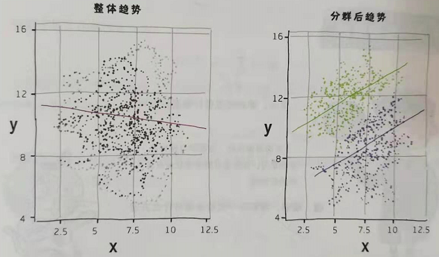
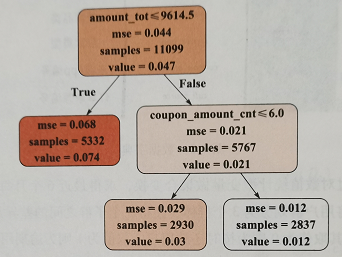

# 用户分群

## 1 何为分群?

分群（segmentation）是指按照特定的维度将样本空间划分为多个子空间。它是模型开发流程中常用且重要的一环，把数据整体分为多个群组，每一群组内具有同质性（Homogeneity），而不同群组之间具有不同质性（Heterogeneity）。换言之，分群后相同群组中样本足够相似，而不同群组中的样本间的差异要尽可能大。总而言之，在该步骤中，建模人员要尽可能地将不同的目标客户或现有账户分进不同的组，以最大限度区分不同行为模式和数理关系。

在评分卡建模的过程中，根据实际场景，有时会将样本群体划分为多个子群，在每个子群中分别建模。由这种子群分别建立的评分卡称为子评分卡（Children Score Card）。

## 2 为什么要分群?

**辛普森悖论**为英国统计学家辛普森于1951年提出的悖论，即在某个条件下的两组数据，分别讨论时都会满足某种性质，可是一旦合并考虑，却可能导致相反的结论。换言之，变量在不同子空间中可能和目标变量形成完全不同的相关趋势。

辛普森悖论同样发生在风控领域。**不同资产状况下的用户表现，通常有较大差异。**在不同额度的贷款产品中，通常小额现金贷用户的资产质量相对大额分期用户较差。如果将两者混合在同一个样本空间中进行分析，往往会得到错误的结论。为了避免辛普森悖论的出现，就需要在不同的子空间中单独分析。因此在建立评分卡模型之前，有时需要对用户进行分群处理。

需要注意的是，用户分群不一定在评分卡建模之前。如果直接建模可以获得符合预期的结果，从整个平台的工作角度思考，可能并无分群的必要。因此我们需要将局部的优化与时间资源开销等保持一个较好的平衡。通常是在单个评分卡模型的效果并不好的前提下，尝试通过分群建立多个模型，使得贷款平台拥有更好的风险预测能力。

分群方法分为**经验分群**与**技术分群**。基于经验的分群方法，主要是将客群按照**常识**进行划分，如按照申请人的身份是老师、学生、企业家等可以划分为不同的客群；或者按照不同的**借贷场景**，将客群分为小额现金贷、大额分期等子群。此外，还可以根据客户是否有房，消费是否活跃等属性进行分群，具体可以参考DTI指标进行分析。技术型分群方法通常分为**基于监督模型分群**和**基于无监督模型分群**。接下来主要介绍两种技术型分群方法。

## 3 监督分群

监督分群是通过监督学习方法进行模型预测，将客群分为多个自己的方法，其中最常用的监督学习模型是决策树。

### 3.1 决策树分群

基于有监督模型分群，即将量化后的用户信息带入决策树模型，自动挖掘有区分度的变量，并根据相关变量将客群划分为多个子群。这种分群方法利用了样本的标签信息，因此属于有监督的分群方法。常见的决策树算法有ID3、C4.5、CART分类树、CART回归树等。

决策树是给定变量条件下类的条件概率分布。要进行分类的样本即给定的变量值，其本质是划分变量空间。变量空间的维数为数据集的变量个数。经过ID3或C2.5算法将变量空间进行划分，并且划分后的每个变量空间区间对应着发生概率最大的类别标签。

通过CART回归树实现用户的分层管理，输出结果如下所示：

CART回归树的节点预测属性mse表示当前子群中目标变量的均值。而当前案例中，目标变量的均值等价于标签为1的样本占当前子群样本的比例。从图中可以看出，决策树将原始样本群划分为3个子群，其负样本占比依次为0.074、0.03、0.012。

CART回归树模型利用均方误差最小化原则，选择最合适的变量用于子群划分。该决策树模型的第一个划分节点为amount_tot，表示该骑手最近6个月配送外卖的总金额。第二个划分节点为coupon_amount_cnt，表示该骑手最近6个月领取代金券的总金额。于是通过两条规则组合，实现了客群之间的差异最大化。**对于这类直接建模效果不好的数据集：通过决策树分层后在其子空间中建模，有可能获取更好的结果。**

### 3.2 生成拒绝规则

决策树模型除了用于用户分群以外，还常用于策略生成。其原理非常容易理解：通过CART回归树找到负样本占比最多的子树，拒绝该子集中的样本，或给予其更低的额度，有利于抵御风险。因此，可抽取其决策路径作为规则，从而有效地识别风险客户。

## 4 无监督分群

基于无监督模型分群，即通过人为判断，将主观认为差异性较大的变量放入无监督模型，通过聚类将不同客群区分开，如根据不同渠道、不同收入、不同学历、不同年龄段、不同产品类型等。这种方法不使用样本的标签，因此属于无监督的分群方法。常用的无监督分群方法有K均值聚类和混合高斯模型（Gaussian Mixture Model，GMM）等，其中GMM利用多个高斯分布对数据集进行拟合，在实践中有更好的表现。

具体分群过程参见ScoreCard中分群建模。

## 5 聚类分析和用户画像

聚类分析的内容可参考聚类分析方法论中的总结。

通过多种聚类方法获得聚类后，如何分析出不同簇之间的主要差异从而获取用户画像的标签呢？

（1）方差分析

计算每个特征的全局方差以及簇内方差，并使用全局方差做标准化，可以得到聚类后每个特征方差减少的占比，减少得越多的特征，说明聚类结果主要由这些特征影响。此时，我们可以从其业务含义出发，将用户划分为不同类别的客群，并给予其不同的标签。

（2）特征分布+雷达图

通过特征分布和雷达图的对比，找到每个群体之间特征的差异，通过特征差异定义不同群体的标签含义。

## 6 风控分群方案

https://www.geekmeta.com/article/1273660.html

https://zhuanlan.zhihu.com/p/91139654

## 6 实例

https://www.kaggle.com/fabiendaniel/customer-segmentation

