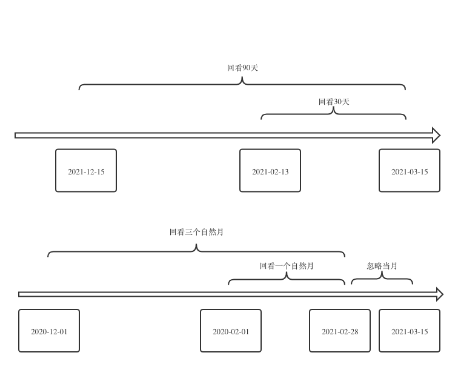

# 记录型数据的特征构造

> 基于RFM模型思路自动化构建记录型数据的特征

在信贷场景中，很多数据在构造特征的时候都是通过数数的形式数出来的。我们发现这类数据的特征构造有着比较明显的套路：

| 原始数据     | 数数型特征           |
| ------------ | -------------------- |
| 用户订单数据 | 过去30天的订单数     |
| 用户点击数据 | 过去30天点击次数     |
| 用户登录数据 | 过去30天登录次数     |
| 用户直播数据 | 过去30天观看直播次数 |

我们把这类可以通过数数进行特征构造的数据称作记录型数据，因为用户在发生一次相关事件时，就会有相应的一条数据被记录在数据库中。

比如用户进行一次购物，就会记录一条订单数据，用户登录一次app就会记录一条登录信息。我们把这类记录型数据抽象成如下的四元组：(e, t, v, c)，其中e表示事件的标签，t是该事件发生的时间，v是这个事件携带的数值型数据，c是这个事件携带的类别型数据。

在具体计算中我们需要根据一个主体来计算，我们再加上主体的标签，一般是一个用户，所以我们用u来表示。

举例说明：

1.订单数据

| 订单号       | 事件标签e       |
| ------------ | --------------- |
| 订单生成时间 | 事件时间t       |
| 订单GMV      | 事件数值型数据v |
| 订单支付方式 | 事件类别型数据c |

2.点击数据

| 点击记录主键     | 事件标签e       |
| ---------------- | --------------- |
| 点击时间         | 事件时间t       |
| 点击的页面       | 事件类别型数据c |
| 点击的按钮       | 事件类别型数据c |
| 点击时的设备编号 | 事件类别型数据c |

剩下的登录，直播和其他数据就不一一列举了，基本的数据的组织形式都是由e, t, v, c这四类数据组成的。

拿到这样的日志型数据的四元组后，我们通过**RFM模型**的思路去构建特征框架。

即recency：近一段时间的记录数，frequency：过去一段时间周期的平均记录数，monetary：过去一段时间的记录的价值，这里我们理解为类别型和数值型变量。

| 数据       | 时间切片     |
| ---------- | ------------ |
| 类别型变量 | 近期一段时间 |
| 类别型变量 | 时间周期     |
| 数值型变量 | 近期一段时间 |
| 数值型变量 | 时间周期     |

## 01 特征构造

按照上面的分类我们列出常见的几种记录型特征的模板：

**1. 距今时间数**

| 特征模板 | T时间内事件e最近一次发生距今天数/月份数 |
| -------- | --------------------------------------- |
| 举例     | 30天内用户最近一次登录距今天数          |
| 涉及变量 | u, t, e                                 |

Spark操作

```python3
df.filter(t<T).groupBy(u).agg(F.min(t))
```

**2. 活跃时间数**

| 特征模板 | T时间内事件e发生的天数/月份数  |
| -------- | ------------------------------ |
| 举例     | 12个月内用户有购买行为的月份数 |
| 涉及变量 | u, t, e                        |

Spark操作

```text
df.filter(t<T).groupBy(u).agg(F.countDistinct(t))
```

**3. 近期次数**

| 特征模板 | T时间内事件e出现次数 |
| -------- | -------------------- |
| 举例     | 30天用户点击行为次数 |
| 涉及变量 | u, t, e              |

Spark操作

```text
df.filter(t<T).groupBy(u).agg(F.count(e))
```

**4. 周期次数**

| 特征模板 | T时间内事件e出现次数的周期的总均最值 |
| -------- | ------------------------------------ |
| 举例     | 12个月内用户平均每月购买的次数       |
| 涉及变量 | u, t, e                              |

Spark操作

```text
df_monthly = df.filter(t in [1:12]).groupBy(u, t).agg(F.count(e).alias(c_m))
df_monthly.groupBy(u).agg(F.mean(c_m))
```

**5. 近期数值统计**

| 特征模板 | T时间内事件e中数值v的总均最值 |
| -------- | ----------------------------- |
| 举例     | 12个月内用户购买商品的总价值  |
| 涉及变量 | u, t, e, v                    |

Spark操作

```text
df.filter(t<T).groupBy(u).agg(F.sum(v))
```

**6. 周期数值统计**

| 特征模板 | T时间内事件e中数值v的和的周期的总均最值 |
| -------- | --------------------------------------- |
| 举例     | 12个月内平均每月用户购买的商品价格      |
| 涉及变量 | u, t, e, v                              |

Spark操作

```text
df_monthly = df.filter(t in [1:12]).groupBy(u, t).agg(F.sum(v).alias(v_m))
df_monthly.groupBy(u).agg(F.mean(v_m))
```

**7. 长短次数和占比**

| 特征模板 | T时间内事件e长短周期里次数占比 |
| -------- | ------------------------------ |
| 举例     | 用户1个月与3个月登录次数比     |
| 涉及变量 | u, t, e                        |

Spark操作

```text
short = df.filter(t in [1:3]).groupBy(u).agg(F.count(e))
long = df.filter(t in [1:12]).groupBy(u).agg(F.count(e))
df.withColumn(col_name, short/long)
```

**8. 长短数值和占比**

| 特征模板 | T时间内事件e长短周期里数值v占比 |
| -------- | ------------------------------- |
| 举例     | 用户1个月与3个月购买商品价值比  |
| 涉及变量 | u, t, e, v                      |

Spark操作

```text
short = df.filter(t in [1:3]).groupBy(u).agg(F.sum(v))
long = df.filter(t in [1:12]).groupBy(u).agg(F.sum(v))
df.withColumn(col_name, short/long)
```

**9. 长短周期次数均值占比**

| 特征模板 | T时间内事件e长短周期里次数均值占比 |
| -------- | ---------------------------------- |
| 举例     | 用户3个月与12个月平均登录次数比    |
| 涉及变量 | u, t, e                            |

Spark操作

```text
# 方法一：缺失值补零
short = df.filter(t in [1:3]).groupBy(u).agg(F.count(e))
long = df.filter(t in [1:12]).groupBy(u).agg(F.count(e))
df.withColumn(col_name, (short / short_term) / (long / long_term))

# 方法二：忽略缺失值
short_monthly = df.filter(t in [1:3]).groupBy(u, t).agg(F.count(e))
long_monthly = df.filter(t in [1:12]).groupBy(u, t).agg(F.count(e))

short_avg = df_short.groupBy(u).agg(F.avg(e))
long_avg = df_long.groupBy(u).agg(F.avg(e))

df.withColumn(col_name, short_avg/long_avg)
```

**10. 长短周期数值均值占比**

| 特征模板 | T时间内事件e长短周期里数值均值占比  |
| -------- | ----------------------------------- |
| 举例     | 用户3个月与12个月平均购买商品价值比 |
| 涉及变量 | u, t, e, v                          |

Spark操作

```text
# 方法一：缺失值补零
short = df.filter(t in [1:3]).groupBy(u).agg(F.sum(v))
long = df.filter(t in [1:12]).groupBy(u).agg(F.sum(v))
df.withColumn(col_name, (short / short_term) / (long / long_term))

# 方法二：忽略缺失值
short_monthly = df.filter(t in [1:3]).groupBy(u, t).agg(F.sum(v))
long_monthly = df.filter(t in [1:12]).groupBy(u, t).agg(F.sum(v))

short_avg = df_short.groupBy(u).agg(F.avg(e))
long_avg = df_long.groupBy(u).agg(F.avg(e))

df.withColumn(col_name, short_avg/long_avg)
```

**11. 近期类别次数**

| 特征模板 | T时间内c类型事件e出现次数             |
| -------- | ------------------------------------- |
| 举例     | 3个月内用户在各个商品类别下的购买次数 |
| 涉及变量 | u, t, e, c                            |

Spark操作

```text
d.filter(t<T).groupBy(u).pivot(c).agg(F.count(e))
```

**12. 近期类别数值统计**

| 特征模板 | T时间内c类型事件e中数值v的总均最值      |
| -------- | --------------------------------------- |
| 举例     | 3个月内用户在各个商品类别下的购买总价值 |
| 涉及变量 | u, t, e, c, v                           |

Spark操作

```text
d.filter(t<T).groupBy(u).pivot(c).agg(F.sum(v))
```

**13. 近期类别次数占比**

| 特征模板 | T时间内c类型事件e出现次数占比           |
| -------- | --------------------------------------- |
| 举例     | 3个月内用户在各个商品类别下购买次数占比 |
| 涉及变量 | u, t, e, c                              |

Spark操作

```text
nmr = df.filter(t in [1:3]).groupBy(u).pivot(c).agg(F.count(e))
denom = df.filter(t in [1:12]).groupBy(u).agg(F.count(e))
df.select(*[F.col(nmr) / F.col(denom) for nmr in lst_nmr])
```

**14. 近期类别数值占比**

| 特征模板 | T时间内c类型事件e数值v占比              |
| -------- | --------------------------------------- |
| 举例     | 3个月内用户在各个商品类别下购买总价占比 |
| 涉及变量 | u, t, e, c, v                           |

Spark操作

```text
nmr = df.filter(t in [1:3]).groupBy(u).pivot(c).agg(F.sum(v))
denom = df.filter(t in [1:12]).groupBy(u).agg(F.sum(v))
df.select(*[F.col(nmr) / F.col(denom) for nmr in lst_nmr])
```

## 02 时间切片

上述特征模板里都会用到时间切片的概念。我们在做时间切片时，把回看过去一段时间的时间切片分成两大类情况：

**1. 直接从当前观察点回看一段时间**

**2. 从当前观察点前一个完整自然月末回看两种情况**

如下图，观察时点为2021-03-15，按情况一回看30天和回看90天分别会看到2021-03-13和2020-12-15。

按情况二回看一个自然月会忽略三月的一个不完整的自然月，从二月底向前回看到2021-02-01，回看三个自然月到2020-12-01。



通常在抓取近期变化的时候，我们喜欢使用情况一的时间切片。当我们关注长期趋势，或计算需要中间表支持的时候，情况二的时间切片比较适合。

往往在信贷模型中，反欺诈类特征会用情况一且多为短时间，如最近1小时，最近1天，最近1周，最近1个月。而在信用模型中会选择情况二的长周期，如最近12个自然月，最近24个自然月这样的特征，而且往往长周期的数据量很大，基本都需要有每月为单位的聚合表帮助计算。

## 03 新老客按月平均问题

在按月的平均值类的统计中，有个特征计算上的细节问题，就是特征模板9和特征模板10的计算中，平均值的计算需要考虑空值的处理逻辑。这个逻辑会对新老用户的特征数值差异有影响。

举个例子，我们从当前时间点向前回看12个自然月，把老客和新客的登录数据按月的统计结果列出来。因为老客在平台时间久，基本每月都有登录，但是新客可能是两个月前才注册的，所以只有最近两个自然月有登录数据。

| 月份 | 12   | 11   | 10   | 9    | 8    | 7    | 6    | 5    | 4    | 3    | 2    | 1    |
| ---- | ---- | ---- | ---- | ---- | ---- | ---- | ---- | ---- | ---- | ---- | ---- | ---- |
| 老客 | 2    | 0    | 4    | 2    | 8    | 4    | 0    | 2    | 4    | 2    | 2    | 2    |
| 新客 | NA   | NA   | NA   | NA   | NA   | NA   | NA   | NA   | NA   | NA   | 1    | 2    |

我们计算新客的3个月和12个月的均值的比值。

方法1：在把缺失值填补0

3个月的均值：3/3 = 1

12个月的均值：3/12 = 0.25

比值: 1/0.25 = 4

方法2：在忽略缺失值直接按有数值月份计算

3个月的均值：3/2 = 1.5

12个月的均值：3/2 = 1.5

比值: 1.5/1.5 = 1

在填补0的计算方式下，是把新客当做老客来看待，会对新客的活跃度有惩罚，同时比值会放大近期的活跃度。

在忽略缺失值的情况下，是按新客的登录月份来计算的，对新客登录频率的计算相对客观，但是对其趋势计算会有偏差。所以在选择的时候需要根据具体场景是否要针对新客的行为有偏好来决定特征的计算方式。

以上我们总结了常见的记录型特征的构造方式。

当然还有很多特征思路没有被纳入在这个特征模板中，我们可以把这个特征构造当做一个benchmark，在这个benchmark的特征效果不错的情况下，再深入的挖掘更复杂细致的特征。

这样能节省我们比较套路化的特征构造时间，把精力用在更有价值的数据分析和其他复杂特征构造上面。

> 交易流水数据的特征自动化构造。