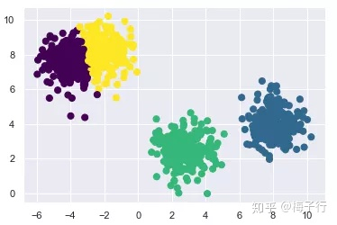
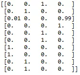
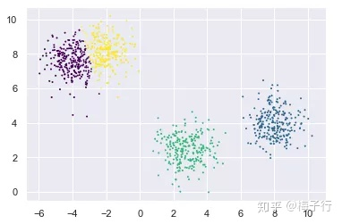
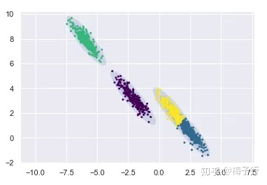
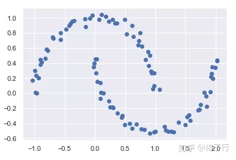
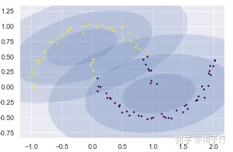
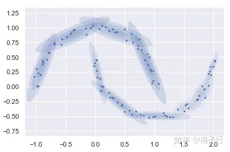
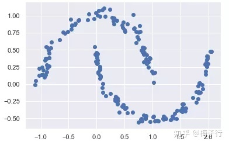
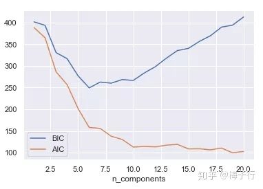

# 分群建模

## 1、分群

风控模型上可以对客户分群，在群上定制建模，提高模型预测精度。

### 1.1 K-Means

**1.1.1 算法思想**

该算法利用数据点之间的欧式距离大小，将数据划分到不同的类别，欧式距离较短的点处于同一类。算法结果直接返回的是数据点所属的类别。

K-Means的具体聚类过程参见聚类分析方法论。

**1.1.2 缺点**

二维k-means模型的本质是，它以每个簇的中心为圆心，簇中的点到簇中心点的欧氏距离最大值为半径画一个圆。这个圆硬性的将训练集进行截断。而且，k-means要求这些簇的形状必须是圆形的。因此，k-means模型拟合出来的簇（圆形）与实际数据分布（可能是椭圆）差别很大，经常出现多个圆形的簇混在一起，相互重叠。总的来说，k-means存在两个缺点，使得它对许多数据集（特别是低维数据集）的拟合效果不尽如人意：

- 类的形状不够灵活，拟合结果与实际相差较大，精度有限。
- 样本属于每一个簇的概率是定性的，只有是与否，不能输出概率值。应用中缺少鲁棒性。

> 聚类算法使用前需要先对数据做预处理，包括缺失值填充、极值和异常值处理等。

### 1.2 GMM

**1.2.1 GMM算法原理**


**1.2.2 GMM简单应用**

高斯混合模型（GMM）可以看做是k-means模型的一个优化。它既是一种工业界常用的技术手段，也是一种生成式模型。高斯混合模型试图找到多维高斯模型概率分布的混合表示，从而拟合出任意形状的数据分布。在最简单的场景中，GMM可以用与k-means相同的方式进行聚类。

```python3
import matplotlib.pyplot as plt
import seaborn as sns; sns.set()
import numpy as np

#产生实验数据
from sklearn.datasets.samples_generator import make_blobs
X, y_true = make_blobs(n_samples=700, centers=4,
                       cluster_std=0.5, random_state=2019)
X = X[:, ::-1] #方便画图

from sklearn.mixture import GaussianMixture as GMM
gmm = GMM(n_components=4).fit(X) #指定聚类中心个数为4
labels = gmm.predict(X)
plt.scatter(X[:, 0], X[:, 1], c=labels, s=50, cmap='viridis')
```



它使用EM算法进行迭代：

1.选择位置和初始形状；

2.循环直至收敛：

- E步骤：对于每个点，为每个点分别计算由该混合模型内的每个分量生成的概率。

- M步骤：调整模型参数以最大化模型生成这些参数的可能性。

该算法保证该过程内的参数总会收敛到一个局部最优解。

**1.2.3 GMM中的概率模型**

事实上在GMM算法中，有一个隐含的概率模型。可以通过其得到簇分配结果的概率。打印前十个点分别属于四个类的概率。

```python3
probs = gmm.predict_proba(X)
print(probs[:10].round(2))
```



因为GMM模型并不是通过硬截断进行分割类别，而是通过高斯平滑模型进行估计的。所以将每个点的概率进行可视化时，散点图并不是严格成椭圆形状的。

```python3
size = probs.max(1)
plt.scatter(X[:, 0], X[:, 1], c=labels, cmap='viridis', s=size)
```



如果允许使用全部的协方差类型，则可以拟合任意形状的分布。为了更好的展示GMM模型的拟合结果，首先需要构造一个画椭圆的函数。在网上找到的代码因为一些API有改动，重新更新了一版。

```python3
from matplotlib.patches import Ellipse

#给定的位置和协方差画一个椭圆
def draw_ellipse(position, covariance, ax=None, **kwargs):
    ax = ax or plt.gca()
    #将协方差转换为主轴
    if covariance.shape == (2, 2):
        U, s, Vt = np.linalg.svd(covariance)
        angle = np.degrees(np.arctan2(U[1, 0], U[0, 0]))
        width, height = 2 * np.sqrt(s)
    else:
        angle = 0
        width, height = 2 * np.sqrt(covariance)

    #画出椭圆
    for nsig in range(1, 4):
        ax.add_patch(Ellipse(position, nsig * width, nsig * height,
                             angle, **kwargs))
#画图
def plot_gmm(gmm, X, label=True, ax=None):
    ax = ax or plt.gca()
    labels = gmm.fit(X).predict(X)
    if label:
        ax.scatter(X[:, 0], X[:, 1], c=labels, s=4, cmap='viridis', zorder=2)
    else:
        ax.scatter(X[:, 0], X[:, 1], s=4, zorder=2)
    ax.axis('equal')
    w_factor = 0.2 / gmm.weights_.max()
    for pos, covar, w in zip(gmm.means_, gmm.covariances_  , gmm.weights_):
        draw_ellipse(pos, covar, alpha=w * w_factor)
```

下面使用椭圆形来拟合数据。

```python3
rng = np.random.RandomState(13)
X_stretched = np.dot(X, rng.randn(2, 2))
gmm = GMM(n_components=4, covariance_type='full', random_state=42)
plot_gmm(gmm, X_stretched)
```



**1.2.4 GMM模型的组件**

下面考虑一个特殊的分布形式。如下图所示

```python3
from sklearn.datasets import make_moonsXmoon, y
moon = make_moons(100, noise=.04, random_state=0)
plt.scatter(Xmoon[:, 0], Xmoon[:, 1]);
```



如果使用两个高斯分布进行拟合，则得到的结果如下。

```python3
gmm2 = GMM(n_components=2, covariance_type='full', random_state=0)
plot_gmm(gmm2, Xmoon)
```



即使是椭圆形状，仍有一部分点被错误的归类为另一个分布。这时，如果使用更多的高斯分布进行归纳，则可以得到更好的效果。

```python3
gmm10 = GMM(n_components=10, covariance_type='full', random_state=0)
plot_gmm(gmm10, Xmoon, label=False)
```



这里使用了10个高斯分布。但是并不是为了得到10个聚类结果。而是通过10个分布进行集成得到最终的归纳结果。也就是说，GMM模型的本质并不是聚类，而是得到一个，能够生成当前样本形式的分布。

因此可以使用前面10个高斯分布集成的生成模型，来生成服从当前分布形式的200个新的样本。

```python3
Xnew = gmm10.sample(200)[0]
plt.scatter(Xnew[:, 0], Xnew[:, 1])
```



**1.2.5 最优组件个数的确定**

在实际使用过程中，需要选择每次建模使用多少个高斯分布进行聚类才能有最好的聚类效果。这里介绍两种确定最优组件个数的方法——赤池信息准则（kaike information criterion ，AIC)）和贝叶斯信息准则（ Bayesian information criterion ，BIC）。

很多参数估计问题均采用似然函数作为目标函数，当训练数据足够多时，可以不断提高模型精度，但这是以提高模型复杂度为代价的，同时带来一个机器学习中非常普遍的问题——过拟合。因此需要一种方法在模型复杂度与模型对数据集描述能力之间寻求最佳平衡。

为此提出一种概念叫做信息准则，通过加入模型复杂度的惩罚项来避免过拟合问题，这里介绍两种常用的模型选择方法：

（1）AIC

AIC是衡量统计模型拟合优良性的一种准则，它是建立熵的概念上，提供了权衡估计模型复杂度和拟合数据优良性的标准。

通常情况下，AIC定义为：


$$
AIC=2k-2lnL
$$


其中，k是模型参数个数，L是似然函数。从一组可供选择的模型中选择最佳模型时，通常选择AIC最小的模型。

当两个模型之间存在较大差异时，差异主要体现在似然函数项，当似然函数差异不显著时，式中第一项，即模型复杂度会起作用，从而表明参数个数少的模型是较好的选择。

一般而言，当模型复杂度提高（k增大）时，似然函数L也会增大，从而使AIC变小，但是k过大时，似然函数增速减缓，导致AIC增大。模型过于复杂容易造成过拟合现象。

所以目标就是选取AIC最小的模型，AIC不仅要提高模型拟合度（极大似然），而且要引入惩罚项，使模型参数尽可能少，从而降低过拟合的可能性。

（2）BIC

BIC与AIC相似，更多地用于模型选择。训练模型时，增加参数数量，也就是增加模型复杂度，会增大似然函数，但是也会导致过拟合现象，针对该问题，AIC和BIC均引入了与模型参数个数相关的惩罚项，BIC的惩罚项比AIC的大。同时要考虑样本数量，样本数量过多时，可有效防止模型精度过高造成的模型复杂度过高。
$$
BIC=klnn-2lnL
$$
其中，k为模型参数个数，n为样本数量，L为似然函数。  惩罚项在维度过大且训练样本数量相对较少的情况下，可以有效避免出现维度灾难现象。

（3）AIC和BIC的比较

```python3
n_components = np.arange(1, 21)
models = [GMM(n, covariance_type='full', random_state=0).fit(Xmoon)
          for n in n_components]

plt.plot(n_components, [m.bic(Xmoon) for m in models], label='BIC')
plt.plot(n_components, [m.aic(Xmoon) for m in models], label='AIC')
plt.legend(loc='best')
plt.xlabel('n_components')
```



最佳的聚类数目是使得AIC或BIC最小化的值，具体取决于我们希望使用的近似值。上图可以看出，AIC显示，选择10个高斯分布差不多就是最优解了。而BIC则倾向于使用更简单的模型，在6个高斯分布时即达到最优解。

除此之外，KMeans和GMM聚类均可采用手肘法和轮廓系数来评价聚类效果，其中手肘法取曲线的转折位置，轮廓系数取最大值。

> 手肘法和轮廓系数参见聚类分析方法论。

**1.2.6 总结**

GMM模型因其优秀的聚类表现，以及可以生产样本的强大功能，在风控领域的应用非常广泛。如对反欺诈中的欺诈样本抓取与生成、模型迭代中的幸存者偏差等问题都有一定的作用。

比如说在反欺诈检测模型中，可以先通过GMM模型对欺诈样本进行聚类，后将聚类后得到的簇作为同一类欺诈手段，后续只针对不同的簇进行建模，在实践中对欺诈客户的召回有很好的效果。


参考资料：

[1] [最佳聚类实践：高斯混合模型（GMM）]( https://zhuanlan.zhihu.com/p/81255623 )


