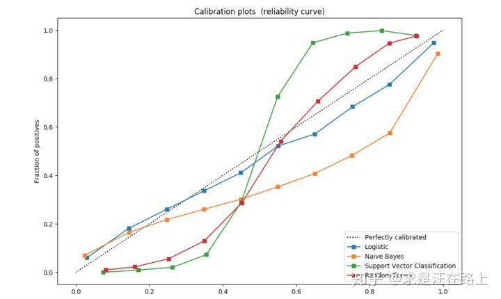
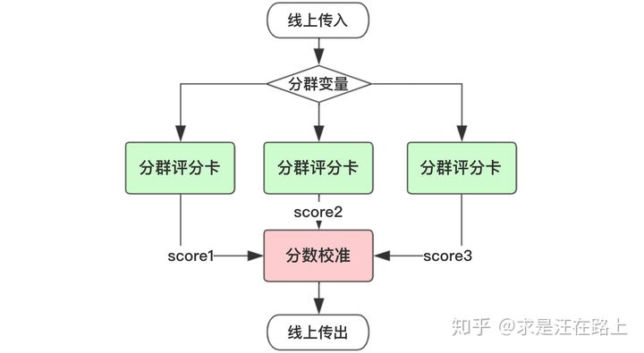
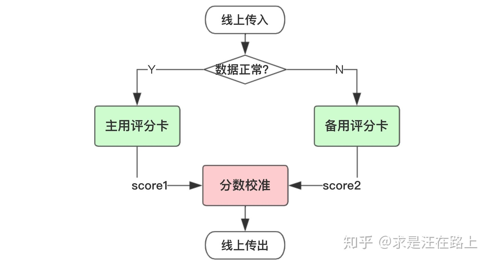
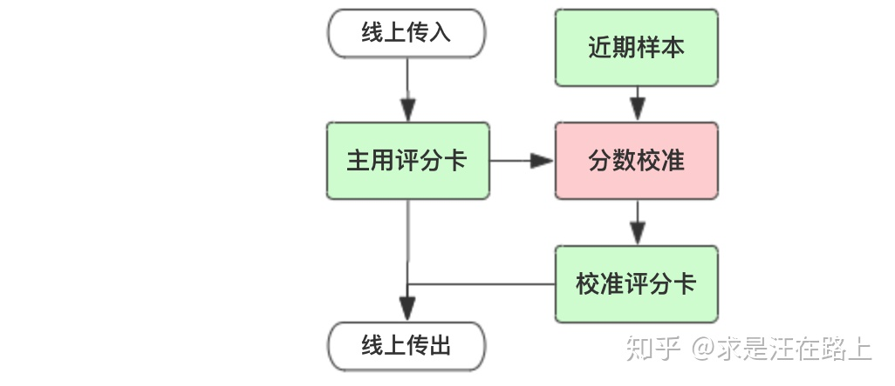
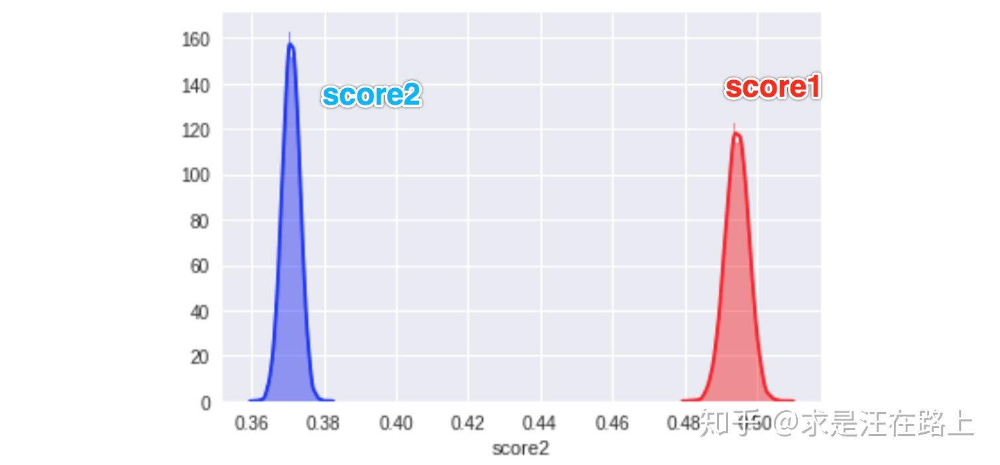
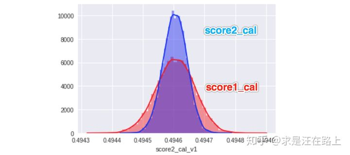
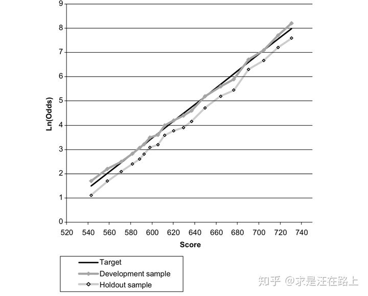
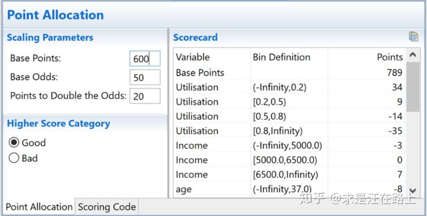

# 评分卡和xgb分数校准

## 1 评分卡模型分数校准

分群后模型的概率值不具备可比性，需进行分数校准。

### 1.1 风控业务背景

在评分卡建模中，我们通常会把LR输出的概率分（probability）转换为整数分(score)，称之为评分卡分数校准(calibration)。事实上，这个阶段称为尺度变换（scaling）或许更为合适。只是有些书中并不严格区分校准和尺度变换，统称为风险校准。

大家耳熟能详的一些信用评分就是最终以这种形式呈现，例如：

> 1. 芝麻分的分值范围为350～950，分值越高代表信用越好，相应违约率相对较低，较高的芝麻分可以帮助用户获得更高效、更优质的服务。
> 2. FICO分的分值范围为300～850，分数越高, 说明客户的信用风险越小。

但我们可能并不清楚这些问题：分数校准的概念是什么？为什么要做分数校准？分数校准的原理是什么？如何做分数校准？在哪些场景里需要做分数校准？

### 1.2 分数校准的概念

在机器学习模型实践应用中，大多数情况下，我们主要关注分类模型的**排序性（ranking）**，而很少关心输出概率的具体数值。也就是——**关注相对值，忽略绝对值**。

一方面，有的分类器（例如SVM）只能直接打上类别标签没法给出置信度。另一方面，在某些场景中，我们希望得到真实的概率。例如，在信贷风控中，将预测的客户违约概率(Probability of Default ，PD）与真实违约概率对标，即**模型风险概率能够代表真实的风险等级。**这样我们就可以进行更准确的风险定价。

这就引出了校准(calibration)的概念，我们将其理解为：

> 预测分布和真实分布（观测）在统计上的一致性。

对于完美校准的（2分类）分类器，如果分类器预测某个样本属于正类的概率是0.8，那么就应当说明有80%的把握（置信度，confidence level）认为该样本属于正类，或者100个概率为0.8的样本里面有80个确实属于正类。

由于我们无法获知真实的条件概率，通常用观测样本的标签来统计代替，并用**可靠性曲线图**（Reliability Curve Diagrams）来直观展示当前模型的输出结果与真实结果有多大偏差。如图1所示，如果数据点几乎都落在对角线上，那么说明模型被校准得很好；反之，如果和对角线的偏离程度越明显，则校准越差。

图 1 - 校准曲线（横坐标 = 预测概率，纵坐标 = 实际频率）

因此，其横坐标为事件发生预测概率，纵坐标为事件发生实际频率，能展示**“某个事件预测概率 VS 实际发生的频率”之间的关系**。对于一个理想的预测系统，两者是完全一致的，也就是对角线。

那么可靠性曲线图是如何绘制的？步骤如下：

- **step 1.** 横坐标：将预测概率升序排列，选定一个阈值，此时[0，阈值]作为一个箱子。
- **step 2**. 纵坐标：计算这个箱子内的命中率（hit rate），也就是正样本率。
- **step 3**. 选定多个阈值，重复计算得到多个点，连接成线。

$$
hit\_rate={{position}\over{position+negative}}
$$

我们以扔硬币来评估正面朝上的概率这个场景进行说明。经过投掷记录，我们得到1W（或者更多）个有真实0（反面朝上）和1（正面朝上）标签的样本。进而，我们根据硬币的各类特征和正反面标签，训练得到一个二分类模型，给这批样本打上分，升序排列。然后，取一个分数作为阈值（如0.5），统计分数取值为0～0.5的这批样本中1的实际占比，当作“真实”概率。最后，比较“真实”概率与预测概率来检测一致性。

在实践中，我们已经普遍认识到一个现象：

> LR的输出概率可以认为是真实概率，而其他分类器的输出概率并不反映真实概率。

那么这背后的数学原理是什么？

### 1.3 分数校准的业务应用场景

分数校准主要目的在于：

1. 确保不同评分卡给出的分数具有相同的含义；
2. 保证预测概率与真实概率之间的一致性（拟合度）；
3. 修正实际概率和开发样本中期望概率之间的偏差。

接下来，我们将结合实际业务场景展开介绍。注意，因为我们是用评分卡(LR)建立的模型，因此分数校准实际只做了尺度变换这一步。

**场景1: 分群评分卡**

有时候我们会发现单一评分卡在**全量人群**上表现并不是特别好。此时会采用先分群（segmentation），再针对各人群建立多个子评分卡模型。

基于以下几个原因，我们需要把分数校准到同一尺度。

1. 针对多个分支模型需要制订多套风控策略，将会大大增加策略同学的工作量，且不利于策略维护调整。
2. 不同评分卡输出的分数并不具有可比性，它们的分布存在差异。为了融合后统一输出一个最终分数。
3. 各分群评分卡相当于一个分段函数，分数之间存在跃变。校准可以保证各分数具有连续性。

图 2 - 分群评分卡场景

**场景2: 降级备用策略**

在用到外部数据建模时，考虑到外部数据采集上存在潜在的不稳定性，我们通常会采取降级策略。也就是说，去掉外部数据后再建立一个模型，作为主用（active）模型的一个备用（standby）模型。如果外部数据有一天停止提供服务，就可以切换到备用模型上。

同时，为了使下游业务调用无感知，我们会将主用备用模型的分数校准至一个尺度。这样就能保证风控策略同学只需要制订一套cutoff方案，且不用调整，只需做必要的**策略切换日志**和**前后波动监控**即可。

图 3 - 降级备用策略

**场景3: 客群变化修正**

当面向客群发生变化时，开发样本与最近样本之间存在偏差（bias）。如果开发样本的Odds大于实际的Odds，那么计算每个分数段的坏样本率，得出来的结果将会大于真实情况。

然而考虑到建模成本，我们有时并不想refit模型，此时就可以利用最近样本对评分卡进行校准，修正偏差。

图 4 - 基于近期样本校准

> 除此之外，场景三也适用于如下情况：
>
> 1. 产品本身坏样本较少，为了提高评分模型的敏感程度，会对坏样本进行过抽样或者好样本进行欠抽样；
>
> 2. 如果是乙方公司，好坏样本的来源可能不同，或者甲方爸爸并没有全量反馈样本表现，那么自然样本中的好坏比无法反映真实的情况。

### 1.4 如何进行概率分数校准？

针对上述实际业务场景，我们该如何去做概率分数校准呢？ 以下是两种最为常见的概率校准方法：

1. Platt scaling使用LR模型对模型输出的值做拟合（并不是对reliability diagram中的数据做拟合），适用于样本量少的情形，如**信贷风控场景**中。
2. Isotonic regression则是对reliability diagram中的数据做拟合，适用于样本量多的情形。例如**搜索推荐场景**。样本量少时，使用isotonic regression容易过拟合。

现以数值案例展示前文中的三个场景。

**方案1：针对场景1和2的Platt校准**

假设目前有一个LR模型分数score1，并令score2 = 0.75*score1，以此来模拟场景1和2。此时score1和score2的排序性完全一致，只是绝对值不同，对应不同的风险等级，如图5所示。我们需要将score1和score2校准到同一尺度。

图 5 - 两个分支模型的概率分布

普拉托（Platt）最早提出可以通过**sigmoid函数**将SVM的预测结果转化为一个后验概率值，其实施流程为：

- **step 1**. 利用样本特征X和目标变量y训练一个分类器model1。（不限定分类器类型）
- **step 2**. 利用model1对样本预测，得到预测结果out。
- **step 3**. 将预测结果out作为新的特征X'，再利用样本的标签y，训练一个LR。
- **step 4**. LR最后输出的概率值就是platt's scaling后的预测概率。

我们把score1和score2分别执行step 3，得到校准后的分数score1_cal和score2_cal，如图6所示。通过分布可知，两个分数的**差异几乎为0**，故而具有相同的风险等级。同时，由于校准函数是单调的，那么校准前后将不会影响排序性和区分度。

图 6 - 校准后的两个分支模型的概率分布

**方案2：针对场景3的Odds校准**

场景3一般称为评分卡分数的错误分配（Misassignment），如图7所示。

图 7 - 截距错配(Intercept Misalignment)

我们知道，LR中的截距近似于开发样本的ln(Odds)，那么就可以采取以下方式进行校准。

![[公式]](https://www.zhihu.com/equation?tex=%5Cleft%5C%7B+%5Cbegin%7Baligned%7D+ln%28%5Cfrac%7Bp%7D%7B1-p%7D%29+%3D+w+%2A+x+%2B+ln%28%7BOdds_%7Bexpect%7D%7D%29+%5C%5C+ln%28%7BOdds_%7Bcalibrate%7D%7D%29+%3D+ln%28%5Cfrac%7BOdds_%7Bactual%7D%7D%7BOdds_%7Bexpect%7D%7D%29+%3D+ln%28Odds_%7Bactual%7D%29+-+ln%28%7BOdds_%7Bexpect%7D%7D%29%5C%5C+%5Cend%7Baligned%7D+%5Cright.+%5C%5C++%5CRightarrow+ln%28%5Cfrac%7Bp%7D%7B1-p%7D%29+%3D+w_1+%2A+x_1+%2B+ln%28%7BOdds_%7Bexpect%7D%7D%29+%2B+ln%28%7BOdds_%7Bcalibrate%7D%7D%29+%5C%5C++%5CRightarrow+ln%28%5Cfrac%7Bp%7D%7B1-p%7D%29+%3D+w_1+%2A+x_1+%2B+ln%28%7BOdds_%7Bactual%7D%7D%29+%5Ctag%7B1%7D)

> 理解可参考：https://zhuanlan.zhihu.com/p/90895509

在评分卡尺度变换后，我们可以得到ln(Odds)和Score之间的线性关系（后文会介绍），也就是：

![[公式]](https://www.zhihu.com/equation?tex=Score+%3D+A+-+B+%2A+Ln%28Odds%29+%5Ctag%7B2%7D)

那么，利用近期样本和开发样本就可以分别绘制出这样一条直线。如果这两条直线是平行关系，此时我们认为：在同一个分数段上，开发样本相对于近期样本把Odds预估得过大或过小。因此， 可通过$Ln(Odds_{actual})-Ln(Odds_{expect})$来进行校正。

在图8中，实际上该产品的整体违约率只有**2%**左右，而评(分卡开发样本的违约率为**10%**。因此可以通过这种方式对每个分数区间的Odds予以校准。

图 8 - 基于Odds的评分卡校准

### 1.5 如何定量评估校准的好坏？

我们通常用对数损失函数(Logarithmic Loss，LL)和Brier分数（Brier score，BS）来衡量校准质量，分别定义如下：

![[公式]](https://www.zhihu.com/equation?tex=%5Cleft%5C%7B+%5Cbegin%7Baligned%7D+Log%5C_Loss+%3D+-%5Csum_%7Bi%3D1%7D%5E%7BN%7D%28y_i+%2A+log%28p_i%29+%2B+%281-y_i%29%2Alog%281-p_i%29%29++%5C%5C+Brier%5C_Score+%3D+%5Cfrac%7B1%7D%7BN%7D%5Csum_%7Bi%3D1%7D%5E%7BN%7D%28y_i+-+p_i%29%5E2+%5C%5C+y_i+%5Cin+%5C%7B0%2C1%5C%7D+%3A+actual+%5Cspace%5Cspace+class+%5Cspace%5Cspace+label%5C%5C+p_i+%5Cin+%5B0%2C1%5D+%3A+%5Cspace%5Cspace+estimated+%5Cspace%5Cspace+default+%5Cspace%5Cspace+probability+%5C%5C+%5Cend%7Baligned%7D+%5Cright.+%5Ctag%7B3%7D)

1. 观察LL可知，当真实label=0，预测概率为1时，损失函数将达到+∞。LL惩罚明显错误的分类。当**预测概率越接近于真实标签，LL越小，模型的校准效果就越好**。
2. 观察BS可知，当BS指标越小，代表模型预测结果越接近于真实标签。

因此，这两个指标都反映样本集上**真实标签与预测概率之间的差异性**（也就是一致性）。

这里，我们就有了答案 ：LR在参数估计时所用到的损失函数正是对数损失函数，故而才具有良好的校准度。

> LogisticRegression returns well calibrated predictions as it directly optimizes **log-loss**.

### 1.6 概率分数尺度变换成整数分数

至此**，**我们已经掌握了如何对模型输出概率进行校准，但还不是文章开头所见的整数分。现在，介绍**将概率分数尺度变换（scaling）成整数分数**。在很多信用评分书籍中，有时也会并不加以区分地称为风险校准，但并不恰当。

这是非常有用的，因为从业务上很难理解一个概率分代表的含义，但人们对于整数分更容易接受。比如，温度计上的刻度 ️。单调性保证了映射过程不会改变分数的排序性。

图 9 - 评分卡赋分

为简化处理，我们只考虑一个自变量X，那么逻辑回归定义如下：

![[公式]](https://www.zhihu.com/equation?tex=ln%28Odds%29+%3D+ln%28%5Cfrac%7Bp%28Y%3DBad%7CX%29%7D%7Bp%28Y%3DGood%7CX%29%7D%29+%3D++ln%28%5Cfrac%7Bp%7D%7B1-p%7D%29+%3D+w+%2A+WOE%28x%29+%2B+b+%5Ctag%7B4%7D)

在《[WOE与IV指标的深入理解应用](https://zhuanlan.zhihu.com/p/80134853)》一文中，我们认识到WOE变换是一个**分段函数，**其把**自变量x与y之间的非线性关系转换为线性关系**。若把WOE定义如下，那么含义为：**自变量x在经过WOE变换后，取值越大，预测为bad的概率越高。**

![[公式]](https://www.zhihu.com/equation?tex=WOE%28x%29+%3D+%5Cleft%5C%7B+%5Cbegin%7Baligned%7D+woe_1+%3D+ln%28%5Cfrac%7BBad_1%7D%7BGood_1%7D%29++-+ln%28%5Cfrac%7BBad_T%7D%7BGood_T%7D%29+%2C+x+%5Cin+bin_1%5C%5C+woe_2+%3D+ln%28%5Cfrac%7BBad_2%7D%7BGood_2%7D%29++-+ln%28%5Cfrac%7BBad_T%7D%7BGood_T%7D%29+%2C+x+%5Cin+bin_2%5C%5C+...+%5C%5C+woe_m+%3D+ln%28%5Cfrac%7BBad_m%7D%7BGood_m%7D%29++-+ln%28%5Cfrac%7BBad_T%7D%7BGood_T%7D%29+%2C+x+%5Cin+bin_m+%5C%5C+%5Cend%7Baligned%7D+%5Cright.+%5Ctag%7B5%7D)

我们会发现在2个地方出现了Odds的身影——**LR的左边和WOE变换**。

此时，由于两者的Odds（几率）的定义是**坏好比**，也就是**“坏人概率 / 好人概率”**。因此，在参数估计时，自变量前的**权重系数w的符号是正的**。实践中发现不少人搞不清楚为什么有时候是正号，有时候是负号。问题主要在于**WOE和LR中Odds定义是否一致**。

1. 当WOE中定义Odds是**好坏比**时，w系数为**负**；
2. 当WOE中定义Odds是**坏好比**时，w系数为**正**；

将LR输出线性映射为信用分的公式如下，通常将**常数A称为补偿**，**常数B称为刻度。**

![[公式]](https://www.zhihu.com/equation?tex=define+%5Cleft%5C%7B+%5Cbegin%7Baligned%7D+A+%3E+0%2C+B+%3E+0+%5C%5C+Odds+%3D+%5Cfrac%7Bp%28Y%3DBad%7CX%29%7D%7Bp%28Y%3DGood%7CX%29%7D++%3D+%5Cfrac%7Bp%7D%7B1+-+p%7D+%5C%5C+%5Cend%7Baligned%7D+%5Cright.+%5C%5C++%5CRightarrow+credit%5C_score+%3D+A+-+B+%2A+ln%28Odds%29+%5C%5C++%5CRightarrow+credit%5C_score+%3D+A+-+B+%2A+%5B%5Cbeta_0+%2B+%5Cbeta_1+%2A+WOE%28x%29%5D+%5Ctag%7B6%7D)

在上式中，由于Odds是坏好比，Odds越大，代表bad的概率越高；而信用分越高，代表bad的概率越低。**两者业务含义上相反，因此是减号**。

我们需要定义三个必要的参数：

- **1. 基准Odds**：与真实违约概率一一对应，可换算得到违约概率。
- **2. 基准分数**：在基准Odds时对应的信用分数。
- **3. PDO**:**（P**oints to **D**ouble the **O**dds）：Odds（坏好比）变成2倍时，所**减少**的信用分。

接下来，我们就可以求解出A和B，过程如下：

![[公式]](https://www.zhihu.com/equation?tex=define+%5Cleft%5C%7B+%5Cbegin%7Baligned%7D+PDO+%3E+0+%5C%5C+A+%3E+0%2C+B+%3E+0+%5C%5C+Odds+%3D+%5Cfrac%7Bp%28Y%3DBad%7CX%29%7D%7Bp%28Y%3DGood%7CX%29%7D+%3D+%5Cfrac%7Bp%7D%7B1+-+p%7D+%5C%5C+%5Cend%7Baligned%7D+%5Cright.+%5C%5C++%5CRightarrow+%5Cleft%5C%7B+%5Cbegin%7Baligned%7D+base%5C_score+%3D+A+-+B+%2A+ln%28Odds_0%29+%5C%5C+base%5C_score+-+PDO+%3D+A+-+B+%2A+ln%282+%2A+Odds_0%29+%5C%5C+%5Cend%7Baligned%7D+%5Cright.+%5C%5C++%5CRightarrow+%5Cleft%5C%7B+%5Cbegin%7Baligned%7D+B+%3D+%5Cfrac%7BPDO%7D%7Bln%282%29%7D+%5C%5C+A+%3D++base%5C_score+%2B+%5Cfrac%7BPDO%7D%7Bln%282%29%7D+%2A+ln%28Odds_0%29+%5C%5C++%5Cend%7Baligned%7D+%5Cright.+%5C%5C++%5Ctag%7B7%7D)

现以具体数字来说明。假设我们希望信用分base_score为600时，对应的Odds（坏好比）为**1:50**。而当Odds扩大2倍至**2:50**时，信用分**降低20分**至580分**（PDO=20）**。那么：

![[公式]](https://www.zhihu.com/equation?tex=+%5Cleft%5C%7B+%5Cbegin%7Baligned%7D+B+%3D+%5Cfrac%7BPDO%7D%7Bln%282%29%7D+%3D+%5Cfrac%7B20%7D%7Bln%282%29%7D+%3D+28.8539++%5C%5C+A+%3D++base%5C_score+%2B+%5Cfrac%7BPDO%7D%7Bln%282%29%7D+%2A+ln%28Odds_0%29+%3D+600+%2B+28.8539+%2A+ln%281%2F50%29+%3D+487.122%5C%5C+%5Cend%7Baligned%7D+%5Cright.+%5C%5C++%5CRightarrow++%5CRightarrow+credit%5C_score+%3D+487.122+-+28.8539+%2A+ln%28Odds%29++%5C%5C++%5CRightarrow+credit%5C_score+%3D+487.122+-+28.8539+%2A+%28w+%2A+WOE%28x%29+%2B+b%29+%5Ctag%7B8%7D+)

### 1.7 总结

我们从新的角度再次认识到了为什么评分卡最终选择了逻辑回归。其中一个原因是，**逻辑回归本身具有良好的校准度，其输出概率与真实概率之间存在良好的一致性。**因此，我们也就可以直接把概率分数线形映射为整数分数。

## 2 xgb分数校准

如果我们用机器学习模型（如XGBoost、随机森林等）来进行风控建模，又希望把概率对标到真实概率，那么我们就可以考虑**Platt Scaling**。

即将分群的模型分别计算总样本上的概率，然后将几个概率重新做模型（LR），得到可比的总体分数。

参考资料：

[1] [信用评分卡模型分数校准](https://zhuanlan.zhihu.com/p/82670834)

[2] [原来评分卡模型的概率是这么校准的！](https://zhuanlan.zhihu.com/p/90895509)

[3] [风控模型中的概率分数校准](https://zhuanlan.zhihu.com/p/92958088)

