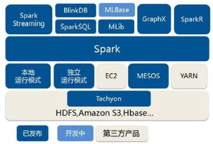
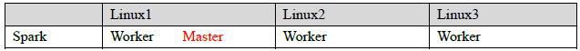
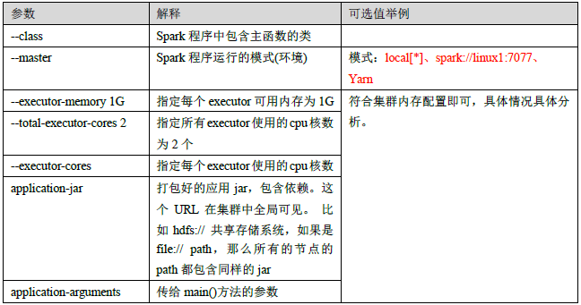
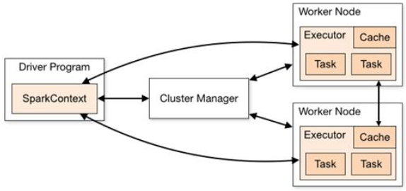
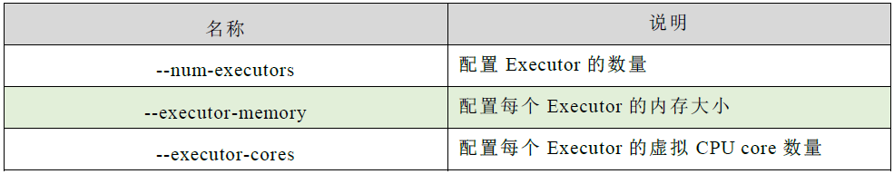
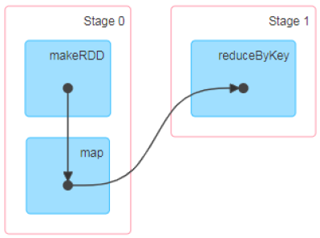
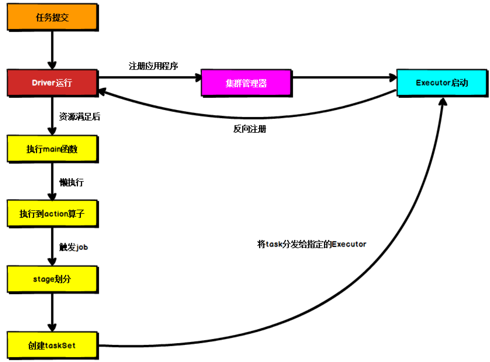

# 『pyspark』一：spark基础

## 1、简介

### 1.1 spark VS hadoop

spark和hadoop的根本差异是多个作业之间的数据通信问题：spark多个作业之间数据通信是基于**内存**，而hadoop是基于**磁盘**。

### 1.2 核心模块

- spark core：提供spark最基础与最核心的功能
- spark SQL：spark用来操作结构化数据的组件，可以使用SQL来查询数据
- spark Streaming：spark平台上针对实时数据进行流式计算的组件，提供了丰富的处理数据流的API
- spark MLlib：机器学习算法库
- spark GraphX：面向图计算提供的框架与算法库

## 2、spark运行环境

Spark作为一个数据处理框架和计算引擎，被设计在所有常见的集群环境中运行, 在国内工作中主流的环境为Yarn，不过逐渐容器式环境也慢慢流行起来。



### 1.1 Local模式

不需要其他任何节点资源就可以在本地执行Spark代码的环境，一般用于教学，调试，演示等。

本地模式提交应用：

```shell
bin/spark submit \
--class org.apache.spark.examples.SparkPi \
--master local[2] \
./examples/jars/spark examples_2.12 3.0.0.jar \
10
```

其中：

- --class表示要执行程序的主类，此处可以更换为咱们自己写的应用程序；
- --master local[2] 部署模式，默认为本地模式，数字表示分配的虚拟CPU核数量；
- spark-examples_2.12-3.0.0.jar 运行的应用类所在的jar包，实际使用时，可以设定为咱们自己打的jar包；
- 数字10表示程序的入口参数，用于设定当前应用的任务数量；

### 1.2 Standalone模式

local本地模式毕竟只是用来进行练习演示的，真实工作中还是要将应用提交到对应的集群中去执行，这里我们来看看只使用Spark自身节点运行的集群模式，也就是我们所谓的独立部署（Standalone）模式。Spark的Standalone模式体现了经典的master-slave模式。

集群规划:



Standalone模式提交应用：

```shell
bin/spark submit \
--class org.apache.spark.examples.SparkPi \
--master spark:// linux1 :7077 \
./examples/jars/spark examples_2.12 3.0.0.jar \
10
```

- --class表示要执行程序的主类；
- --master spark://linux1:7077 独立部署模式，连接到Spark集群；
- spark-examples_2.12-3.0.0.jar 运行类所在的jar包；
- 数字10表示程序的入口参数，用于设定当前应用的任务数量；



### 1.3 Yarn模式

独立部署（Standalone）模式由Spark自身提供计算资源，无需其他框架提供资源。这种方式降低了和其他第三方资源框架的耦合性，独立性非常强。但是你也要记住，Spark主要是计算框架，而不是资源调度框架，所以本身提供的资源调度并不是它的强项，所以还是和其他专业的资源调度框架集成会更靠谱一些。所以接下来我们来学习在强大的Yarn环境下Spark是如何工作的（其实是因为在国内工作中，Yarn使用的非常多）。

Yarn模式提交应用：

```shell
bin/spark submit \
--class org.apache.spark.examples.SparkPi \
--master yarn \
--deploy-mode cluster \
./examples/jars/spark examples_2.12 3.0.0.jar \
10
```

## 3、Spark 运行架构

### 3.1 运行架构

Spark框架的核心是一个计算引擎，整体来说，它采用了标准 master-slave 的结构。

如下图所示，它展示了一个 Spark执行时的基本结构。图形中的Driver表示master，负责管理整个集群中的作业任务调度。图形中的Executor 则是 slave，负责实际执行任务。



### 3.2 核心组件

#### 3.2.1 计算相关的组件

**（1）Driver**

Spark驱动器节点，用于执行Spark任务中的main方法，负责实际代码的执行工作。

Driver在Spark作业执行时主要负责：

- 将用户程序转化为作业（job）
-  在Executor之间调度任务(task)
- ➢跟踪Executor的执行情况
-  通过UI展示查询运行情况

实际上，我们无法准确地描述Driver的定义，因为在整个的编程过程中没有看到任何有关Driver的字眼。所以简单理解，所谓的Driver就是驱使整个应用运行起来的程序，也称之为Driver类。

**（2）Executor**

Spark Executor是集群中工作节点（Worker）中的一个JVM进程，负责在 Spark 作业中运行具体任务（Task），任务彼此之间相互独立。Spark 应用启动时，Executor节点被同时启动，并且始终伴随着整个 Spark 应用的生命周期而存在。如果有Executor节点发生了故障或崩溃，Spark 应用也可以继续执行，会将出错节点上的任务调度到其他Executor节点上继续运行。

Executor有两个核心功能：

- 负责运行组成Spark应用的任务，并将结果返回给驱动器进程
- 它们通过自身的块管理器（Block Manager）为用户程序中要求缓存的 RDD 提供内存式存储。RDD 是直接缓存在Executor进程内的，因此任务可以在运行时充分利用缓存数据加速运算。

#### 3.2.2 资源相关的组件（Master & Worker）

Spark集群的独立部署环境中，不需要依赖其他的资源调度框架，自身就实现了资源调度的功能，所以环境中还有其他两个核心组件：Master和Worker。

**（1）Master**

Master是一个进程，主要负责资源的调度和分配，并进行集群的监控等职责，类似于Yarn环境中的RM。

**（2）Worker**

Worker也是进程，一个Worker运行在集群中的一台服务器上，由Master分配资源对数据进行并行的处理和计算，类似于Yarn环境中NM。

#### 3.2.3 计算与资源交互（ApplicationMaster）

Hadoop用户向YARN集群提交应用程序时，提交程序中应该包含ApplicationMaster，用于向资源调度器申请执行任务的资源容器Container，运行用户自己的程序任务job，监控整个任务的执行，跟踪整个任务的状态，处理任务失败等异常情况。

说的简单点就是，ResourceManager（资源）和Driver（计算）之间的解耦合靠的就是ApplicationMaster。

Driver -> AM -> Master

### 3.3 核心概念

#### 3.3.1 Executor 与Core

Spark Executor是集群中运行在工作节点（Worker）中的一个JVM进程，是整个集群中的专门用于计算的节点。在提交应用中，可以提供参数指定计算节点的个数，以及对应的资源。这里的资源一般指的是工作节点Executor的内存大小和使用的虚拟CPU核（Core）数量。

应用程序相关启动参数如下：



#### 3.3.2 并行度（Parallelism）

在分布式计算框架中一般都是多个任务同时执行，由于任务分布在不同的计算节点进行计算，所以能够真正地实现多任务并行执行，记住，这里是并行，而不是并发。这里我们将整个集群并行执行任务的数量称之为并行度。那么一个作业到底并行度是多少呢？这个取决于框架的默认配置。应用程序也可以在运行过程中动态修改。

#### 3.3.3 有向无环图（DAG）



大数据计算引擎框架我们根据使用方式的不同一般会分为四类，其中第一类就是Hadoop所承载的MapReduce,它将计算分为两个阶段，分别为 Map阶段 和 Reduce阶段。对于上层应用来说，就不得不想方设法去拆分算法，甚至于不得不在上层应用实现多个 Job 的串联，以完成一个完整的算法，例如迭代计算。 由于这样的弊端，催生了支持 DAG 框架的产生。因此，支持 DAG 的框架被划分为第二代计算引擎。如 Tez 以及更上层的 Oozie。这里我们不去细究各种 DAG 实现之间的区别，不过对于当时的 Tez 和 Oozie 来说，大多还是批处理的任务。接下来就是以 Spark 为代表的第三代的计算引擎。第三代计算引擎的特点主要是 Job 内部的 DAG 支持（不跨越 Job），以及实时计算。

这里所谓的有向无环图，并不是真正意义的图形，而是由Spark程序直接映射成的数据流的高级抽象模型。简单理解就是将整个程序计算的执行过程用图形表示出来,这样更直观，更便于理解，可以用于表示程序的拓扑结构。

DAG（Directed Acyclic Graph）有向无环图是由点和线组成的拓扑图形，该图形具有方向，不会闭环。

#### 3.3.4 提交流程

所谓的提交流程，其实就是我们开发人员根据需求写的应用程序通过Spark客户端提交给Spark运行环境执行计算的流程。在不同的部署环境中，这个提交过程基本相同，但是又有细微的区别，因为国内工作中，将Spark引用部署到Yarn环境中会更多一些，所以这里的提交流程是基于Yarn环境的。



Spark应用程序提交到Yarn环境中执行的时候，一般会有两种部署执行的方式：Client和Cluster。两种模式主要区别在于：**Driver程序的运行节点位置**。

**（1）Yarn Cl ient 模式**：Driver程序运行在集群之外

Client模式将用于监控和调度的Driver模块在客户端执行，而不是在Yarn中，所以一般用于测试。

- Driver在任务提交的本地机器上运行；
- Driver启动后会和ResourceManager通讯申请启动ApplicationMaster；
- ResourceManager分配container，在合适的NodeManager上启动ApplicationMaster，负责向ResourceManager申请Executor内存；
- ResourceManager接到ApplicationMaster的资源申请后会分配container，然后ApplicationMaster在资源分配指定的NodeManager上启动Executor进程；
- Executor进程启动后会向Driver反向注册，Executor全部注册完成后Driver开始执行main函数；
- 之后执行到Action算子时，触发一个Job，并根据宽依赖开始划分stage，每个stage生成对应的TaskSet，之后将task分发到各个Executor上执行。

**（2）Yarn Cluster 模式**：Driver程序在集群里面运行

Cluster模式将用于监控和调度的Driver模块启动在Yarn集群资源中执行。一般应用于实际生产环境。

- 在YARN Cluster模式下，任务提交后会和ResourceManager通讯申请启动ApplicationMaster；
- 随后ResourceManager分配container，在合适的NodeManager上启动ApplicationMaster，此时的ApplicationMaster就是Driver；
- Driver启动后向ResourceManager申请Executor内存，ResourceManager接到ApplicationMaster的资源申请后会分配container，然后在合适的NodeManager上启动Executor进程；
- Executor进程启动后会向Driver反向注册，Executor全部注册完成后Driver开始执行main函数；
- 之后执行到Action算子时，触发一个Job，并根据宽依赖开始划分stage，每个stage生成对应的TaskSet，之后将task分发到各个Executor上执行。


