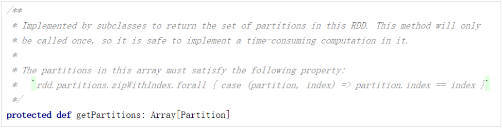

# 『pyspark』二：RDD基础

Spark计算框架为了能够进行高并发和高吞吐的数据处理，封装了三大数据结构，用于处理不同的应用场景。三大数据结构分别是：

- RDD : 弹性分布式数据集
- 累加器：分布式共享只写变量
- 广播变量：分布式共享只读变量

## 1、什么是RDD

RDD（Resilient Distributed Dataset）叫做弹性分布式数据集，是Spark中最基本的**数据处理模型**。代码中是一个抽象类，它代表一个弹性的、不可变、可分区、里面的元素可并行计算的集合。

RDD是最小的计算单元：

> **为什么RDD是最小的计算单元？**
>
> 因为实际项目中的数据处理逻辑比较复杂，逻辑越复杂，拓展程序越麻烦，所以把RDD封装成最小计算单元，每个RDD都保存一个简单的计算逻辑，把多个RDD的逻辑关联起来就可以实现复杂的逻辑。

## 2、RDD数据处理的理解

### 2.1 IO基本实现原理

IO：Input & Output     

**（1）字节流**

**（2）缓冲流**

加缓冲区，提升性能

**（3）字符流**

IO操作体现了装饰者设计模式（在原来的功能基础之上，扩展更丰富的功能）。

### 2.2 RDD与IO之间的关系

WordCount:

总结：

- RDD的数据处理方式类似于IO流，也有装饰者设计模式；
- RDD的数据只有在调用collect方法时，才会真正执行业务逻辑操作，之前的封装全部都是功能的拓展；
- RDD是不保存数据的，但是IO可以临时保存一部分数据；

RDD数据处理演示：

## 3、特点

- 弹性
  - 存储的弹性：内存与磁盘的自动切换；
  - 容错的弹性：数据丢失可以自动恢复；
  - 计算的弹性：计算出错重试机制；
  - 分片的弹性：可根据需要重新分片。
- 分布式：数据存储在大数据集群不同节点上
- 数据集： RDD 封装了计算逻辑，并不保存数据
- 数据抽象： RDD 是一个抽象类，需要子类具体实现
- 不可变：RDD 封装了计算逻辑，是不可以改变的，想要改变，只能产生新的 RDD ，在新的 RDD 里面封装计算逻辑
- 可分区、并行计算

## 4、五大核心属性

- 分区列表

RDD数据结构中存在分区列表，用于执行任务时并行计算，是实现分布式计算的重要属性。

- 分区计算函数

Spark在计算时，是使用分区函数对每一个分区进行计算。

- RDD之间的依赖关系

RDD是计算模型的封装，当需求中需要将多个计算模型进行组合时，就需要将多个RDD建立依赖关系。

- 分区器（可选）

当数据为KV 类型数据时，可以通过设定分区器自定义数据的分区。

- 首选位置（可选）

判断计算发送到哪个节点，效率最优（移动数据不如移动计算）。

## 5、执行原理

从计算的角度来讲，数据处理过程中需要计算资源（内存& CPU ）和计算模型（逻辑）。执行时，需要将计算资源和计算模型进行协调和整合。

Spark框架在执行时，先申请资源，然后将应用程序的数据处理逻辑分解成一个一个的计算任务。然后将任务发到已经分配资源的计算节点上 , 按照指定的计算模型进行数据计算。最后得到计算结果。

RDD是 Spark 框架中用于数据处理的核心模型，接下来我们看看，在 Yarn 环境中， RDD的工作原理：

- 启动 Yarn 集群环境

- Spark 通过申请资源创建调度节点和计算节点

- Spark 框架根据需求将计算逻辑根据分区划分成不同的任务

- 调度节点将任务根据计算节点状态发送到对应的计算节点进行计算

从以上流程可以看出RDD 在整个流程中主要用于将逻辑进行封装，并生成 Task 发送给Executor 节点执行计算，后续看下 Spark 框架中 RDD 具体是如何进行数据处理的。

