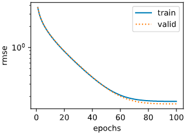

# 建模流程

## 1、数据预处理

数据预处理主要包括两个函数`data.TensorDataset`和`data.DataLoader`，其中：

- `data.TensorDataset`：用来对 tensor 进行打包，就好像 python 中的 zip 功能，生成的数据集可索引可迭代。
- `data.DataLoader`：用来包装所使用的数据，每次抛出一批数据（batch_size）。

```python
# 划分训练集和测试集样本
train_features = torch.tensor(all_features[:n_train].values, dtype=torch.float)
test_features = torch.tensor(all_features[n_train:].values, dtype=torch.float)
train_labels = torch.tensor(train_data.SalePrice.values, dtype=torch.float).view(-1, 1)

# 构建dataset和DataLoader
dataset = torch.utils.data.TensorDataset(train_features, train_labels)
train_iter = torch.utils.data.DataLoader(dataset, batch_size, shuffle=True)  # 用于每个epoch的梯度下降
```

数据预处理后，构造数据迭代器train_iter，用于模型训练中每个epoch的梯度下降。

## 2、模型

模型包括三部分：网络结构、优化器和损失函数，这三部分是深度学习模型需要根据实际需求进行选择和调整的部分，即不同模型的的差异所在，而模型训练过程基本不存在差别。

### 2.1 网络结构

负责数据的加工、处理和转换。

```python
def get_net(feature_num):
    net = nn.Linear(feature_num, 1)
    for param in net.parameters():
        nn.init.normal_(param, mean=0, std=0.01)
    return net

net = get_net(train_features.shape[1])
```

### 2.2 优化器

负责网络参数的更新迭代。

```python
optimizer = torch.optim.Adam(params=net.parameters(), lr=learning_rate, weight_decay=weight_decay) 
```

### 2.3 损失函数

负责计算模型预测结果与实际表现的差异，训练模型就是为了减少损失函数，达到更好的预测效果。

```python
loss = torch.nn.MSELoss() 
```

### 2.4 评价函数

构造评价函数来评估模型训练的好坏：

```python
def log_rmse(net, features, labels):
    with torch.no_grad():
        # 将小于1的值设成1，使得取对数时数值更稳定
        clipped_preds = torch.max(net(features), torch.tensor(1.0))
        rmse = torch.sqrt(loss(clipped_preds.log(), labels.log()))
    return rmse.item()
```

## 3、模型训练

模型的几个部分定义好之后，训练过程基本是固定的，如下：

```python
train_ls, test_ls = [], []
for epoch in range(num_epochs):
    for X, y in train_iter:
        l = loss(net(X.float()), y.float())
        optimizer.zero_grad()
        l.backward()
        optimizer.step()
    train_ls.append(log_rmse(net, train_features, train_labels))
    if test_labels is not None:
        test_ls.append(log_rmse(net, test_features, test_labels))
```

## 4、K折交叉验证

只做一次数据划分，模型表现具有偶然性，可以使用K折交叉验证取平均值，获得更具说服力的评估结果。

```python
def get_k_fold_data(k, i, X, y):
    # 返回第i折交叉验证时所需要的训练和验证数据
    assert k > 1
    fold_size = X.shape[0] // k
    X_train, y_train = None, None
    for j in range(k):
        idx = slice(j * fold_size, (j + 1) * fold_size)
        X_part, y_part = X[idx, :], y[idx]
        if j == i:
            X_valid, y_valid = X_part, y_part
        elif X_train is None:
            X_train, y_train = X_part, y_part
        else:
            X_train = torch.cat((X_train, X_part), dim=0)
            y_train = torch.cat((y_train, y_part), dim=0)
    return X_train, y_train, X_valid, y_valid

def k_fold(k, X_train, y_train, num_epochs,
           learning_rate, weight_decay, batch_size):
    train_l_sum, valid_l_sum = 0, 0
    for i in range(k):
        data = get_k_fold_data(k, i, X_train, y_train)
        net = get_net(X_train.shape[1])
        train_ls, valid_ls = train(net, *data, num_epochs, learning_rate,
                                   weight_decay, batch_size)
        train_l_sum += train_ls[-1]
        valid_l_sum += valid_ls[-1]
        if i == 0:
            d2l.semilogy(range(1, num_epochs + 1), train_ls, 'epochs', 'rmse',
                         range(1, num_epochs + 1), valid_ls,
                         ['train', 'valid'])
        print('fold %d, train rmse %f, valid rmse %f' % (i, train_ls[-1], valid_ls[-1]))
    return train_l_sum / k, valid_l_sum / k
    
k, num_epochs, lr, weight_decay, batch_size = 5, 100, 5, 0, 64
train_l, valid_l = k_fold(k, train_features, train_labels, num_epochs, lr, weight_decay, batch_size)
print('%d-fold validation: avg train rmse %f, avg valid rmse %f' % (k, train_l, valid_l))

# fold 0, train rmse 0.170121, valid rmse 0.156678
# fold 1, train rmse 0.162696, valid rmse 0.191865
# fold 2, train rmse 0.163893, valid rmse 0.168560
# fold 3, train rmse 0.167923, valid rmse 0.154610
# fold 4, train rmse 0.163136, valid rmse 0.182722
# 5-fold validation: avg train rmse 0.165554, avg valid rmse 0.170887
```

在一次训练过程中，每个epoch训练后模型的损失rmse如下：




