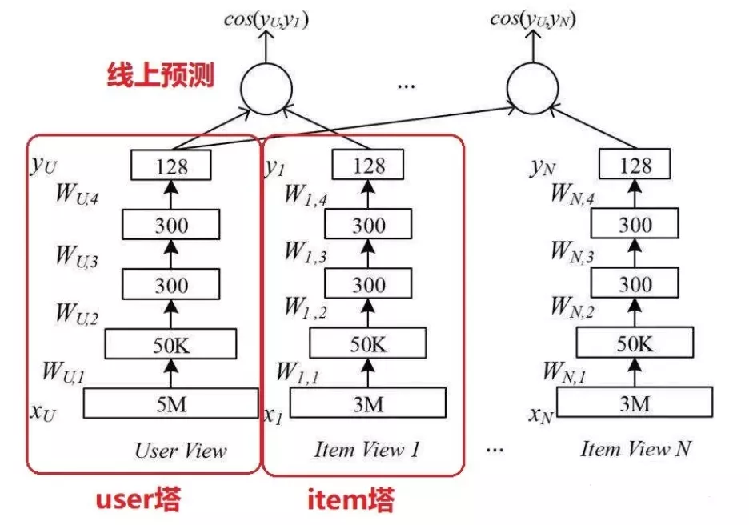
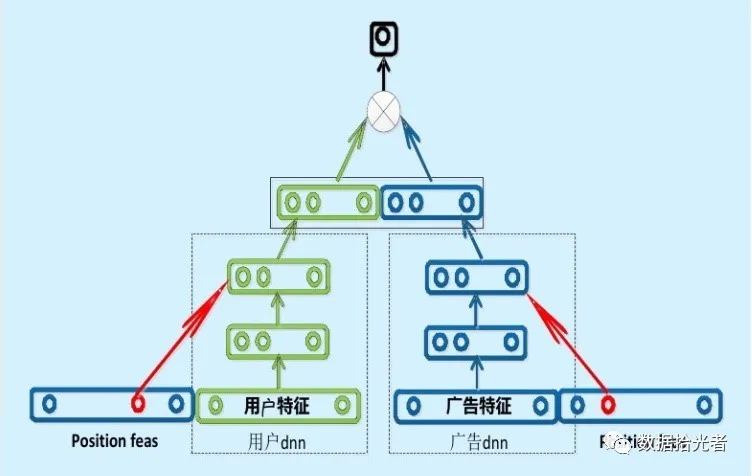
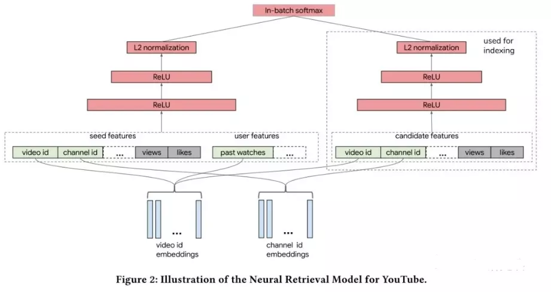
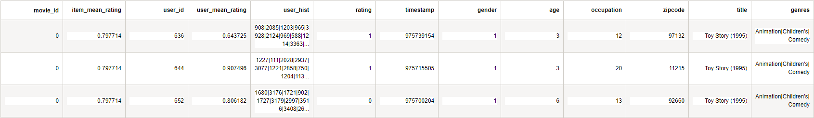

# 模型实现-DSSM

本文介绍用于商业兴趣建模的 DSSM 双塔模型。作为推荐领域中大火的双塔模型，因为效果不错并且对工业界十分友好，所以被各大厂广泛应用于推荐系统中。

通过构建 user 和 item 两个独立的子网络，将训练好的两个“塔”中的 user embedding 和 item embedding 各自缓存到内存数据库中（redis）。线上预测的时候只需要在内存中计算相似度运算即可。DSSM 双塔模型是推荐领域不中不得不会的重要模型。

以 YouTube 视频推荐系统为例，一般推荐系统包括两个部分：

- 第一步是**召回模型**，主要是进行初筛操作，从海量视频资源池中初步选择一部分用户可能感兴趣的视频数据子集，从数量上看可能是从千万级别筛选出百级别。
- 第二步是**精排模型**，主要作用是对上面找到的百级别的视频子集进一步精筛，从数量上看可能是从百级别筛选出几十级别。然后根据得分高低排序，生成一个排序列表作为用户的候选播放列表从而完成视频推荐任务。

广告推荐领域中使用的 DSSM 双塔模型是从广告维度为广告主推荐一定数量的人群，从数量上看是从百亿级别人群中找出百万级人群用于投放广告，所以是召回模型。

本文主要分为以下几个部分：

- DSSM模型理论知识
- 工业界使用的双塔模型
- pytorch实现双塔模型

## 1、DSSM模型理论知识

### 1.1 DSSM模型的原理

DSSM(Deep Structured Semantic Models)也叫深度语义匹配模型，最早是微软发表的一篇应用于 NLP 领域中计算语义相似度任务的文章。

DSSM 深度语义匹配模型原理很简单：获取搜索引擎中的用户搜索 query 和 doc 的海量曝光和点击日志数据，训练阶段分别用复杂的深度学习网络构建 query 侧特征的 query embedding 和 doc 侧特征的 doc embedding，线上 infer 时通过计算两个语义向量的 cos 距离来表示语义相似度，最终获得语义相似模型。**这个模型既可以获得语句的低维语义向量表达 sentence embedding，还可以预测两句话的语义相似度**。

### 1.2 DSSM模型的结构

DSSM 模型总的来说可以分成三层结构，分别是输入层、表示层和匹配层。以广告推荐中的 DSSM 双塔模型结构为例，如下图所示：


#### 1.2.1 输入层

模型训练分成两座不同的“塔”分别进行，其实也就是两个不同的神经网络。其中一座塔是用于生成 user embedding。输入用户特征训练数据，用户特征包括用户稠密特征和用户稀疏特征，其中用户稠密特征进行 one-hot 编码操作，用户稀疏特征进行 embedding 降维到低维空间(64 或者 32 维)，然后进行特征拼接操作。广告侧和用户侧类似。

从后续的代码实现中可以知道，整个工程最复杂的部分就是这块特征处理的部分。

#### 1.2.2 表示层

将拼接好的特征提供给各自的深度学习网络模型。用户特征和广告特征经过各自的两个全连接层后转化成了固定长度的向量，这里得到了维度相同的 user embedding 和 ad embedding。各塔内部的网络层数和维度可以不同，但是输出的维度必须是一样的，这样才能在匹配层进行运算。项目中 user embedding 和 ad embedding 维度都是 32。

图中表示层的结构是比较简单的实现方式，只使用了两层全连接网络来作为特征抽取器，实际使用中有很多变种，比如 CNN-DSSM、LSTM-DSSM 等，现在深度学习领域公认最强的特征抽取器是 Transformer，也可以考虑在表示层中加入 Transformer。

#### 1.2.3 匹配层

模型训练好了之后会分别得到 user embedding 和 ad embedding，将它们存储到 Redis 这一类内存数据库中。如果要为某个特定的广告推荐人群，则将该广告的 ad embedding 分别和所有人群的 user embedding 计算 cos 相似度。选择距离最近的 N 个人群子集作为广告投放人群，这样就完成了广告推荐任务。模型训练过程中将 cos 函数得到的结果进入 sigmoid 函数和真实标签计算 logloss，查看网络是否收敛。模型评估主要使用 auc 指标。

## 2、工业界使用的双塔模型

DSSM 深度语义匹配模型最早是应用于 NLP 领域中计算语义相似度任务。因为语义匹配本身是一种排序问题，和推荐场景不谋而合，所以 DSSM 模型被自然的引入到推荐领域中。**DSSM 模型分别使用相对独立的两个复杂网络构建用户相关特征的 user embedding 和 item 相关特征的 item embedding，所以称为双塔模型**。

### 2.1 朴素的DSSM双塔模型（2005）

双塔模型最大的特点是 user 和 item 是独立的两个子网络，对工业界十分友好。将两个塔各自缓存，线上预测的时候只需要在内存中进行相似度运算即可。下面是 2015 年朴素的 DSSM 双塔模型结构：



### 2.2 百度的双塔模型



百度的双塔模型分别使用复杂的网络对用户相关的特征和广告相关的特征进行 embedding，分别形成两个独立的塔，在最后的交叉层之前用户特征和广告特征之间没有任何交互。这种方案就是训练时引入更多的特征完成复杂网络离线训练，然后将得到的 user embedding 和 item embedding 存入 Redis 这一类内存数据库中。线上预测时使用 LR、浅层 NN 等轻量级模型或者更方便的相似距离计算方式。这也是业界很多大厂采用的推荐系统的构造方式。

### 2.3 谷歌的双塔模型（2019）

2019 年谷歌推出自己的双塔模型，文章的核心思想是：在大规模的推荐系统中，利用双塔模型对 user-item 对的交互关系进行建模，从而学习【用户，上下文】向量和【item】向量的关联。针对大规模流数据，提出 in-batch softmax 损失函数与流数据频率估计方法更好的适应 item 的多种数据分布。利用双塔模型构建 YouTube 视频推荐系统，对于用户侧的塔根据用户观看视频特征构建 user embedding，对于视频侧的塔根据视频特征构建 video emebdding。两个塔分别是相互独立的网络。



## 3、pytorch实现双塔模型

根据以上双塔模型的介绍，逐层分析DSSM的代码实现过程，下面以movieLens为例说明：



### 3.1 DSSM双塔模型

首先，先看一下DSSM双塔模型的实现，不考虑模型实现中的细节，双塔结构的实现十分简洁易懂，如下：

```python
class DSSM(BaseTower):
    """DSSM双塔模型"""
    def __init__(self, user_dnn_feature_columns, item_dnn_feature_columns, gamma=1, dnn_use_bn=True,
                 dnn_hidden_units=(300, 300, 128), dnn_activation='relu', l2_reg_dnn=0, l2_reg_embedding=1e-6,
                 dnn_dropout=0, init_std=0.0001, seed=1024, task='binary', device='cpu', gpus=None):
        super(DSSM, self).__init__(user_dnn_feature_columns, item_dnn_feature_columns,
                                   l2_reg_embedding=l2_reg_embedding, init_std=init_std, seed=seed, task=task,
                                   device=device, gpus=gpus)
		
        # user塔的表示层
        self.user_dnn = DNN(compute_input_dim(user_dnn_feature_columns), dnn_hidden_units,
                            activation=dnn_activation, l2_reg=l2_reg_dnn, dropout_rate=dnn_dropout,
                            use_bn=dnn_use_bn, init_std=init_std, device=device)
		
        # item塔的表示层
        self.item_dnn = DNN(compute_input_dim(item_dnn_feature_columns), dnn_hidden_units,
                            activation=dnn_activation, l2_reg=l2_reg_dnn, dropout_rate=dnn_dropout,
                            use_bn=dnn_use_bn, init_std=init_std, device=device)

        self.user_dnn_embedding = None
        self.item_dnn_embedding = None

        self.gamma = gamma
        self.l2_reg_embedding = l2_reg_embedding
        self.seed = seed
        self.task = task
        self.device = device
        self.gpus = gpus

    def forward(self, inputs):
        # user塔
        user_sparse_embedding_list, user_dense_value_list = \
            self.input_from_feature_columns(inputs, self.user_dnn_feature_columns, self.user_embedding_dict)  # user输入层
        user_dnn_input = combined_dnn_input(user_sparse_embedding_list, user_dense_value_list)
        self.user_dnn_embedding = self.user_dnn(user_dnn_input)  # user表示层
		
        # item塔
        item_sparse_embedding_list, item_dense_value_list = \
            self.input_from_feature_columns(inputs, self.item_dnn_feature_columns, self.item_embedding_dict)  # item输入层
        item_dnn_input = combined_dnn_input(item_sparse_embedding_list, item_dense_value_list)
        self.item_dnn_embedding = self.item_dnn(item_dnn_input)  # item表示层
		
        # 匹配层
        score = Cosine_Similarity(self.user_dnn_embedding, self.item_dnn_embedding, gamma=self.gamma)

        output = self.out(score)

        return output
```

DSSM继承自BaseTower类，BaseTower定义了模型的基本操作，比如输入层的数据预处理、fit()、evaluate()、predict()等方法，具体实现如下：

```python
class BaseTower(nn.Module):
    def __init__(self, user_dnn_feature_columns, item_dnn_feature_columns, l2_reg_embedding=1e-5,
                 init_std=0.0001, seed=1024, task='binary', device='cpu', gpus=None):
        super(BaseTower, self).__init__()
        torch.manual_seed(seed)

        self.reg_loss = torch.zeros((1,), device=device)
        self.aux_loss = torch.zeros((1,), device=device)
        self.device = device
        self.gpus = gpus
        if self.gpus and str(self.gpus[0]) not in self.device:
            raise ValueError("`gpus[0]` should be the same gpu with `device`")

        self.feature_index = build_input_features(user_dnn_feature_columns + item_dnn_feature_columns)

        self.user_dnn_feature_columns = user_dnn_feature_columns
        self.user_embedding_dict = create_embedding_matrix(self.user_dnn_feature_columns, init_std,
                                                           sparse=False, device=device)

        self.item_dnn_feature_columns = item_dnn_feature_columns
        self.item_embedding_dict = create_embedding_matrix(self.item_dnn_feature_columns, init_std,
                                                           sparse=False, device=device)

        self.regularization_weight = []
        self.add_regularization_weight(self.user_embedding_dict.parameters(), l2=l2_reg_embedding)
        self.add_regularization_weight(self.item_embedding_dict.parameters(), l2=l2_reg_embedding)

        self.out = PredictionLayer(task,)
        self.to(device)

        # parameters of callbacks
        self._is_graph_network = True  # used for ModelCheckpoint
        self.stop_training = False  # used for EarlyStopping

    def fit(self, x=None, y=None, batch_size=None, epochs=1, verbose=1, initial_epoch=0, validation_split=0.,
            validation_data=None, shuffle=True, callbacks=None):
        if isinstance(x, dict):
            x = [x[feature] for feature in self.feature_index]

        do_validation = False
        if validation_data:
            do_validation = True
            if len(validation_data) == 2:
                val_x, val_y = validation_data
                val_sample_weight = None
            elif len(validation_data) == 3:
                val_x, val_y, val_sample_weight = validation_data
            else:
                raise ValueError(
                    'When passing a `validation_data` argument, '
                    'it must contain either 2 items (x_val, y_val), '
                    'or 3 items (x_val, y_val, val_sample_weights), '
                    'or alternatively it could be a dataset or a '
                    'dataset or a dataset iterator. '
                    'However we received `validation_data=%s`' % validation_data)

            if isinstance(val_x, dict):
                val_x = [val_x[feature] for feature in self.feature_index]

        elif validation_split and 0 < validation_split < 1.:
            do_validation = True
            if hasattr(x[0], 'shape'):
                split_at = int(x[0].shape[0] * (1. - validation_split))
            else:
                split_at = int(len(x[0]) * (1. - validation_split))

            x, val_x = (slice_arrays(x, 0, split_at),
                        slice_arrays(x, split_at))
            y, val_y = (slice_arrays(y, 0, split_at),
                        slice_arrays(y, split_at))

        else:
            val_x = []
            val_y = []

        for i in range(len(x)):
            if len(x[i].shape) == 1:
                x[i] = np.expand_dims(x[i], axis=1)

        train_tensor_data = Data.TensorDataset(torch.from_numpy(
            np.concatenate(x, axis=-1)), torch.from_numpy(y))
        if batch_size is None:
            batch_size = 256

        model = self.train()
        loss_func = self.loss_func
        optim = self.optim

        if self.gpus:
            print('parallel running on these gpus:', self.gpus)
            model = torch.nn.DataParallel(model, device_ids=self.gpus)
            batch_size *= len(self.gpus)  # input `batch_size` is batch_size per gpu
        else:
            print(self.device)

        train_loader = DataLoader(dataset=train_tensor_data, shuffle=shuffle, batch_size=batch_size)

        sample_num = len(train_tensor_data)
        steps_per_epoch = (sample_num - 1) // batch_size + 1

        # train
        print("Train on {0} samples, validate on {1} samples, {2} steps per epoch".format(
            len(train_tensor_data), len(val_y), steps_per_epoch))
        for epoch in range(initial_epoch, epochs):
            epoch_logs = {}
            start_time = time.time()
            loss_epoch = 0
            total_loss_epoch = 0
            train_result = {}

            with tqdm(enumerate(train_loader), disable=verbose != 1) as t:
                for _, (x_train, y_train) in t:
                    x = x_train.to(self.device).float()
                    y = y_train.to(self.device).float()

                    y_pred = model(x).squeeze()

                    optim.zero_grad()
                    loss = loss_func(y_pred, y.squeeze(), reduction='sum')
                    reg_loss = self.get_regularization_loss()

                    total_loss = loss + reg_loss + self.aux_loss

                    loss_epoch += loss.item()
                    total_loss_epoch += total_loss.item()
                    total_loss.backward()
                    optim.step()

                    if verbose > 0:
                        for name, metric_fun in self.metrics.items():
                            if name not in train_result:
                                train_result[name] = []
                            train_result[name].append(metric_fun(
                                y.cpu().data.numpy(), y_pred.cpu().data.numpy().astype('float64')
                            ))

            # add epoch_logs
            epoch_logs["loss"] = total_loss_epoch / sample_num
            for name, result in train_result.items():
                epoch_logs[name] = np.sum(result) / steps_per_epoch

            if do_validation:
                eval_result = self.evaluate(val_x, val_y, batch_size)
                for name, result in eval_result.items():
                    epoch_logs["val_" + name] = result

            if verbose > 0:
                epoch_time = int(time.time() - start_time)
                print('Epoch {0}/{1}'.format(epoch + 1, epochs))

                eval_str = "{0}s - loss: {1: .4f}".format(epoch_time, epoch_logs["loss"])

                for name in self.metrics:
                    eval_str += " - " + name + ": {0: .4f} ".format(epoch_logs[name]) + " - " + \
                                "val_" + name + ": {0: .4f}".format(epoch_logs["val_" + name])
                print(eval_str)
            if self.stop_training:
                break

    def evaluate(self, x, y, batch_size=256):
        pred_ans = self.predict(x, batch_size)
        eval_result = {}
        for name, metric_fun in self.metrics.items():
            eval_result[name] = metric_fun(y, pred_ans)
        return eval_result

    def predict(self, x, batch_size=256):
        model = self.eval()
        if isinstance(x, dict):
            x = [x[feature] for feature in self.feature_index]
        for i in range(len(x)):
            if len(x[i].shape) == 1:
                x[i] = np.expand_dims(x[i], axis=1)

        tensor_data = Data.TensorDataset(
            torch.from_numpy(np.concatenate(x, axis=-1))
        )
        test_loader = DataLoader(
            dataset=tensor_data, shuffle=False, batch_size=batch_size
        )

        pred_ans = []
        with torch.no_grad():
            for _, x_test in enumerate(test_loader):
                x = x_test[0].to(self.device).float()

                y_pred = model(x).cpu().data.numpy()
                pred_ans.append(y_pred)

        return np.concatenate(pred_ans).astype("float64")

    def input_from_feature_columns(self, X, feature_columns, embedding_dict, support_dense=True):
        sparse_feature_columns = list(
            filter(lambda x: isinstance(x, SparseFeat), feature_columns)) if len(feature_columns) else []

        dense_feature_columns = list(
            filter(lambda x: isinstance(x, DenseFeat), feature_columns)) if len(feature_columns) else []

        varlen_sparse_feature_columns = list(
            filter(lambda x: isinstance(x, VarLenSparseFeat), feature_columns)) if feature_columns else []

        if not support_dense and len(dense_feature_columns) > 0:
            raise ValueError(
                "DenseFeat is not supported in dnn_feature_columns")

        sparse_embedding_list = [embedding_dict[feat.embedding_name](
            X[:, self.feature_index[feat.name][0]:self.feature_index[feat.name][1]].long()) for
            feat in sparse_feature_columns]

        varlen_sparse_embedding_list = get_varlen_pooling_list(embedding_dict, X, self.feature_index,
                                                               varlen_sparse_feature_columns, self.device)

        dense_value_list = [X[:, self.feature_index[feat.name][0]:self.feature_index[feat.name][1]] for feat in
                            dense_feature_columns]

        return sparse_embedding_list + varlen_sparse_embedding_list, dense_value_list

    def compute_input_dim(self, feature_columns, include_sparse=True, include_dense=True, feature_group=False):
        sparse_feature_columns = list(
            filter(lambda x: isinstance(x, (SparseFeat, VarLenSparseFeat)), feature_columns)) if len(
            feature_columns) else []
        dense_feature_columns = list(
            filter(lambda x: isinstance(x, DenseFeat), feature_columns)) if len(feature_columns) else []

        dense_input_dim = sum(
            map(lambda x: x.dimension, dense_feature_columns))
        if feature_group:
            sparse_input_dim = len(sparse_feature_columns)
        else:
            sparse_input_dim = sum(feat.embedding_dim for feat in sparse_feature_columns)
        input_dim = 0
        if include_sparse:
            input_dim += sparse_input_dim
        if include_dense:
            input_dim += dense_input_dim
        return input_dim

    def add_regularization_weight(self, weight_list, l1=0.0, l2=0.0):
        if isinstance(weight_list, torch.nn.parameter.Parameter):
            weight_list = [weight_list]
        else:
            weight_list = list(weight_list)
        self.regularization_weight.append((weight_list, l1, l2))

    def get_regularization_loss(self):
        total_reg_loss = torch.zeros((1,), device=self.device)
        for weight_list, l1, l2 in self.regularization_weight:
            for w in weight_list:
                if isinstance(w, tuple):
                    parameter = w[1]  # named_parameters
                else:
                    parameter = w
                if l1 > 0:
                    total_reg_loss += torch.sum(l1 * torch.abs(parameter))
                if l2 > 0:
                    try:
                        total_reg_loss += torch.sum(l2 * torch.square(parameter))
                    except AttributeError:
                        total_reg_loss += torch.sum(l2 * parameter * parameter)

        return total_reg_loss

    def add_auxiliary_loss(self, aux_loss, alpha):
        self.aux_loss = aux_loss * alpha

    def compile(self, optimizer, loss=None, metrics=None):
        self.metrics_names = ["loss"]
        self.optim = self._get_optim(optimizer)
        self.loss_func = self._get_loss_func(loss)
        self.metrics = self._get_metrics(metrics)

    def _get_optim(self, optimizer):
        if isinstance(optimizer, str):
            if optimizer == "sgd":
                optim = torch.optim.SGD(self.parameters(), lr=0.01)
            elif optimizer == "adam":
                optim = torch.optim.Adam(self.parameters())  # 0.001
            elif optimizer == "adagrad":
                optim = torch.optim.Adagrad(self.parameters())  # 0.01
            elif optimizer == "rmsprop":
                optim = torch.optim.RMSprop(self.parameters())
            else:
                raise NotImplementedError
        else:
            optim = optimizer
        return optim

    def _get_loss_func(self, loss):
        if isinstance(loss, str):
            if loss == "binary_crossentropy":
                loss_func = F.binary_cross_entropy
            elif loss == "mse":
                loss_func = F.mse_loss
            elif loss == "mae":
                loss_func = F.l1_loss
            else:
                raise NotImplementedError
        else:
            loss_func = loss
        return loss_func

    def _log_loss(self, y_true, y_pred, eps=1e-7, normalize=True, sample_weight=None, labels=None):
        # change eps to improve calculation accuracy
        return log_loss(y_true,
                        y_pred,
                        eps,
                        normalize,
                        sample_weight,
                        labels)

    def _get_metrics(self, metrics, set_eps=False):
        metrics_ = {}
        if metrics:
            for metric in metrics:
                if metric == "binary_crossentropy" or metric == "logloss":
                    if set_eps:
                        metrics_[metric] = self._log_loss
                    else:
                        metrics_[metric] = log_loss
                if metric == "auc":
                    metrics_[metric] = roc_auc_score
                if metric == "mse":
                    metrics_[metric] = mean_squared_error
                if metric == "accuracy" or metric == "acc":
                    metrics_[metric] = lambda y_true, y_pred: accuracy_score(
                        y_true, np.where(y_pred > 0.5, 1, 0))
                self.metrics_names.append(metric)
        return metrics_

    @property
    def embedding_size(self):
        feature_columns = self.dnn_feature_columns
        sparse_feature_columns = list(
            filter(lambda x: isinstance(x, (SparseFeat, VarLenSparseFeat)), feature_columns)) if len(
            feature_columns) else []
        embedding_size_set = set([feat.embedding_dim for feat in sparse_feature_columns])
        if len(embedding_size_set) > 1:
            raise ValueError("embedding_dim of SparseFeat and VarlenSparseFeat must be same in this model!")
        return list(embedding_size_set)[0]
```

下面逐层分析DSSM的代码实现过程：

### 3.2 输入层

BaseTower中定义了输入层的实现，如下。我们将输入特征划分为稠密特征和稀疏特征，其中，稠密特征直接做标准化操作，稀疏特征进行 embedding 降维到低维空间，然后进行特征拼接操作。

```python
def input_from_feature_columns(self, X, feature_columns, embedding_dict, support_dense=True):
    sparse_feature_columns = list(
        filter(lambda x: isinstance(x, SparseFeat), feature_columns)) if len(feature_columns) else []

    dense_feature_columns = list(
        filter(lambda x: isinstance(x, DenseFeat), feature_columns)) if len(feature_columns) else []

    varlen_sparse_feature_columns = list(
        filter(lambda x: isinstance(x, VarLenSparseFeat), feature_columns)) if feature_columns else []

    if not support_dense and len(dense_feature_columns) > 0:
        raise ValueError(
            "DenseFeat is not supported in dnn_feature_columns")

    sparse_embedding_list = [embedding_dict[feat.embedding_name](
        X[:, self.feature_index[feat.name][0]:self.feature_index[feat.name][1]].long()) for
        feat in sparse_feature_columns]

    varlen_sparse_embedding_list = get_varlen_pooling_list(embedding_dict, X, self.feature_index,
                                                           varlen_sparse_feature_columns, self.device)

    dense_value_list = [X[:, self.feature_index[feat.name][0]:self.feature_index[feat.name][1]] for feat in
                        dense_feature_columns]

    return sparse_embedding_list + varlen_sparse_embedding_list, dense_value_list
```

稠密特征的处理较为简单，不做赘述。稀疏特征的处理较为复杂，这里我们将稀疏特征划分为两类：

- 单类别稀疏特征（sparse_feature_columns）：该类特征主要是指user_id、gender、age和occupation等类别编码的特征，每个客户只有惟一的取值，因此只需要使用nn.Embedding进行编码，输出低维表示。
- 变长稀疏特征（varlen_sparse_feature_columns）：该类特征一般为变长序列特征，比如用户观看电影的历史行为序列user_hist，每个客户的行为序列长度不一，因此需要将每个电影的Embedding进行pooling（get_varlen_pooling_list），输出低维表示。

针对稀疏特征的Embedding编码处理如下：

```python
def create_embedding_matrix(feature_columns, init_std=0.0001, linear=False, sparse=False, device='cpu'):
    """创建稀疏特征的embedding矩阵"""
    sparse_feature_columns = list(
        filter(lambda x: isinstance(x, SparseFeat), feature_columns)) if len(feature_columns) else []

    varlen_sparse_feature_columns = list(
        filter(lambda x: isinstance(x, VarLenSparseFeat), feature_columns)) if len(feature_columns) else []

    embedding_dict = nn.ModuleDict({feat.embedding_name: nn.Embedding(feat.vocabulary_size,
                                                                      feat.embedding_dim if not linear else 1)
                                    for feat in sparse_feature_columns + varlen_sparse_feature_columns})

    for tensor in embedding_dict.values():
        nn.init.normal_(tensor.weight, mean=0, std=init_std)

    return embedding_dict.to(device)


def get_varlen_pooling_list(embedding_dict, features, feature_index, varlen_sparse_feature_columns, device):
    """对变长稀疏特征进行pooling处理"""
    varlen_sparse_embedding_list = []

    for feat in varlen_sparse_feature_columns:
        seq_emb = embedding_dict[feat.embedding_name](
                        features[:, feature_index[feat.name][0]:feature_index[feat.name][1]].long())
        if feat.length_name is None:
            seq_mask = features[:, feature_index[feat.name][0]:feature_index[feat.name][1]].long() != 0

            emb = SequencePoolingLayer(mode=feat.combiner, support_masking=True, device=device)([seq_emb, seq_mask])

        else:
            seq_length = features[:, feature_index[feat.length_name][0]:feature_index[feat.length_name][1]].long()

            emb = SequencePoolingLayer(mode=feat.combiner, support_masking=False, device=device)([seq_emb, seq_length])

        varlen_sparse_embedding_list.append(emb)

    return varlen_sparse_embedding_list
```

将输入层处理后的稀疏特征和稠密特征进行拼接操作：

```python
def combined_dnn_input(sparse_embedding_list, dense_value_list):
    if len(sparse_embedding_list) > 0 and len(dense_value_list) > 0:
        sparse_dnn_input = torch.flatten(
            torch.cat(sparse_embedding_list, dim=-1), start_dim=1)
        dense_dnn_input = torch.flatten(
            torch.cat(dense_value_list, dim=-1), start_dim=1)
        return concat_fun([sparse_dnn_input, dense_dnn_input])
    elif len(sparse_embedding_list) > 0:
        return torch.flatten(torch.cat(sparse_embedding_list, dim=-1), start_dim=1)
    elif len(dense_value_list) > 0:
        return torch.flatten(torch.cat(dense_value_list, dim=-1), start_dim=1)
    else:
        raise NotImplementedError
```

### 3.3 表示层

表示层使用朴素的双塔结构，即DNN，DNN的构建过程较为简单，如下：

```python
class DNN(nn.Module):
    def __init__(self, inputs_dim, hidden_units, activation='relu', l2_reg=0, dropout_rate=0, use_bn=False,
                 init_std=0.0001, dice_dim=3, seed=1024, device='cpu'):
        super(DNN, self).__init__()
        self.dropout_rate = dropout_rate
        self.dropout = nn.Dropout(dropout_rate)
        self.seed = seed
        self.l2_reg = l2_reg
        self.use_bn = use_bn
        if len(hidden_units) == 0:
            raise ValueError("hidden_units is empty!!")
        hidden_units = [inputs_dim] + list(hidden_units)

        self.linears = nn.ModuleList(
            [nn.Linear(hidden_units[i], hidden_units[i+1]) for i in range(len(hidden_units) - 1)])

        if self.use_bn:
            self.bn = nn.ModuleList(
                [nn.BatchNorm1d(hidden_units[i+1]) for i in range(len(hidden_units) - 1)])

        self.activation_layers = nn.ModuleList(
            [activation_layer(activation, hidden_units[i+1], dice_dim) for i in range(len(hidden_units) - 1)])

        for name, tensor in self.linears.named_parameters():
            if 'weight' in name:
                nn.init.normal_(tensor, mean=0, std=init_std)

        self.to(device)

    def forward(self, inputs):
        deep_input = inputs
        for i in range(len(self.linears)):
            fc = self.linears[i](deep_input)

            if self.use_bn:
                fc = self.bn[i](fc)

            fc = self.activation_layers[i](fc)

            fc = self.dropout(fc)
            deep_input = fc
        return deep_input
```

### 3.4 匹配层

匹配层计算用户embedding 和物品embedding 的 cos 相似度：

```python
def Cosine_Similarity(query, candidate, gamma=1, dim=-1):
    query_norm = torch.norm(query, dim=dim)
    candidate_norm = torch.norm(candidate, dim=dim)
    cosine_score = torch.sum(torch.multiply(query, candidate), dim=-1)
    cosine_score = torch.div(cosine_score, query_norm*candidate_norm+1e-8)
    cosine_score = torch.clamp(cosine_score, -1, 1.0)*gamma
    return cosine_score
```

将 cos 函数得到的结果进入 sigmoid 函数得到最终的预测输出，预测值和真实标签计算 logloss，评估网络是否收敛。

```python
class PredictionLayer(nn.Module):
    def __init__(self, task='binary', use_bias=True, **kwargs):
        if task not in ["binary", "multiclass", "regression"]:
            raise ValueError("task must be binary,multiclass or regression")

        super(PredictionLayer, self).__init__()
        self.use_bias = use_bias
        self.task = task
        if self.use_bias:
            self.bias = nn.Parameter(torch.zeros((1,)))

    def forward(self, X):
        output = X
        if self.use_bias:
            output += self.bias
        if self.task == "binary":
            output = torch.sigmoid(X)
        return output
```

### 3.5 实例

以movieLens为例，DSSM模型的测试程序如下：

```python
import numpy as np
import pandas as pd
import torch
from sklearn.metrics import log_loss, roc_auc_score
from sklearn.preprocessing import LabelEncoder, MinMaxScaler
from keras.preprocessing.sequence import pad_sequences

from preprocessing.inputs import SparseFeat, DenseFeat, VarLenSparseFeat
from model.dssm import DSSM


def data_process(data_path, samp_rows=10000):
    data = pd.read_csv(data_path, nrows=samp_rows)
    data['rating'] = data['rating'].apply(lambda x: 1 if x > 3 else 0)
    data = data.sort_values(by='timestamp', ascending=True)
    train = data.iloc[:int(len(data)*0.8)].copy()
    test = data.iloc[int(len(data)*0.8):].copy()
    return train, test, data


def get_user_feature(data):
    data_group = data[data['rating'] == 1]
    data_group = data_group[['user_id', 'movie_id']].groupby('user_id').agg(list).reset_index()
    data_group['user_hist'] = data_group['movie_id'].apply(lambda x: '|'.join([str(i) for i in x]))
    data = pd.merge(data_group.drop('movie_id', axis=1), data, on='user_id')
    data_group = data[['user_id', 'rating']].groupby('user_id').agg('mean').reset_index()
    data_group.rename(columns={'rating': 'user_mean_rating'}, inplace=True)
    data = pd.merge(data_group, data, on='user_id')
    return data


def get_item_feature(data):
    data_group = data[['movie_id', 'rating']].groupby('movie_id').agg('mean').reset_index()
    data_group.rename(columns={'rating': 'item_mean_rating'}, inplace=True)
    data = pd.merge(data_group, data, on='movie_id')
    return data


def get_var_feature(data, col):
    key2index = {}

    def split(x):
        key_ans = x.split('|')
        for key in key_ans:
            if key not in key2index:
                # Notice : input value 0 is a special "padding",\
                # so we do not use 0 to encode valid feature for sequence input
                key2index[key] = len(key2index) + 1
        return list(map(lambda x: key2index[x], key_ans))

    var_feature = list(map(split, data[col].values))
    var_feature_length = np.array(list(map(len, var_feature)))
    max_len = max(var_feature_length)
    var_feature = pad_sequences(var_feature, maxlen=max_len, padding='post', )
    return key2index, var_feature, max_len


def get_test_var_feature(data, col, key2index, max_len):
    print("user_hist_list: \n")

    def split(x):
        key_ans = x.split('|')
        for key in key_ans:
            if key not in key2index:
                # Notice : input value 0 is a special "padding",
                # so we do not use 0 to encode valid feature for sequence input
                key2index[key] = len(key2index) + 1
        return list(map(lambda x: key2index[x], key_ans))

    test_hist = list(map(split, data[col].values))
    test_hist = pad_sequences(test_hist, maxlen=max_len, padding='post')
    return test_hist


if __name__ == '__main__':
    # %%
    data_path = './data/movielens.txt'
    train, test, data = data_process(data_path, samp_rows=100000)
    train = get_user_feature(train)
    train = get_item_feature(train)

    sparse_features = ['user_id', 'movie_id', 'gender', 'age', 'occupation']
    dense_features = ['user_mean_rating', 'item_mean_rating']
    target = ['rating']

    user_sparse_features, user_dense_features = ['user_id', 'gender', 'age', 'occupation'], ['user_mean_rating']
    item_sparse_features, item_dense_features = ['movie_id', ], ['item_mean_rating']

    # 1.Label Encoding for sparse features,and process sequence features
    for feat in sparse_features:
        lbe = LabelEncoder()
        lbe.fit(data[feat])
        train[feat] = lbe.transform(train[feat])
        test[feat] = lbe.transform(test[feat])
    mms = MinMaxScaler(feature_range=(0, 1))
    mms.fit(train[dense_features])
    train[dense_features] = mms.transform(train[dense_features])

    # 2.preprocess the sequence feature
    genres_key2index, train_genres_list, genres_maxlen = get_var_feature(train, 'genres')
    user_key2index, train_user_hist, user_maxlen = get_var_feature(train, 'user_hist')

    user_feature_columns = [SparseFeat(feat, data[feat].nunique(), embedding_dim=4)
                            for i, feat in enumerate(user_sparse_features)] + [DenseFeat(feat, 1, ) for feat in
                                                                               user_dense_features]
    item_feature_columns = [SparseFeat(feat, data[feat].nunique(), embedding_dim=4)
                            for i, feat in enumerate(item_sparse_features)] + [DenseFeat(feat, 1, ) for feat in
                                                                               item_dense_features]

    item_varlen_feature_columns = [VarLenSparseFeat(SparseFeat('genres', vocabulary_size=1000, embedding_dim=4),
                                                    maxlen=genres_maxlen, combiner='mean', length_name=None)]

    user_varlen_feature_columns = [VarLenSparseFeat(SparseFeat('user_hist', vocabulary_size=3470, embedding_dim=4),
                                                    maxlen=user_maxlen, combiner='mean', length_name=None)]

    # 3.generate input data for model
    user_feature_columns += user_varlen_feature_columns
    item_feature_columns += item_varlen_feature_columns

    # add user history as user_varlen_feature_columns
    train_model_input = {name: train[name] for name in sparse_features + dense_features}
    train_model_input["genres"] = train_genres_list
    train_model_input["user_hist"] = train_user_hist

    # %%
    # 4.Define Model,train,predict and evaluate
    device = 'cpu'
    use_cuda = True
    if use_cuda and torch.cuda.is_available():
        print('cuda ready...')
        device = 'cuda:0'

    model = DSSM(user_feature_columns, item_feature_columns, task='binary', device=device)

    model.compile("adam", "binary_crossentropy", metrics=['auc', 'accuracy'])

    # %%
    model.fit(train_model_input, train[target].values, batch_size=256, epochs=10, verbose=2, validation_split=0.2)
    # model.save

    # %%
    # 5.preprocess the test data
    test = pd.merge(test, train[['movie_id', 'item_mean_rating']].drop_duplicates(), on='movie_id', how='left').fillna(
        0.5)
    test = pd.merge(test, train[['user_id', 'user_mean_rating']].drop_duplicates(), on='user_id', how='left').fillna(
        0.5)
    test = pd.merge(test, train[['user_id', 'user_hist']].drop_duplicates(), on='user_id', how='left').fillna('1')
    test[dense_features] = mms.transform(test[dense_features])

    test_genres_list = get_test_var_feature(test, 'genres', genres_key2index, genres_maxlen)
    test_user_hist = get_test_var_feature(test, 'user_hist', user_key2index, user_maxlen)

    test_model_input = {name: test[name] for name in sparse_features + dense_features}
    test_model_input["genres"] = test_genres_list
    test_model_input["user_hist"] = test_user_hist

    # %%
    # 6.Evaluate
    eval_tr = model.evaluate(train_model_input, train[target].values)
    print(eval_tr)

    # %%
    pred_ts = model.predict(test_model_input, batch_size=2000)
    print("test LogLoss", round(log_loss(test[target].values, pred_ts), 4))
    print("test AUC", round(roc_auc_score(test[target].values, pred_ts), 4))

    # %%
    # 7.Embedding
    print("user embedding shape: ", model.user_dnn_embedding.shape)
    print("item embedding shape: ", model.item_dnn_embedding.shape)
```

完整代码参见：https://github.com/MemoryForSky/deepctr

## 4、总结

本文主要介绍了用于商业兴趣建模的 DSSM 双塔模型，以及使用pytorch实现双塔模型的过程。

在建模过程中，通过构建 user 和 item 两个独立的子网络，将训练好的两个塔中的 user embedding 和 item embedding 各自缓存到内存数据库中。

线上预测的时候只需要在内存中进行相似度运算即可。

因为该模型效果不错并且对工业界十分友好，所以被各大厂广泛应用于推荐系统中。

## 5. 参考资料

[1] [推荐系统中不得不说的 DSSM 双塔模型](https://www.6aiq.com/article/1589485687711)

[2] [DeepCTR-Torch](https://github.com/shenweichen/DeepCTR-Torch)

[3] [DSSM-Lookalike](https://github.com/wangzhegeek/DSSM-Lookalike)

https://zhuanlan.zhihu.com/p/34147880