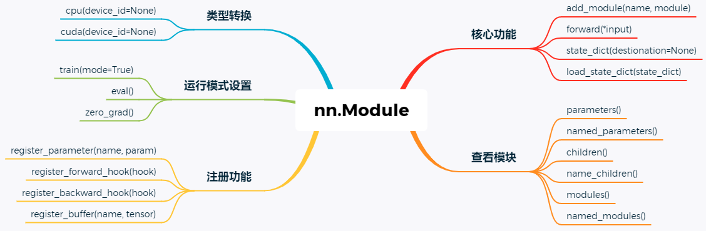

# 自定义模型

## 1、nn.Module

pytorch里面一切自定义操作基本上都是继承nn.Module类来实现的，因此首先要看一下nn.Module类的定义。



### 1.1 类方法

```python
class Module(object):
    def __init__(self):
    # 核心功能
    def forward(self, *input):
        # 每次运行时都会执行的步骤，所有自定义的module都要重写这个函数
    def add_module(self, name, module):
        # 将子模块加入当前的模块中，被添加的模块可以name来获取
    def state_dict(destionation=None):
        # 返回一个字典，保存module的所有状态
    def load_state_dict(state_dict):
        # 用来加载模型参数
    
    # 查看模块
    def parameters(self, recurse=True):
        # 返回一个包含模型所有参数的迭代器，一般用作optimizer参数
    def named_parameters(self, prefix='', recurse=True):
        # 返回一个包含模型所有参数的迭代器，yield 参数名字和参数本身
    def children(self):
        # 返回包含模型当前子模块的迭代器
    def named_children(self):
        # 返回包含模型当前子模块的迭代器，yield 模块名字和模块本身
    def modules(self):  
        # 返回一个包含当前模型所有模块的迭代器
    def named_modules(self, memo=None, prefix=''):
        # 返回一个包含当前模型所有模块的迭代器, yield 模块名和模块本身
    
    # 类型转换
    def cpu(self):
        # 将所有的模型参数(parameters)和buffers复制到CPU
    def cuda(self, device=None):
        # 将所有的模型参数(parameters)和buffers赋值GPU
    def double(self):
        # 将parameters和buffers的数据类型转换成double
    def float(self):
        # 将parameters和buffers的数据类型转换成float
    def half():
        # 将parameters和buffers的数据类型转换成half
    
    # 运行模式设置
    def train(self, mode=True):
        # 将module设置为training mode，只影响dropout和batchNorm
    def eval(self):
        # 将模型设置成evaluation模式，只影响dropout和batchNorm
    def zero_grad(self):
    	# 将module中的所有模型的梯度设置为0
    
    # 注册功能
    def register_parameter(name, param):
        # 向module添加parameter，可以通过name获取
	def register_forward_hook(hook):
    	# 在module上注册一个forward hook，每次调用forward()计算输出的时候，这个hook就会被调用　
	def register_backward_hook(hook):
    	# 在module上注册一个bachward hook，每次计算module的inputs的梯度的时候，这个hook会被调用
	def register_buffer(name, tensor):
    	# 给module添加一个persistent buffer，通常用来保存一个不需要看成模型参数的状态
```

在自定义网络时，需要继承`nn.Module`类，并重新实现构造函数`__init__`和`forward`两个方法。这里有一些注意事项：

（1）一般把网络中具有可学习参数的层（如全连接层、卷积层等）放在构造函数`__init__()`中，当然也可以把不具有参数的层也放在里面；

（2）不具有可学习参数的层(如`ReLU`、`dropout`、`BatchNormanation`层)可放在构造函数中，也可不放在构造函数中，如果不放在构造函数`__init__`里面，则在forward方法里面可以使用`nn.functional`来代替；

（3）`forward`方法是必须要重写的，它是实现模型的功能，实现各个层之间的连接关系的核心。

### 1.2 方法介绍

`Sequenrial`类实现了整数索引，故而可以使用model[index] 这样的方式获取一个层，但是Module类并没有实现整数索引，不能够通过整数索引来获得层，但是它提供了下面几个方法来操作：

```python
def children(self): 
def named_children(self): 
def modules(self):
def named_modules(self, memo=None, prefix=''):
'''注意：这几个方法返回的都是一个Iterator迭代器，故而通过for循环访问，当然也可以通过next'''
```

**（1）`model.children()`方法**

```python
import torch.nn as nn
from collections import OrderedDict
class MyNet(nn.Module):
    def __init__(self):
        super(MyNet, self).__init__()
        self.conv_block=torch.nn.Sequential()
        self.conv_block.add_module("conv1",torch.nn.Conv2d(3, 32, 3, 1, 1))
        self.conv_block.add_module("relu1",torch.nn.ReLU())
        self.conv_block.add_module("pool1",torch.nn.MaxPool2d(2))
 
        self.dense_block = torch.nn.Sequential()
        self.dense_block.add_module("dense1",torch.nn.Linear(32 * 3 * 3, 128))
        self.dense_block.add_module("relu2",torch.nn.ReLU())
        self.dense_block.add_module("dense2",torch.nn.Linear(128, 10))
 
    def forward(self, x):
        conv_out = self.conv_block(x)
        res = conv_out.view(conv_out.size(0), -1)
        out = self.dense_block(res)
        return out
 
model = MyNet()
 
for i in model.children():
    print(i)
    print(type(i)) # 查看每一次迭代的元素到底是什么类型，实际上是 Sequential 类型,所以有可以使用下标index索引来获取每一个Sequenrial 里面的具体层
 
'''运行结果为：
Sequential(
  (conv1): Conv2d(3, 32, kernel_size=(3, 3), stride=(1, 1), padding=(1, 1))
  (relu1): ReLU()
  (pool1): MaxPool2d(kernel_size=2, stride=2, padding=0, dilation=1, ceil_mode=False)
)
<class 'torch.nn.modules.container.Sequential'>
Sequential(
  (dense1): Linear(in_features=288, out_features=128, bias=True)
  (relu2): ReLU()
  (dense2): Linear(in_features=128, out_features=10, bias=True)
)
<class 'torch.nn.modules.container.Sequential'>
'''
```

**（2）`model.named_children()`方法**

```python
for i in model.named_children():
    print(i)
    print(type(i)) # 查看每一次迭代的元素到底是什么类型，实际上是 返回一个tuple,tuple 的第一个元素是
 
'''运行结果为：
('conv_block', Sequential(
  (conv1): Conv2d(3, 32, kernel_size=(3, 3), stride=(1, 1), padding=(1, 1))
  (relu1): ReLU()
  (pool1): MaxPool2d(kernel_size=2, stride=2, padding=0, dilation=1, ceil_mode=False)
))
<class 'tuple'>
('dense_block', Sequential(
  (dense1): Linear(in_features=288, out_features=128, bias=True)
  (relu2): ReLU()
  (dense2): Linear(in_features=128, out_features=10, bias=True)
))
<class 'tuple'>
'''
```

> 总结：
>
> （1）model.children()和model.named_children()方法返回的是迭代器iterator；
>
> （2）model.children()：每一次迭代返回的元素实际上是 Sequential 类型，而Sequential类型又可以使用下标index索引来获取每一个Sequenrial 里面的具体层，比如conv层、dense层等；
>
> （3）model.named_children()：每一次迭代返回的元素实际上是一个元组类型，元组的第一个元素是名称，第二个元素就是对应的层或者是Sequential。

**（3）`model.modules()`方法**

```python
for i in model.modules():
    print(i)
    print("==================================================")
'''运行结果为：
MyNet(
  (conv_block): Sequential(
    (conv1): Conv2d(3, 32, kernel_size=(3, 3), stride=(1, 1), padding=(1, 1))
    (relu1): ReLU()
    (pool1): MaxPool2d(kernel_size=2, stride=2, padding=0, dilation=1, ceil_mode=False)
  )
  (dense_block): Sequential(
    (dense1): Linear(in_features=288, out_features=128, bias=True)
    (relu2): ReLU()
    (dense2): Linear(in_features=128, out_features=10, bias=True)
  )
)
==================================================
Sequential(
  (conv1): Conv2d(3, 32, kernel_size=(3, 3), stride=(1, 1), padding=(1, 1))
  (relu1): ReLU()
  (pool1): MaxPool2d(kernel_size=2, stride=2, padding=0, dilation=1, ceil_mode=False)
)
==================================================
Conv2d(3, 32, kernel_size=(3, 3), stride=(1, 1), padding=(1, 1))
==================================================
ReLU()
==================================================
MaxPool2d(kernel_size=2, stride=2, padding=0, dilation=1, ceil_mode=False)
==================================================
Sequential(
  (dense1): Linear(in_features=288, out_features=128, bias=True)
  (relu2): ReLU()
  (dense2): Linear(in_features=128, out_features=10, bias=True)
)
==================================================
Linear(in_features=288, out_features=128, bias=True)
==================================================
ReLU()
==================================================
Linear(in_features=128, out_features=10, bias=True)
==================================================
'''
```

**（4）`model.named_modules()`方法**

```python
for i in model.named_modules():
    print(i)
    print("==================================================")
'''运行结果是：
('', MyNet(
  (conv_block): Sequential(
    (conv1): Conv2d(3, 32, kernel_size=(3, 3), stride=(1, 1), padding=(1, 1))
    (relu1): ReLU()
    (pool1): MaxPool2d(kernel_size=2, stride=2, padding=0, dilation=1, ceil_mode=False)
  )
  (dense_block): Sequential(
    (dense1): Linear(in_features=288, out_features=128, bias=True)
    (relu2): ReLU()
    (dense2): Linear(in_features=128, out_features=10, bias=True)
  )
))
==================================================
('conv_block', Sequential(
  (conv1): Conv2d(3, 32, kernel_size=(3, 3), stride=(1, 1), padding=(1, 1))
  (relu1): ReLU()
  (pool1): MaxPool2d(kernel_size=2, stride=2, padding=0, dilation=1, ceil_mode=False)
))
==================================================
('conv_block.conv1', Conv2d(3, 32, kernel_size=(3, 3), stride=(1, 1), padding=(1, 1)))
==================================================
('conv_block.relu1', ReLU())
==================================================
('conv_block.pool1', MaxPool2d(kernel_size=2, stride=2, padding=0, dilation=1, ceil_mode=False))
==================================================
('dense_block', Sequential(
  (dense1): Linear(in_features=288, out_features=128, bias=True)
  (relu2): ReLU()
  (dense2): Linear(in_features=128, out_features=10, bias=True)
))
==================================================
('dense_block.dense1', Linear(in_features=288, out_features=128, bias=True))
==================================================
('dense_block.relu2', ReLU())
==================================================
('dense_block.dense2', Linear(in_features=128, out_features=10, bias=True))
==================================================
'''
```

> 总结：
>
> （1）model.modules()和model.named_modules()方法返回的是迭代器iterator；
>
> （2）model的modules()方法和named_modules()方法都会将整个模型的所有构成（包括包装层、单独的层、自定义层等）由浅入深依次遍历出来，只不过modules()返回的每一个元素是直接返回的层对象本身，而named_modules()返回的每一个元素是一个元组，第一个元素是名称，第二个元素才是层对象本身。
>
> （3）如何理解children和modules之间的这种差异性。注意pytorch里面不管是模型、层、激活函数、损失函数都可以当成是nn.Module的拓展，所以modules和named_modules会层层迭代，由浅入深，将每一个自定义块block、以及block里面的每一个层都当成是module来迭代。而children就比较直观，表示的是所谓的“孩子”，所以没有层层迭代深入。

## 2、模型构造

### 2.1 继承Module类

将所有层都放在构造函数`__init__`里，在`forward`里实现所有层的连接关系：

```python
class MLP(nn.Module):
    # 声明带有模型参数的层，这里声明了两个全连接层
    def __init__(self, **kwargs):
        # 调用MLP父类Block的构造函数来进行必要的初始化。这样在构造实例时还可以指定其他函数参数
        super(MLP, self).__init__(**kwargs)
        self.hidden = nn.Linear(784, 256) # 隐藏层
        self.act = nn.ReLU()
        self.output = nn.Linear(256, 10)  # 输出层
         
    # 定义模型的前向计算，即如何根据输入x计算返回所需要的模型输出
    def forward(self, x):
        a = self.act(self.hidden(x))
        return self.output(a)
```

将没有训练参数的层不放在构造函数里面，所以这些层就不会出现在model里，但是运行关系在forward里面通过functional的方法实现：

```python
import torch.nn as nn
import torch.nn.functional as F

class MLP(nn.Module):
    def __init__(self, **kwargs):
        super(MLP, self).__init__(**kwargs)
        self.hidden = nn.Linear(784, 256)
        self.output = nn.Linear(256, 10)
        
    def forward(self, x):
        a = F.relu(self.hidden(x))
        return self.output(a)
```

> 所有放在构造函数\_\_init\_\_里面的层都是这个模型的“固有属性”。

### 2.2 Module子类

Module子类非常灵活，有多种实现方式：

#### 2.2.1 Sequential类

方式一：直接使用层

```python
import torch.nn as nn
class MyNet(nn.Module):
    def __init__(self):
        super(MyNet, self).__init__()
        self.conv_block = nn.Sequential(
            nn.Conv2d(3, 32, 3, 1, 1),
            nn.ReLU(),
            nn.MaxPool2d(2))
        self.dense_block = nn.Sequential(
            nn.Linear(32 * 3 * 3, 128),
            nn.ReLU(),
            nn.Linear(128, 10)
        )
    # 在这里实现层之间的连接关系，其实就是所谓的前向传播
    def forward(self, x):
        conv_out = self.conv_block(x)
        res = conv_out.view(conv_out.size(0), -1)
        out = self.dense_block(res)
        return out
 
model = MyNet()
print(model)
'''运行结果为：
MyNet(
  (conv_block): Sequential(
    (0): Conv2d(3, 32, kernel_size=(3, 3), stride=(1, 1), padding=(1, 1))
    (1): ReLU()
    (2): MaxPool2d(kernel_size=2, stride=2, padding=0, dilation=1, ceil_mode=False)
  )
  (dense_block): Sequential(
    (0): Linear(in_features=288, out_features=128, bias=True)
    (1): ReLU()
    (2): Linear(in_features=128, out_features=10, bias=True)
  )
)
'''
```

方式二：使用`OrderedDict`

```python
import torch.nn as nn
from collections import OrderedDict
class MyNet(nn.Module):
    def __init__(self):
        super(MyNet, self).__init__()
        self.conv_block = nn.Sequential(
            OrderedDict(
                [
                    ("conv1", nn.Conv2d(3, 32, 3, 1, 1)),
                    ("relu1", nn.ReLU()),
                    ("pool", nn.MaxPool2d(2))
                ]
            ))
 
        self.dense_block = nn.Sequential(
            OrderedDict([
                ("dense1", nn.Linear(32 * 3 * 3, 128)),
                ("relu2", nn.ReLU()),
                ("dense2", nn.Linear(128, 10))
            ])
        )
 
    def forward(self, x):
        conv_out = self.conv_block(x)
        res = conv_out.view(conv_out.size(0), -1)
        out = self.dense_block(res)
        return out
 
model = MyNet()
print(model)
'''运行结果为：
MyNet(
  (conv_block): Sequential(
    (conv1): Conv2d(3, 32, kernel_size=(3, 3), stride=(1, 1), padding=(1, 1))
    (relu1): ReLU()
    (pool): MaxPool2d(kernel_size=2, stride=2, padding=0, dilation=1, ceil_mode=False)
  )
  (dense_block): Sequential(
    (dense1): Linear(in_features=288, out_features=128, bias=True)
    (relu2): ReLU()
    (dense2): Linear(in_features=128, out_features=10, bias=True)
  )
)
'''
```

方式三：使用`add_module`

```python
import torch.nn as nn
class MyNet(nn.Module):
    def __init__(self):
        super(MyNet, self).__init__()
        self.conv_block=torch.nn.Sequential()
        self.conv_block.add_module("conv1",torch.nn.Conv2d(3, 32, 3, 1, 1))
        self.conv_block.add_module("relu1",torch.nn.ReLU())
        self.conv_block.add_module("pool1",torch.nn.MaxPool2d(2))
 
        self.dense_block = torch.nn.Sequential()
        self.dense_block.add_module("dense1",torch.nn.Linear(32 * 3 * 3, 128))
        self.dense_block.add_module("relu2",torch.nn.ReLU())
        self.dense_block.add_module("dense2",torch.nn.Linear(128, 10))
 
    def forward(self, x):
        conv_out = self.conv_block(x)
        res = conv_out.view(conv_out.size(0), -1)
        out = self.dense_block(res)
        return out
 
model = MyNet()
print(model)
'''运行结果为：
MyNet(
  (conv_block): Sequential(
    (conv1): Conv2d(3, 32, kernel_size=(3, 3), stride=(1, 1), padding=(1, 1))
    (relu1): ReLU()
    (pool1): MaxPool2d(kernel_size=2, stride=2, padding=0, dilation=1, ceil_mode=False)
  )
  (dense_block): Sequential(
    (dense1): Linear(in_features=288, out_features=128, bias=True)
    (relu2): ReLU()
    (dense2): Linear(in_features=128, out_features=10, bias=True)
  )
)
'''
```

#### 2.2.2 ModuleList类

```python
net = nn.ModuleList([nn.Linear(784, 256), nn.ReLU()])
net.append(nn.Linear(256, 10)) # # 类似List的append操作
print(net[-1])  # 类似List的索引访问
print(net)

# Linear(in_features=256, out_features=10, bias=True)
# ModuleList(
#   (0): Linear(in_features=784, out_features=256, bias=True)
#   (1): ReLU()
#   (2): Linear(in_features=256, out_features=10, bias=True)
# )
```

#### 2.2.3 ModuleDict类

```python
net = nn.ModuleDict({
    'linear': nn.Linear(784, 256),
    'act': nn.ReLU(),
})
net['output'] = nn.Linear(256, 10) # 添加
print(net['linear']) # 访问
print(net.output)
print(net)

# Linear(in_features=784, out_features=256, bias=True)
# Linear(in_features=256, out_features=10, bias=True)
# ModuleDict(
#   (act): ReLU()
#   (linear): Linear(in_features=784, out_features=256, bias=True)
#   (output): Linear(in_features=256, out_features=10, bias=True)
# )
```

### 2.3 构造复杂模型

```python
class FancyMLP(nn.Module):
    def __init__(self, **kwargs):
        super(FancyMLP, self).__init__(**kwargs)
        # 不可训练参数（常数参数）
        self.rand_weight = torch.rand((20, 20), requires_grad=False) 
        self.linear = nn.Linear(20, 20)

    def forward(self, x):
        x = self.linear(x)
        # 使用创建的常数参数，以及nn.functional中的relu函数和mm函数
        x = nn.functional.relu(torch.mm(x, self.rand_weight.data) + 1)
        
        # 复用全连接层。等价于两个全连接层共享参数
        x = self.linear(x)
        # 控制流，这里我们需要调用item函数来返回标量进行比较
        while x.norm().item() > 1:
            x /= 2
        if x.norm().item() < 0.8:
            x *= 10
        return x.sum()

class NestMLP(nn.Module):
    def __init__(self, **kwargs):
        super(NestMLP, self).__init__(**kwargs)
        self.net = nn.Sequential(nn.Linear(40, 30), nn.ReLU()) 

    def forward(self, x):
        return self.net(x)

net = nn.Sequential(NestMLP(), nn.Linear(30, 20), FancyMLP())

X = torch.rand(2, 40)
print(net)
net(X)

# Sequential(
#   (0): NestMLP(
#     (net): Sequential(
#       (0): Linear(in_features=40, out_features=30, bias=True)
#       (1): ReLU()
#     )
#   )
#   (1): Linear(in_features=30, out_features=20, bias=True)
#   (2): FancyMLP(
#     (linear): Linear(in_features=20, out_features=20, bias=True)
#   )
# )
# tensor(-0.4605, grad_fn=<SumBackward0>)
```

## 3、参数

### 3.1 访问模型参数

```python
print(type(net.named_parameters()))
for name, param in net.named_parameters():
    print(name, param.size())
# <class 'generator'>
# 0.weight torch.Size([3, 4])
# 0.bias torch.Size([3])
# 2.weight torch.Size([1, 3])
# 2.bias torch.Size([1])
```

### 3.2 初始化模型参数

```python
for name, param in net.named_parameters():
    if 'weight' in name:
        init.normal_(param, mean=0, std=0.01)
        print(name, param.data)
# 0.weight tensor([[ 0.0030,  0.0094,  0.0070, -0.0010],
#         [ 0.0001,  0.0039,  0.0105, -0.0126],
#         [ 0.0105, -0.0135, -0.0047, -0.0006]])
# 2.weight tensor([[-0.0074,  0.0051,  0.0066]])

for name, param in net.named_parameters():
    if 'bias' in name:
        init.constant_(param, val=0)
        print(name, param.data)
# 0.bias tensor([0., 0., 0.])
# 2.bias tensor([0.])
```

### 3.3 自定义初始化方法

```python
def init_weight_(tensor):
    with torch.no_grad():
        tensor.uniform_(-10, 10)
        tensor *= (tensor.abs() >= 5).float()

for name, param in net.named_parameters():
    if 'weight' in name:
        init_weight_(param)
        print(name, param.data)
# 0.weight tensor([[ 7.0403,  0.0000, -9.4569,  7.0111],
#         [-0.0000, -0.0000,  0.0000,  0.0000],
#         [ 9.8063, -0.0000,  0.0000, -9.7993]])
# 2.weight tensor([[-5.8198,  7.7558, -5.0293]])

for name, param in net.named_parameters():
    if 'bias' in name:
        param.data += 1
        print(name, param.data)
# 0.bias tensor([1., 1., 1.])
# 2.bias tensor([1.])
```

### 3.4 共享模型参数

```python
linear = nn.Linear(1, 1, bias=False)
net = nn.Sequential(linear, linear) 
print(net)
# Sequential(
#   (0): Linear(in_features=1, out_features=1, bias=False)
#   (1): Linear(in_features=1, out_features=1, bias=False)
# )

for name, param in net.named_parameters():
    init.constant_(param, val=3)
    print(name, param.data)
# 0.weight tensor([[3.]])

print(id(net[0]) == id(net[1]))
print(id(net[0].weight) == id(net[1].weight))
# True
# True
```

## 4、自定义层

### 4.1 不含模型参数

```python
class CenteredLayer(nn.Module):
    def __init__(self, **kwargs):
        super(CenteredLayer, self).__init__(**kwargs)
    def forward(self, x):
        return x - x.mean()
    
layer = CenteredLayer()
layer(torch.tensor([1, 2, 3, 4, 5], dtype=torch.float))
# tensor([-2., -1.,  0.,  1.,  2.])
```

### 4.2 含模型参数

```python
class MyDictDense(nn.Module):
    def __init__(self):
        super(MyDictDense, self).__init__()
        self.params = nn.ParameterDict({
                'linear1': nn.Parameter(torch.randn(4, 4)),
                'linear2': nn.Parameter(torch.randn(4, 1))
        })
        self.params.update({'linear3': nn.Parameter(torch.randn(4, 2))}) # 新增

    def forward(self, x, choice='linear1'):
        return torch.mm(x, self.params[choice])

net = MyDictDense()
print(net)
# MyDictDense(
#   (params): ParameterDict(
#       (linear1): Parameter containing: [torch.FloatTensor of size 4x4]
#       (linear2): Parameter containing: [torch.FloatTensor of size 4x1]
#       (linear3): Parameter containing: [torch.FloatTensor of size 4x2]
#   )
# )

x = torch.ones(1, 4)
print(net(x, 'linear1'))
print(net(x, 'linear2'))
print(net(x, 'linear3'))
# tensor([[1.5082, 1.5574, 2.1651, 1.2409]], grad_fn=<MmBackward>)
# tensor([[-0.8783]], grad_fn=<MmBackward>)
# tensor([[ 2.2193, -1.6539]], grad_fn=<MmBackward>)
```

