# 文本挖掘比赛：（一）数据篇

## 1、比赛说明

[基于文本挖掘的企业隐患排查质量分析模型](https://www.sodic.com.cn/competitions/900010)


### 1.1 赛题背景

企业自主填报安全生产隐患，对于将风险消除在事故萌芽阶段具有重要意义。企业在填报隐患时，往往存在不认真填报的情况，“虚报、假报”隐患内容，增大了企业监管的难度。采用大数据手段分析隐患内容，找出不切实履行主体责任的企业，向监管部门进行推送，实现精准执法，能够提高监管手段的有效性，增强企业安全责任意识。

### 1.2 赛题任务

本赛题提供企业填报隐患数据，参赛选手需通过智能化手段识别其中是否存在“虚报、假报”的情况。

### 1.3 赛题数据

**训练集：**


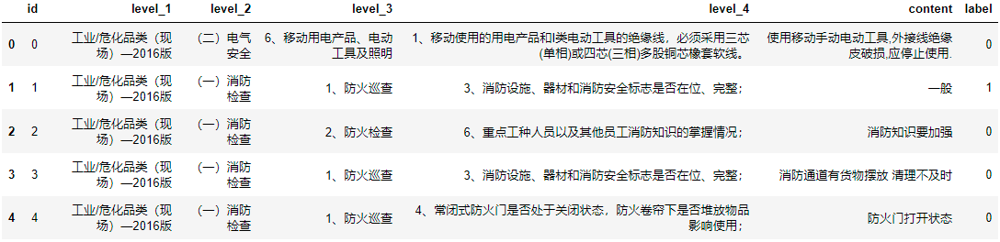

**测试集：**

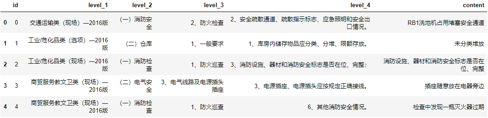

**数据说明：**

训练集数据包含“【id、level_1（一级标准）、level_2（二级标准）、level_3（三级标准）、level_4（四级标准）、content（隐患内容）和label（标签）】”共7个字段。

其中“id”为主键，无业务意义；“一级标准、二级标准、三级标准、四级标准”为《深圳市安全隐患自查和巡查基本指引（2016年修订版）》规定的排查指引，一级标准对应不同隐患类型，二至四级标准是对一级标准的细化，企业自主上报隐患时，根据不同类型隐患的四级标准开展隐患自查工作；“隐患内容”为企业上报的具体隐患；“标签”标识的是该条隐患的合格性，“1”表示隐患填报不合格，“0”表示隐患填报合格。

**预测结果文件：**

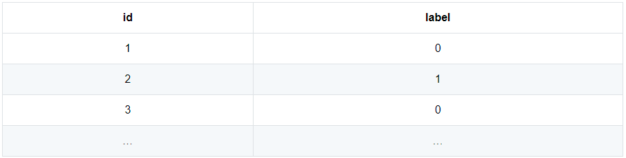

### 1.4 评测标准

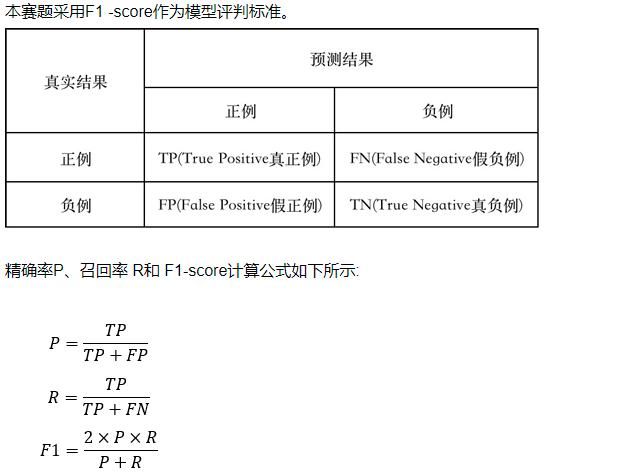

## 2、数据探索

### 2.1 读取数据

```python
train = pd.read_csv('./data/train.csv')
test = pd.read_csv('./data/test.csv')
```

### 2.2 数据统计

```python
train.shape
# (12000, 7)
test.shape
# (18000, 6)

train.label.value_counts()
# 0    10712
# 1     1288
train.label.mean()
# 0.10733333333333334    # 正样本占比10.7%
```

### 2.3 字段信息

```python
train.info()
```

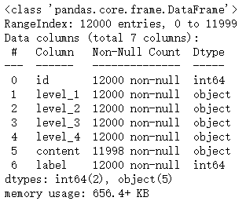

```python
test.info()
```

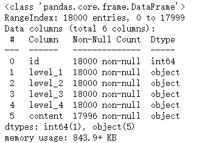

content字段存在缺失值，填充空值：

```python
train['content'].fillna('', inplace=True)
test['content'].fillna('', inplace=True)
```

### 2.4 字段探索

合并训练集和测试集，进行字段探索：

```python
train['type'] = 'train'
test['type'] = 'test'
df = pd.concat([train, test])
```

**（1）level**

- **字段取值**

```python
df.groupby('type')[['level_1', 'level_2', 'level_3', 'level_4']].nunique()
```

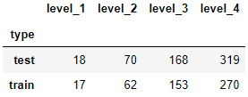

可见，测试集中存在训练集中未见的标准，只考虑训练集中的标准会造成模型泛化能力不好。

- **样本数量**

**level_1：**

```python
df_cnt = df.groupby(['type','level_1'])['content'].count().reset_index()
df_pvt = pd.pivot_table(df_cnt, index='level_1', columns='type', values='content').sort_values(by='train', ascending=False)
df_pvt
```

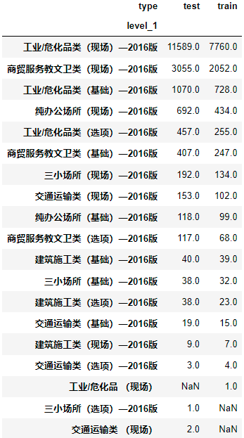

测试集中存在两个训练集中未见的一级标准。

**level_2：**

```python
df_cnt = df.groupby(['type','level_2'])['content'].count().reset_index()
df_pvt = pd.pivot_table(df_cnt, index='level_2', columns='type', values='content').sort_values(by='train', ascending=False)
df_pvt.head(10).append(df_pvt.tail(10))
```

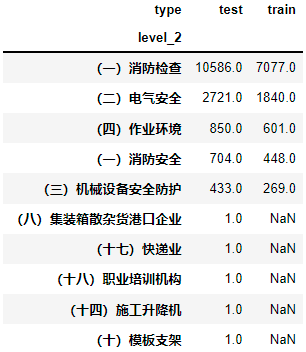

```python
print('测试集多于训练集的标准：{}个'.format((df_pvt.train.isnull()&df_pvt.test.notnull()).sum()))
# 测试集多于训练集的标准：16个
```

**level_3：**

```python
df_cnt = df.groupby(['type','level_3'])['content'].count().reset_index()
df_pvt = pd.pivot_table(df_cnt, index='level_3', columns='type', values='content').sort_values(by='train', ascending=False)
df_pvt.head(5).append(df_pvt.tail(5))
```

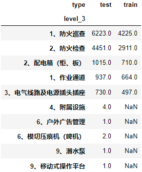

```python
print('测试集多于训练集的标准：{}个'.format((df_pvt.train.isnull()&df_pvt.test.notnull()).sum()))
# 测试集多于训练集的标准：32个
```

**level_4：**

```
df_cnt = df.groupby(['type','level_4'])['content'].count().reset_index()
df_pvt = pd.pivot_table(df_cnt, index='level_4', columns='type', values='content').sort_values(by='train', ascending=False)
df_pvt.head(5).append(df_pvt.tail(5))
```

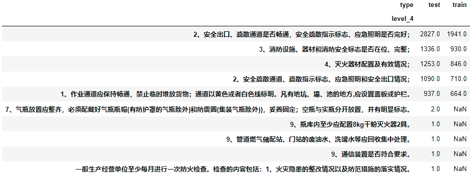

```python
print('测试集多于训练集的标准：{}个'.format((df_pvt.train.isnull()&df_pvt.test.notnull()).sum()))
# 测试集多于训练集的标准：109个
```

如上可知：level字段中，测试集存在大量训练集未见的标准，level字段参与文本训练不见得是好事。

**（2）content**

```python
df['content_len'] = df.content.str.len()
df.groupby('type')['content_len'].max()
# test     394
# train    151

df.groupby('type')['content_len'].min()
# test     0
# train    0

# 绘制训练集和测试集的content长度分布图
plt.figure(figsize=(8, 6))
sns.kdeplot(df[df.type == 'train'].content_len, label='train_content_len')
sns.kdeplot(df[df.type == 'test'].content_len, label='test_content_len')
```

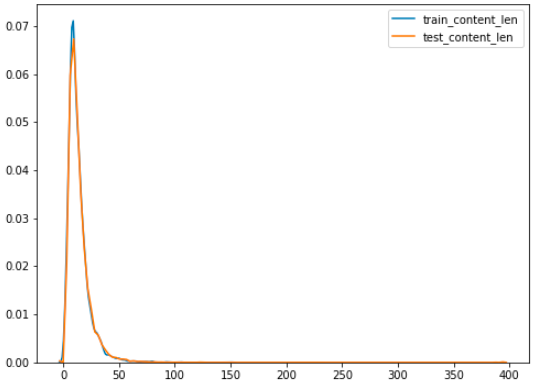

如图所示，训练集和测试集的content长度分布一致。

从上面的 head() 就很明显地看出，正样本基本上都是文本比较短的，我们可以用文本字符串长度来确认。

```python
train['content_strlen'] = train['content'].astype(str).apply(len)
train[train['content_strlen']<=3]['label'].mean()
# 0.8769968051118211
```

可以看出，content长度小于等于3的数据正样本率高达 87.7%，当然也很容易理解，上报隐患时填写的文本太短，说明填写比较随意，基本是不符合监管要求的。

另外，在数据探索中也会发现部分样本的标签存在模棱两可的情况，比如content的内容基本一致，但是标签不一致，不过这种情况很难处理，就不考虑了，当做噪声吧。

根据以上分析，分类任务主要以content为核心构造变量，主要包括两个思路：

（1）基于数据分析和探索，构造统计类特征；

（2）对长文本使用bert进行分类，构造子模型分，进入最终的LGB模型；

## 3、统计类特征

首先，对content和level_4两个字段进行预处理，只保留文本，剔除无用的符号和数字：

```python
df["content"] = df["content"].astype(str)
regex = re.compile(u"[\u4e00-\u9fa5]+")
df["level4_nosign"] = df["level_4"].apply(lambda x: ''.join(regex.findall(x)))
df["content_nosign"] = df["content"].apply(lambda x: ''.join(regex.findall(x)))
df.head()
```

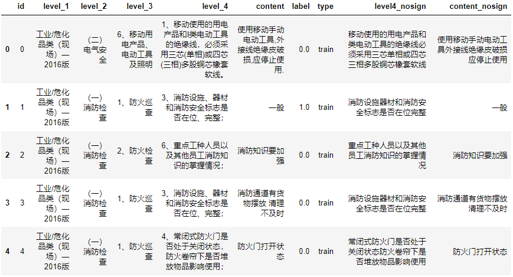

### 3.1 level和content的相关类特征

#### 3.1.1 最长公共子序列

- 计算content文本是否包含于level_4

- content与level_4最长公共子序列
- content、level_4与子序列的长度、差值、比值

```python
def getMaxSame(a, b):
    # 获得a,b字符串最大相同子序列
    if len(a)<=len(b):
        s1, s2 = a, b
    else:
        s1, s2 = b, a
    maxlen = 0
    maxstr = ""
    for i in range(len(a)):
        for j in range(len(a), i-1, -1):
            if s1[i:j] in s2 and len(s1[i:j]) > maxlen:
                maxlen = len(s1[i:j])
                maxstr = s1[i:j]
    return maxstr

# content是否包含于level_4
df["content_in_level4"] = df.apply(lambda x: int(x.content_nosign in x.level4_nosign), axis=1)
# content与level4最长相同子字符串
df["content_level4_substr"] = df.apply(lambda x: getMaxSame(x.content_nosign, x.level4_nosign), axis=1)
# content与level4最长相同子字符串长度
df["content_level4_sublen"] = df["content_level4_substr"].str.len()
df["level4_strlen"] = df.level4_nosign.apply(len)
df["content_strlen"] = df.content_nosign.apply(len)
df['level4_content_sub'] = df['level4_strlen'] - df['content_strlen']
df['level4_content_div'] = df['level4_strlen'] / df['content_strlen']
df["substr_level4_div"] = df["content_level4_sublen"] / df["level4_strlen"]
df["substr_content_div"] = df["content_level4_sublen"] / df["content_strlen"]
```

#### 3.1.2 子句

level_4和content的子句长度及差值。

```python
# level_4和content的分句长度比较
def get_len(x):
    x_split = re.split("[,，;；.。]", x)
    x_split = [i for i in x_split if len(i)>2]
    return len(x_split)

df['level4_sent_num'] = df.level_4.apply(lambda x: get_len(x))
df['content_sent_num'] = df.content.apply(lambda x: get_len(x))
df['level4_content_sent_sub'] = df['level4_sent_num'] - df['content_sent_num']
```

#### 3.1.3 分词

基于jieba分词，计算三个特征：相同词的个数，不同词的个数，相同词占level_4和content的比值、Jaccard相似度。

```python
df['level4_nosign_jieba'] = df['level4_nosign'].apply(lambda x: set(jieba.cut(x)))
df['content_nosign_jieba'] = df['content_nosign'].apply(lambda x: set(jieba.cut(x)))
df['same_word'] = df.apply(lambda x: len(x.level4_nosign_jieba&x.content_nosign_jieba), axis=1)
df['different_word'] = df.apply(lambda x: len(x.content_nosign_jieba-x.level4_nosign_jieba), axis=1)
df['same_word_level4'] = df.apply(lambda x: x.same_word/len(x.level4_nosign_jieba), axis=1)
df['same_word_content'] = df.apply(lambda x: x.same_word/len(x.content_nosign_jieba) 
                                   if len(x.content_nosign_jieba)>0 else 0, axis=1)
df['jaccard'] = df.apply(lambda x: x.same_word/len(x.level4_nosign_jieba|x.content_nosign_jieba), axis=1)
```

### 3.2 content类特征

#### 3.2.1 关键词特征

对content分词，统计关键词的索引和出现次数

```python
word_lst, label_lst = [], []
df['jieba'] = df.apply(lambda x: [i for i,j in list(pseg.cut(x.content)) if i not in x.content_level4_substr and j in ["v", "d", "a"]], axis=1)
for i, j in df[df.label.notna()][['jieba', 'label']].values:
    word_lst.extend(i)
    label_lst.extend(len(i)*[j])
df_word = pd.DataFrame({"word": word_lst, "label": label_lst})
word_label1_30 = list(df_word.loc[df_word.label==1, "word"].value_counts().sort_values(ascending=False)[:30].index)
word_label0_100 = set(df_word.word.value_counts().sort_values(ascending=False)[:130].index)-set(ci_label1_30)

def getIndex(a, b):
    # 输出a在b中的索引，若a不在b中，则返回-1
    if a in b:
        return b.index(a)
    else:
        return -1

for i, word in enumerate(word_label1_30):
    df['word_'+str(i)] = df.content.apply(lambda x: getIndex(word, x))  # 前30多的词，出现在当前content的索引
df["word_label0_100"] = df.jieba.apply(lambda x: len(set(x)&word_label0_100))  # 前100正样本特有的词，出现在当前content几次
```

#### 3.2.2 TextRank特征

使用TextRank算法对正负样本的content分别提取关键词，并基于关键词衍生特征：

```python
def get_word_weight(text, nums=100, window=2, speech_tags=['a', 'd', 't', 'v', 'l']):
    """使用textrank获取分词的权重"""
    # 创建分词类的实例
    tr4w = TextRank4Keyword(allow_speech_tags=speech_tags)
    # 对文本进行分析，设定窗口大小为2，并将英文单词小写
    tr4w.analyze(text=text, lower=True, window=window)

    # 从关键词列表中获取前20个关键词
    word_lst = []
    weight_lst = []
    for item in tr4w.get_keywords(num=nums, word_min_len=1):
        # 打印每个关键词的内容及关键词的权重
        word_lst.append(item.word)
        weight_lst.append(item.weight)
    word_weight = pd.DataFrame({'word': word_lst, 'weight': weight_lst})
    return word_weight

def get_key_word_num(content, words):
    """获取关键词的命中数量"""
    word_sum = 0
    for word in words:
        if word in content:
            word_sum += 1
    return word_sum
    
text0 = ' '.join(df[df.label==0].content.values)
text1 = ' '.join(df[df.label==1].content.values)
df_content_0 = get_word_weight(text0, nums=100, window=6)
df_content_1 = get_word_weight(text1, nums=100, window=6)
df_content_0.columns = ['word', 'weight_0']
df_content_1.columns = ['word', 'weight_1']
df_content_0_wd = pd.merge(df_content_0, df_content_1, on='word', how='left')
content_0_wd = df_content_0_wd[df_content_0_wd.weight_1.isna()]['word'].values
df_content_1_wd = pd.merge(df_content_1, df_content_0, on='word', how='left')
content_1_wd = df_content_1_wd[df_content_1_wd.weight_0.isna()]['word'].values
df['content_0_cnt'] = df.content.apply(lambda x: get_key_word_num(x, content_0_wd))
df['content_1_cnt'] = df.content.apply(lambda x: get_key_word_num(x, content_1_wd))

df_wd_1 = pd.DataFrame()
for i, word in enumerate(content_1_wd):
    df_wd_1['prwd1_' + str(i)] = df.content.apply(lambda x: int(word in x))

df_wd_0 = pd.DataFrame()
for i, word in enumerate(content_0_wd):
    df_wd_0['prwd0_' + str(i)] = df.content.apply(lambda x: int(word in x))

## 特征筛选
# 方法一：编码后降维
pca = PCA(n_components=0.8)
pca.fit(df_wd_1)
wd1_pca = pca.transform(df_wd_1)

for i in range(wd1_pca.shape[1]):
    df[f'content_pr1_{i}'] = wd1_pca[:, i]

pca = PCA(n_components=0.8)
pca.fit(df_wd_0)
wd0_pca = pca.transform(df_wd_0)

for i in range(wd0_pca.shape[1]):
    df[f'content_pr0_{i}'] = wd0_pca[:, i]

# 方法二：选择IV大于0.02的分词，降维后进入模型
# df_wd_1['label'] = df.label
# df_wd_0['label'] = df.label
# df_wd1_iv = toad.quality(df_wd_1, target='label')
# df_wd1_iv_sel = df_wd1_iv[df_wd1_iv.iv > 0.02].index.values
# df_wd0_iv = toad.quality(df_wd_0, target='label')
# df_wd0_iv_sel = df_wd0_iv[df_wd0_iv.iv > 0.02].index.values

# pca = PCA(n_components=0.95)
# pca.fit(df_wd_1[df_wd1_iv_sel])
# wd1_pca = pca.transform(df_wd_1[df_wd1_iv_sel])

# for i in range(wd1_pca.shape[1]):
#     df[f'content_pr1_{i}'] = wd1_pca[:, i]

# pca = PCA(n_components=0.8)
# pca.fit(df_wd_0[df_wd0_iv_sel])
# wd0_pca = pca.transform(df_wd_0[df_wd0_iv_sel])

# for i in range(wd0_pca.shape[1]):
#     df[f'content_pr0_{i}'] = wd0_pca[:, i]
```

附录查看TextRank原理。

#### 3.2.3 TF-IDF特征

content分词后计算tf-idf，由于维度较高，这里进行降维处理：

```python
df['content_nosign_seg'] = df['content_nosign'].apply(lambda x: " ".join(jieba.cut(x)))
df['content_word_cnt'] = df['content_nosign_seg'].apply(lambda x: len(x.split(" ")))

n_components = 16
X = list(df['content_nosign_seg'].values)
tfv = TfidfVectorizer(ngram_range=(1,1), 
                      token_pattern=r"(?u)\b[^ ]+\b",
                      max_features=10000)
tfv.fit(X)
X_tfidf = tfv.transform(X)
svd = TruncatedSVD(n_components=n_components)
svd.fit(X_tfidf)
X_svd = svd.transform(X_tfidf)

for i in range(n_components):
    df[f'content_tfidf_{i}'] = X_svd[:, i]
```

### 3.3 level类特征

#### 3.3.1 badrate编码

经统计发现，不同level的badrate存在差异，因此对不同level作badrate编码。

```python
# 不同标准的badrate值
for col in ['level_1', 'level_2', 'level_3']:
    risk_ratio = dict(df[df.label.notna()].groupby(col)['label'].mean())
    df[f'{col}_risk_score'] = df[col].map(risk_ratio)
```

#### 3.3.1 类别编码

类别变量编码为数值变量。

```python
for col in ['level_1', 'level_2', 'level_3', 'level_4']:
    df[f'{col}_strlen'] = df[col].astype(str).apply(len)
    lbl = LabelEncoder()
    lbl.fit(df[col])
    df[col] = lbl.transform(df[col])
```

最终，得到的统计类数据集如下：

```python
drop_cols = ['content', 'content_nosign', 'level4_nosign', 'content_level4_substr', 'level4_nosign_jieba', 'content_nosign_jieba', 'jieba', 'content_nosign_seg']
df.drop(drop_cols, axis=1, inplace=True)
train = df[df['label'].notna()]
test = df[df['label'].isna()]
print(train.shape, test.shape)
# (12000, 79) (18000, 79)
train.head()
```

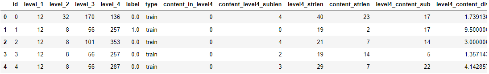

## 4、bert子模型分

### 4.1 sentence classification score

使用单个文本fine-tuning分类模型。

```python
# bert prob
train_bert_pred = pd.read_csv('./data/roberta_pred_oof2.csv')
test_bert_pred = pd.read_csv('./data/roberta_pred_test2.csv')

train = pd.merge(train, train_bert_pred, on='id')
test = pd.merge(test, test_bert_pred, on='id')
```

### 4.2 sentence pair classification score

使用sentence pair fine-tuning分类模型。

```python
# sbert
train_sbert_pred = pd.read_csv('./data/roberta2_pred_oof.csv')
test_sbert_pred = pd.read_csv('./data/roberta2_pred_test.csv')

train = pd.merge(train, train_sbert_pred, on='id')
test = pd.merge(test, test_sbert_pred, on='id')
```

### 4.3 双塔sbert模型提取文本语义

直接使用预训练模型，未做fine-tuning。

```python
# 直接用预训练模型encode，计算文本相似度
df_tr_sim = pd.read_csv('./data/train_sim.csv')
df_ts_sim = pd.read_csv('./data/test_sim.csv')

train = pd.concat([train, df_tr_sim], axis=1)
test = pd.concat([test, df_ts_sim], axis=1)
```


## 附录：

### 1、TextRank原理

TextRank算法是由PageRank算法改进而来的，二者的思想有相同之处，区别在于：PageRank算法根据网页之间的链接关系构造网络，而TextRank算法根据词之间的共现关系构造网络；PageRank算法构造的网络中的边是有向无权边，而TextRank算法构造的网络中的边是无向有权边。TextRank算法的核心公式如下：
$$
WS(V_i)=(1-d)+d*\sum_{V_j \in In(V_i)}{{w_{ji}}\over{\sum_{V_k \in Out(V_j)}w_{jk}}}WS(V_j)
$$
其中，$w_{ji}$表示两个节点之间的边连接具有不同的重要程度，$In(V_i)$表示节点i的邻域，$Out(V_j)$表示节点j的邻域，$WS(V_j)$表示节点j的TextRank值，d为阻尼系数，即按照超链接进行浏览的概率，一般取经验值为0.85，1-d表示浏览者随机跳转到一个新网页的概率。

为了便于理解，给出使用TextRank算法提取关键词的具体步骤如下：

1）将给定的文本按照整句进行分割，即$T=[S_1,S_2,...,S_m]$；

2）对于每个句子$S_i\in T$，对其进行分词和词性标注，然后剔除停用词，只保留指定词性的词，如名词、动词、形容词等，即$S_i=[t_{i,1},t_{i,2},...,t_{i,n}]$，其中$t_{i,j}$为句子i中保留下的词；

3）构建词图$G=(V,E)$，其中V为节点集合，由以上步骤生成的词组成，然后采用共现关系构造任意两个节点之间的边：两个节点之间存在边仅当它们对应的词在长度为K的窗口中共现，K表示窗口大小，即最多共现K个单词，一般K取2；

4）根据上面的公式，迭代计算各节点的权重，直至收敛；

5）对节点的权重进行倒序排序，从中得到最重要的t个单词，作为top-t关键词；

6）对于得到的top-t关键词，在原始文本中进行标记，若它们之间形成了相邻词组，则作为关键词组提取出来。

### 2、TextRank实现

textrank4zh模块是针对中文文本的TextRank算法的python算法实现，该模块的地址为：https://github.com/letiantian/TextRank4ZH。

结合原理部分，TextRank算法主要包括三部分：分词、构建邻接矩阵、计算PageRank值，下面结合源码来看下具体实现：

**（1）分词**

使用jieba进行分词，可配置用于过滤的词性列表和停用词表。

```python

# -*-coding:utf-8-*-
 
# 把新版本的特性引入当前版本
from __future__ import (absolute_import, division, print_function, unicode_literals)
# 导入结巴分词的词性标注组件
import jieba.posseg as pseg
# 导入编码转换模块
import codecs
# 导入操作系统模块
import os
# 导入工具包组件
from textrank4zh import util
 
 
# 获取停用词文件的路径
def get_default_stop_words_file():
	# 获取当前脚本所在的路径
	d = os.path.dirname(os.path.realpath(__file__))
	# 返回停用词表所在路径，os.path.join方法用于将多个路径组合后返回
	return os.path.join(d, 'stopwords.txt')
 
 
"""分词类"""
 
 
class WordSegmentation(object):
 
	"""初始化函数，获取词性列表和停用词表"""
	def __init__(self, stop_words_file=None, allow_speech_tags=util.allow_speech_tags):
		"""
		:param stop_words_file：保存停用词表的文件路径，使用utf-8编码方式，每行存放一个停用词，若不是str类型，则使用默认的停用词
		:param allow_speech_tags：默认的词性列表，用于过滤某些词性的词
		:return:无
		"""
		# 词性列表
		allow_speech_tags = [util.as_text(item) for item in allow_speech_tags]
		# 将词性列表设置为默认的词性列表
		self.default_speech_tags_filter = allow_speech_tags
 
		# 使用set方法创建空集合
		self.stop_words = set()
		# 获取停用词文件的路径
		self.stop_words_file = get_default_stop_words_file()
		# 若停用词文件路径不是str类型，则使用默认的停用词
		if type(stop_words_file is str):
			self.stop_words_file = stop_words_file
		# 打开并读取停用词文件，将其中的停用词加入停用词集合
		for word in codecs.open(self.stop_words_file, 'r', 'utf-8', 'ignore'):
			self.stop_words.add(word.strip())
 
	"""对文本进行分词，返回的分词结果以列表方式存储"""
	def segment(self, text, lower=True, user_stop_words=True, use_speech_tags_filter=False):
		"""
		:param text: 要进行分词的文本
		:param lower: 是否要将单词小写，针对英文
		:param user_stop_words: 若为True，表示使用停用词集合进行过滤，去掉停用词
		:param use_speech_tags_filter:是否基于词性进行过滤，若为True，则使用默认的词性列表进行过滤
		:return:词性过滤后的词列表
		"""
		# 待分词的文本
		text = util.as_text(text)
		# 词性标注结果列表
		jieba_result = pseg.cut(text)
 
		if use_speech_tags_filter == True:
			# 进行词性过滤后的词性标注结果
			jieba_result = [w for w in jieba_result if w.flag in self.default_speech_tags_filter]
		else:
			# 不进行词性过滤的词性标注结果
			jieba_result = [w for w in jieba_result]
 
		# 去除特殊符号
 
		# 去除非语素字和词两端的空格
		# 非语素字只是一个符号，字母x通常用于代表未知数、符号
		word_list = [w.word.strip() for w in jieba_result if w.flag != 'x']
		# 去除空字符
		word_list = [word for word in word_list if len(word) > 0]
 
		# 是否将英文单词小写
		if lower:
			word_list = [word.lower() for word in word_list]
 
		# 是否使用停用词集合进行过滤
		if user_stop_words:
			word_list = [word.strip() for word in word_list if word.strip() not in self.stop_words]
 
		# 返回词性过滤后的词列表
		return word_list
 
	"""将列表sentences中的每个元素/句子转换为由单词构成的列表"""
	def segment_sentences(self, sentences, lower=True, user_stop_words=True, user_speech_tags_filter=False):
		"""
		:param sentences: 句子列表
		:return: 以词性过滤后的词列表为元素的列表
		"""
		res = []
		for sentence in sentences:
			# 调用segment方法，将词性过滤后的词列表加入到列表中
			res.append(self.segment(text=sentences, lower=lower, user_stop_words=user_stop_words, use_speech_tags_filter=user_speech_tags_filter))
		# 返回以词性过滤后的词列表为元素的列表
		return res
 
 
"""分句类"""
 
 
class SentenceSegmentation(object):
 
	"""初始化函数，获取用于分句的分隔符集合"""
	def __init__(self, delimiters=util.sentence_delimiters):
		"""
		:param delimiters: 可迭代对象，用于拆分句子
		"""
		self.delimiters = set([util.as_text(item) for item in delimiters])
 
	"""将文本划分为句子，返回句子列表"""
	def segment(self, text):
		# 获取文本
		res = [util.as_text(text)]
		# 调试
		util.debug(res)
		util.debug(self.delimiters)
 
		# 分句，使用了两层循环
		# 遍历分隔符对象
		for sep in self.delimiters:
			# res表示分句结果
			text, res = res, []
			# 遍历文本对象
			for seq in text:
				# 分句操作
				res += seq.split(sep)
		# 去除句子两端空格，并滤除空句
		res = [s.strip() for s in res if len(s.strip() > 0)]
		# 返回句子列表
		return res
 
 
"""分割类"""
 
 
class Segmentation(object):
 
	"""初始化函数"""
	def __init__(self, stop_word_file=None, allow_speech_tags=util.allow_speech_tags, delimiters=util.sentence_delimiters):
		"""
		:param stop_word_file: 停用词文件
		:param allow_speech_tags: 词性列表，用于过滤某些词性的词
		:param delimiters: 用于拆分句子的分隔符
		"""
		# 创建分词类的实例
		self.ws = WordSegmentation(stop_word_file=stop_word_file, allow_speech_tags=allow_speech_tags)
		# 创建分句类的实例
		self.ss = SentenceSegmentation(delimiters=delimiters)
 
	def segment(self, text, lower=False):
		# 获取文本
		text = util.as_text(text)
		# 拆分文本，得到句子列表
		sentences = self.ss.segment(text)
		# 未进行词性过滤后的词列表
		words_no_filter = self.ws.segment_sentences(sentences=sentences, lower=lower, user_stop_words=False, user_speech_tags_filter=False)
		# 去掉停用词后的词列表
		words_no_stop_words = self.ws.segment_sentences(sentences=sentences, lower=lower, user_stop_words=True, user_speech_tags_filter=False)
		# 进行词性过滤并去掉停用词后的词列表
		words_all_filters = self.ws.segment_sentences(sentences=sentences, lower=lower, user_stop_words=True, user_speech_tags_filter=True)
		# 返回以上结果
		return util.AttrDict(sentences=sentences, words_no_filter=words_no_filter, words_no_stop_words=words_no_stop_words, words_all_filters=words_all_filters)
 
 
# 主模块
if __name__ == '__main__':
	# 空语句，保持程序结构的完整性
	pass
```

**（2）构建邻接矩阵 & 计算PageRank值**

- 获取分词后的列表，在设定的window下进行单词组合，用来构造单词之间的边；
- 使用networkx中的pagerank算法计算节点的pagerank值，将值从小到大排序；

```python
from __future__ import (absolute_import, division, print_function,
						unicode_literals)
 import os
import math
import networkx as nx
import numpy as np
import sys
 
try:
	reload(sys)
	sys.setdefaultencoding('utf-8')
except:
	pass
 
sentence_delimiters = ['?', '!', ';', '？', '！', '。', '；', '……', '…', '\n']
allow_speech_tags = ['an', 'i', 'j', 'l', 'n', 'nr', 'nrfg', 'ns', 'nt', 'nz', 't', 'v', 'vd', 'vn', 'eng']
 
def combine(word_list, window=2):
	"""构造在window下的单词组合，用来构造单词之间的边。
	Keyword arguments:
	word_list  --  list of str, 由单词组成的列表。
	windows    --  int, 窗口大小。
	"""
	if window < 2: window = 2
	for x in xrange(1, window):
		if x >= len(word_list):
			break
		word_list2 = word_list[x:]
		res = zip(word_list, word_list2)
		for r in res:
			yield r 
 
def sort_words(vertex_source, edge_source, window=2, pagerank_config={'alpha': 0.85, }):
	"""将单词按关键程度从大到小排序
	Keyword arguments:
	vertex_source   --  二维列表，子列表代表句子，子列表的元素是单词，这些单词用来构造pagerank中的节点
	edge_source     --  二维列表，子列表代表句子，子列表的元素是单词，根据单词位置关系构造pagerank中的边
	window          --  一个句子中相邻的window个单词，两两之间认为有边
	pagerank_config --  pagerank的设置
	"""
	sorted_words = []
	word_index = {}
	index_word = {}
	_vertex_source = vertex_source
	_edge_source = edge_source
	words_number = 0
	for word_list in _vertex_source:
		for word in word_list:
			if not word in word_index:
				word_index[word] = words_number
				index_word[words_number] = word
				words_number += 1
 
	graph = np.zeros((words_number, words_number))
 
	for word_list in _edge_source:
		for w1, w2 in combine(word_list, window):
			if w1 in word_index and w2 in word_index:
				index1 = word_index[w1]
				index2 = word_index[w2]
				graph[index1][index2] = 1.0
				graph[index2][index1] = 1.0
 
	debug('graph:\n', graph)
 
	nx_graph = nx.from_numpy_matrix(graph)
	scores = nx.pagerank(nx_graph, **pagerank_config)  # this is a dict
	sorted_scores = sorted(scores.items(), key=lambda item: item[1], reverse=True)
	for index, score in sorted_scores:
		item = AttrDict(word=index_word[index], weight=score)
		sorted_words.append(item)
 
	return sorted_words
```

**（3）提取关键词和关键词组**

TextRank4Keyword是我们在使用过程中调用的类，可配置停用词、词性表等，analyze方法实现了算法的主要功能，我们可通过get_keywords提取关键词，get_keyphrases提取关键词组。

```python
# 把新版本的特性引入当前版本
from __future__ import (absolute_import, division, print_function, unicode_literals)
# 导入操作复杂网络的模块
import networkx as nx
# 导入数值计算模块
import numpy as np
# 导入工具包组件
from textrank4zh import util
# 导入Segmentation文件
from textrank4zh.Segmentation import Segmentation
 
 
class TextRank4Keyword(object):
 
	"""初始化函数"""
	def __init__(self, stop_words_file=None, allow_speech_tags=util.allow_speech_tags, delimiters=util.sentence_delimiters):
		"""
		:param stop_words_file:str类型，指定停用词文件的路径，若为其他类型，则使用默认的停用词文件
		:param allow_speech_tags:词性列表，用于过滤某些词性的词
		:param delimiters:用于拆分句子的分隔符，默认值为`?!;？！。；…\n`
		"""
		self.text = ''
		self.Keywords = None
		# 创建分割类的实例
		self.seg = Segmentation(stop_words_file=stop_words_file, allow_speech_tags=allow_speech_tags, delimiters=delimiters)
		# 句子列表
		self.sentences = None
		# 对sentences中每个句子分词而得到的两维列表
		self.words_no_filter = None
		# 去掉words_no_filter中的停止词而得到的两维列表
		self.word_no_stop_words = None
		# 保留words_no_stop_words中指定词性的单词而得到的两维列表
		self.words_all_filters = None
 
	"""分析文本的函数，体现算法思想的部分"""
	def analyze(self, text, window=2, lower=False, vertex_source='all_filters', edge_source='no_stop_words', pagerank_config={'alpha': 0.85,}):
		"""
		:param text: 文本内容
		:param window: 窗口大小，整型，用于构造单词之间的边，去默认值为2
		:param lower: 是否将英文文本转换为小写，默认值为False
		:param vertex_source: 选择使用words_no_filter, words_no_stop_words, words_all_filters中的哪一个来构造pagerank对应的图中的节点。默认值为`'all_filters'`，可选值为`'no_filter', 'no_stop_words', 'all_filters'`。关键词也来自`vertex_source`
		:param edge_source:选择使用words_no_filter, words_no_stop_words, words_all_filters中的哪一个来构造pagerank对应的图中的节点之间的边。默认值为`'no_stop_words'`，可选值为`'no_filter', 'no_stop_words', 'all_filters'`。边的构造要结合`window`参数。
		:param pagerank_config:pagerank算法参数配置，阻尼系数为0.85
		"""
		self.text = text
		self.word_index = {}
		self.index_word = {}
		# 关键词列表
		self.keywords = []
		self.graph = None
 
		result = self.seg.segment(text=text, lower=lower)
		self.sentences = result.sentences
		self.words_no_filter = result.words_no_filter
		self.word_no_stop_words = result.word_no_stop_words
		self.words_all_filters = result.words_all_filters
 
		# 调试
		util.debug(20 * '*')
		util.debug('self.sentences in TextRank4Keyword:\n', ' || '.join(self.sentences))
		util.debug('self.words_no_filter in TextRank4Keyword:\n', self.words_no_filter)
		util.debug('self.words_no_stop_words in TextRank4Keyword:\n', self.words_no_stop_words)
		util.debug('self.words_all_filters in TextRank4Keyword:\n', self.words_all_filters)
 
		# 选项，几种模式
		options = ['no_filter', 'no_stop_words', 'all_filters']
		# 模式选择
		if vertex_source in options:
			_vertex_source = result['words_' +vertex_source]
		else:
			_vertex_source = result['words_all_filters']
		if edge_source in options:
			_edge_source = result['words_' + edge_source]
		else:
			_edge_source = result['words_no_stop_words']
 
		self.keywords = util.sort_words(_vertex_source, _edge_source, window=window, pagerank_config=pagerank_config)
 
 
	"""获取最重要的num个长度大于等于word_min_len的关键词"""
	def get_keywords(self, num=6, word_min_len=1):
		"""
		:param num: 返回的关键词个数
		:param word_min_len: 最小关键词长度
		:return: 关键词列表
		"""
		result = []
		count = 0
		for item in self.keywords:
			if count >= num:
				break
			if len(item.word) >= word_min_len:
				result.append(item)
				count += 1
		return result
 
	"""获取 keywords_num 个关键词构造的可能出现的短语，要求这个短语在原文本中至少出现的次数为min_occur_num"""
	def get_keyphrases(self, keywords_num=12, min_occur_num=2):
		"""
		:param keywords_num: 返回的关键词短语个数
		:param min_occur_num: 短语在文本中的最小出现次数
		:return: 关键词短语列表
		"""
		# 关键词集合
		keywords_set = set([item.word for item in self.get_keywords(num=keywords_num, word_min_len=1)])
		# 关键词短语集合
		keyphrases = set()
		for sentence in self.words_no_filter:
			one = []
			for word in sentence:
				if word in keywords_set:
					one.append(word)
				else:
					if len(one) > 1:
						# 将关键词组成关键词短语
						keyphrases.add(''.join(one))
					if len(one) == 0:
						continue
					else:
						one = []
			# 兜底
			if len(one) > 1:
				keyphrases.add(''.join(one))
		# 在原文本中至少出现min_occur_num词
		return [phrase for phrase in keyphrases if self.text.count(phrase) >= min_occur_num]
```


参考：

[1] [TextRank算法的基本原理及textrank4zh使用实例](https://blog.csdn.net/wotui1842/article/details/80351386)

