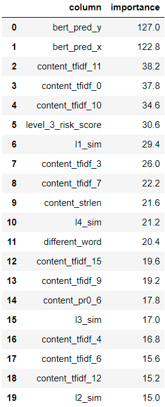
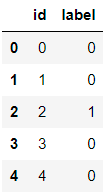

# 文本挖掘比赛：（三）LGB文本分类(调参+阈值搜索)

## 1、数据集

经过前两部分的处理，我们可以得到参与建模的变量，统计类特征的处理包括在`mainProcess`中，bert构建的特征包括在`get_bert_features`中，数据预处理如下：

```python
import warnings
warnings.simplefilter('ignore')

import re
import gc
import pickle
import numpy as np
import pandas as pd
pd.set_option('max_columns', None)
pd.set_option('max_rows', 100)

from tqdm.notebook import tqdm

%matplotlib inline
import matplotlib.pyplot as plt
import seaborn as sns

import sklearn
from sklearn.model_selection import KFold, StratifiedKFold
from sklearn.preprocessing import LabelEncoder
from sklearn.feature_extraction.text import TfidfVectorizer
from sklearn.decomposition import TruncatedSVD
from sklearn.metrics import f1_score
from lightgbm import LGBMClassifier
from sklearn.decomposition import PCA

import jieba
import jieba.posseg as pseg 
import lightgbm as lgb
# 导入编码转换模块
import codecs
# 从textrank4zh模块中导入提取关键词和生成摘要的类
from textrank4zh import TextRank4Keyword, TextRank4Sentence, util

from hyperopt import fmin, tpe, hp
from hyperopt import Trials

train_path = "./data/train.csv"
test_path = "./data/test.csv"

print("数据预处理...")
train, test = mainProcess(train_path, test_path)    # 获取统计类特征
train, test = get_bert_features(train, test)        # 获取bert特征
```

最终得到的数据集如下：

```python
train.shape
# (12000, 114)

test.shape
# (18000, 114)
```

## 2、自动调参

通常有两种常用的调参方法：网格搜索和随机搜索。每一种都有自己的优点和缺点。网格搜索速度慢，但在搜索整个搜索空间方面效果很好，而随机搜索很快，但可能会错过搜索空间中的重要点。幸运的是，还有第三种选择：贝叶斯优化。该比赛的调参环节我们使用了贝叶斯优化的一个实现，一个名为`hyperopt`的 Python 模块。

`hyperopt`的自动调参代码如下：

```python
def hp_param(train_df):
    """基于贝叶斯的自动调参"""
    data = train_df
    X = data.drop(['id', 'label'], axis=1)
    y = data['label']

    #split
    X_train, X_test, y_train, y_test = sklearn.model_selection.train_test_split(X, y, test_size=0.2, random_state=1)

    train_data = lgb.Dataset(data=X_train,label=y_train)
    test_data = lgb.Dataset(data=X_test,label=y_test)
    
    # 搜索空间
    space = {"max_depth": hp.randint("max_depth", 15),
             "num_trees": hp.randint("num_trees", 300),
             "learning_rate": hp.uniform("learning_rate", 1e-3, 5e-1),
             "bagging_fraction": hp.randint("bagging_fraction", 5),
             "num_leaves": hp.randint("num_leaves", 6),   
            }
    
    # 参数变换
    def argsDict_tranform(argsDict, isPrint=False):
        argsDict["max_depth"] = argsDict["max_depth"] + 5
        argsDict['num_trees'] = argsDict['num_trees'] + 150
        argsDict["learning_rate"] = argsDict["learning_rate"] * 0.02 + 0.05
        argsDict["bagging_fraction"] = argsDict["bagging_fraction"] * 0.1 + 0.5
        argsDict["num_leaves"] = argsDict["num_leaves"] * 3 + 10
        if isPrint: 
            print(argsDict)
        else:
            pass 
        return argsDict
    
    def lgb_f1_score(y_hat, data):
        y_true = data.get_label()
        y_hat = np.round(y_hat) # scikits f1 doesn't like probabilities
        return 'f1', f1_score(y_true, y_hat), True
    
    # 模型生成器
    def lightgbm_factory(argsDict):
        argsDict = argsDict_tranform(argsDict)
        
        params={'nthread': -1,  # 进程数
                'max_depth': argsDict['max_depth'],  # 最大深度
                'num_trees': argsDict['num_trees'],  # 树的数量
                'eta': argsDict['learning_rate'],    # 学习率
                'bagging_fraction': argsDict['bagging_fraction'],  # 样本采样
                'num_leaves': argsDict['num_leaves'],  # 终点节点最小样本占比的和
                'objective': 'binary',
                'feature_fraction': 0.8,  # 特征采样
                'lambda_11': 2,  # L1正则化
                'lambda_12': 3,  # L2正则化
                'baggingseed': 100,  # 随机种子，默认为100
               }
        params['metric'] = ['auc']


        model_lgb = lgb.train(params, train_data, valid_sets=[test_data], feval=lgb_f1_score, early_stopping_rounds=10)
        return get_tranformer_score(model_lgb)
    
    # 获取损失函数
    def get_tranformer_score(tranformer):
        model = tranformer
        prediction = model.predict(X_test, num_iteration=model.best_iteration)
        return -sklearn.metrics.roc_auc_score(y_test, prediction)
    
    # 开始调参
    best = fmin(lightgbm_factory, space, algo=tpe.suggest, max_evals=6)
    print('best:')
    print(best)
    
    # 得到最佳参数
    print('best param')
    params = argsDict_tranform(best, isPrint=True)
    return params
    
def model_lgb_hp(train_df, params):
    data = train_df
    X = data.drop(['id', 'label'], axis=1)
    y = data['label']

    #split
    X_train, X_test, y_train, y_test = sklearn.model_selection.train_test_split(X, y, test_size=0.2, random_state=1)

    train_data = lgb.Dataset(data=X_train,label=y_train)
    test_data = lgb.Dataset(data=X_test,label=y_test)

    #train
    gbm_model = LGBMClassifier(boosting_type='gbdt', **params)
    gbm_model.fit(X_train, y_train, eval_set=[(X_train, y_train), (X_test, y_test)], eval_metric='AUC', early_stopping_rounds=10)
    
    pickle.dump(gbm_model, open("model", "wb"))
    print("lgb已保存成文件model")
```

调用如上实现可以获得最优参数best_params：

```python
best_params = hp_param(train)
model_lgb_hp(train, best_params)
```

## 3、训练LGB模型

采用五折交叉验证训练模型，最终的预测结果是五个模型预测结果的平均值。

```python
def train_model(train, test):
    ycol = 'label'
    feature_names = list(filter(lambda x: x not in [ycol, 'id'], train.columns))

    # 贝叶斯调参 A榜f1: 0.95887806
    model = lgb.LGBMClassifier(objective='binary',
                               boosting_type='gbdt',
                               learning_rate=0.05,
                               n_estimators=1000,
                               max_depth=15,
                               num_leaves=13,
                               subsample=0.6,
                               feature_fraction=0.8,
                               reg_alpha=2,     
                               reg_lambda=3,    
                               random_state=2021,
                               is_unbalance=True,
                               metric='auc')

    oof = []
    prediction = test[['id']]
    prediction[ycol] = 0
    df_importance_list = []

    kfold = StratifiedKFold(n_splits=5, shuffle=True, random_state=2021)
    for fold_id, (trn_idx, val_idx) in enumerate(kfold.split(train[feature_names], train[ycol])):
        X_train = train.iloc[trn_idx][feature_names]
        Y_train = train.iloc[trn_idx][ycol]

        X_val = train.iloc[val_idx][feature_names]
        Y_val = train.iloc[val_idx][ycol]

        print('\nFold_{} Training ================================\n'.format(fold_id+1))

        lgb_model = model.fit(X_train,
                              Y_train,
                              eval_names=['train', 'valid'],
                              eval_set=[(X_train, Y_train), (X_val, Y_val)],
                              verbose=100,
                              eval_metric='auc',
                              early_stopping_rounds=50)

        pred_val = lgb_model.predict_proba(X_val, num_iteration=lgb_model.best_iteration_)
        df_oof = train.iloc[val_idx][['id', ycol]].copy()
        df_oof['pred'] = pred_val[:,1]
        oof.append(df_oof)

        pred_test = lgb_model.predict_proba(test[feature_names], num_iteration=lgb_model.best_iteration_)
        prediction[ycol] += pred_test[:,1] / kfold.n_splits

        df_importance = pd.DataFrame({
            'column': feature_names,
            'importance': lgb_model.feature_importances_,
        })
        df_importance_list.append(df_importance)

        del lgb_model, pred_val, pred_test, X_train, Y_train, X_val, Y_val
        gc.collect()
    
    df_oof = pd.concat(oof)
    df_importance = pd.concat(df_importance_list)
    df_importance = df_importance.groupby(['column'])['importance'].agg(
        'mean').sort_values(ascending=False).reset_index()
    print(df_importance)
    
    return df_oof, prediction
```

模型的输出结果：

```python
df_oof, prediction, df_importance = train_model(train, test)
'''
Fold_1 Training ================================

Training until validation scores don't improve for 50 rounds
[100]	train's auc: 0.998856	valid's auc: 0.992418
Early stopping, best iteration is:
[135]	train's auc: 0.999204	valid's auc: 0.992803

Fold_2 Training ================================

Training until validation scores don't improve for 50 rounds
[100]	train's auc: 0.99881	valid's auc: 0.994931
Early stopping, best iteration is:
[97]	train's auc: 0.998795	valid's auc: 0.995108

Fold_3 Training ================================

Training until validation scores don't improve for 50 rounds
[100]	train's auc: 0.998976	valid's auc: 0.985797
Early stopping, best iteration is:
[51]	train's auc: 0.998004	valid's auc: 0.986633

Fold_4 Training ================================

Training until validation scores don't improve for 50 rounds
[100]	train's auc: 0.999213	valid's auc: 0.988753
Early stopping, best iteration is:
[82]	train's auc: 0.999027	valid's auc: 0.989578

Fold_5 Training ================================

Training until validation scores don't improve for 50 rounds
[100]	train's auc: 0.998795	valid's auc: 0.994695
Early stopping, best iteration is:
[76]	train's auc: 0.998359	valid's auc: 0.995042
'''
```

特征重要性：




## 4、搜索最优划分阈值

由于数据的正负样本并不平衡，直接使用0.5作为正样本的划分条件不够合理，这里结合五折交叉验证在训练集上的预测结果，搜索使得f1 score达到最大的划分阈值，搜索过程如下，测试集使用最优划分阈值来得到预测标签：

```python
def search_best_split(df_oof, prediction):
    i_bst = 0
    bst = 0
    for i in np.arange(0.1, 1, 0.05):
        df_oof['pred_label'] = df_oof['pred'].apply(lambda x: 1 if x >= i else 0)
        score = f1_score(df_oof['label'], df_oof['pred_label'])
        print(i, 'f1_score:', score)
        if score> bst:
            i_bst = i
            bst = score
    print('best split point: {}, best f1-score: {}'.format(i_bst, bst))
    
    prediction['label'] = prediction['label'].apply(lambda x: 1 if x >= i_bst else 0)
    print(prediction['label'].value_counts())
    return prediction[['id', 'label']]
```

输出结果如下：

```python
result = search_best_split(df_oof, prediction)
'''
0.1 f1_score: 0.7603853100541843
0.15000000000000002 f1_score: 0.8142394822006473
0.20000000000000004 f1_score: 0.8392498325519089
0.25000000000000006 f1_score: 0.8588114050154587
0.30000000000000004 f1_score: 0.8713286713286713
0.3500000000000001 f1_score: 0.8830616583982991
0.40000000000000013 f1_score: 0.8921533500537442
0.45000000000000007 f1_score: 0.8991291727140784
0.5000000000000001 f1_score: 0.907957462412908
0.5500000000000002 f1_score: 0.9113082039911308
0.6000000000000002 f1_score: 0.9134328358208955
0.6500000000000001 f1_score: 0.9170731707317074
0.7000000000000002 f1_score: 0.919000757002271
0.7500000000000002 f1_score: 0.9223115193264447
0.8000000000000002 f1_score: 0.9242718446601942
0.8500000000000002 f1_score: 0.9224714679260133
0.9000000000000002 f1_score: 0.9174385823600484
0.9500000000000003 f1_score: 0.797088262056415
best split point: 0.8000000000000002, best f1-score: 0.9242718446601942
0    16082
1     1918
'''
```

最终的预测结果如下：

```
result.head()
```



