# 文本挖掘比赛：（二）算法篇

## 1、文本挖掘的历程

对于NLP问题，首先要解决的是文本表示的问题。虽然人能够清楚地了解文本的含义，但是计算机只能处理数值运算，因此首先要考虑如何将文本转化为数值。

### 1.1 向量表示

#### 1.1.1 词袋模型

最初的方案是通过词袋模型把一个句子转化为向量表示。它不考虑句子中单词的顺序，只考虑词表（vocabulary）中单词在这个句子中的出现次数。

如果是表示一个词，那就是one-hot的方式，比如我们想表示apple这个词，就在对应位置设置1，其他位置设置为0，如下：

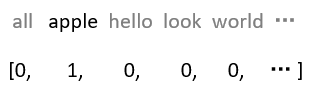

如果是表示一个句子，比如：

> **"John likes to watch movies, Mary likes movies too"**
>
> **"John also likes to watch football games"**
>
> ——来自wiki

对于这两个句子，我们要用词袋模型把它转化为向量表示，这两个句子形成的词表（不去停用词）为：

> **[‘also’, ‘football’, ‘games’, ‘john’, ‘likes’, ‘mary’, ‘movies’, ‘to’, ‘too’, ‘watch’]**

因此，它们的向量表示为：

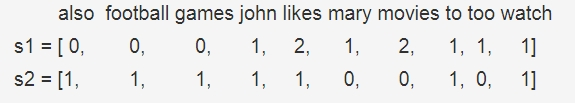

scikit-learn中的CountVectorizer()函数实现了BOW模型，如下：

```python
from sklearn.feature_extraction.text import CountVectorizer
corpus = [
    "John likes to watch movies, Mary likes movies too",
    "John also likes to watch football games",
]
vectorizer = CountVectorizer()
X = vectorizer.fit_transform(corpus)
print(vectorizer.get_feature_names())
print(X.toarray())

#输出结果：
#['also', 'football', 'games', 'john', 'likes', 'mary', 'movies', 'to', 'too', 'watch']
#[[0 0 0 1 2 1 2 1 1 1]
# [1 1 1 1 1 0 0 1 0 1]]
```

#### 1.1.2 TF-IDF

使用BOW模型有很多缺点，首先它没有考虑单词之间的顺序，其次它无法反应出一个句子的关键词，比如下面这个句子：

> **"John likes to play football, Mary likes too"**

这个句子若用BOW模型，它的词表为：[‘football’, ‘john’, ‘likes’, ‘mary’, ‘play’, ‘to’, ‘too’]，则词向量表示为：[1 1 2 1 1 1 1]。若根据BOW模型提取这个句子的关键词，则为 “like”，但是显然这个句子的关键词应该为 “football”。而TF-IDF则可以解决这个问题。TF-IDF看名字也知道包括两部分TF和IDF，TF（Term Frequency，词频）的公式为：
$$
TF(w)={{单词w在文章中出现的次数}\over{文章的单词总数}}
$$
而IDF（inverse document frequency，逆文本频率）的公式为：
$$
IDF(w)=log({{语料库中文档的总数}\over{包含词w的文档数+1}})
$$
其中，分母之所以加1是为了防止分母为0。所以，TF-IDF的公式为：
$$
TF-IDF(w)=TF(w)*IDF(w)
$$
TF-IDF值越大说明这个词越重要，也可以说这个词是关键词。

实际使用中，sklearn也封装TF-IDF方法，如下：

```python
from sklearn.feature_extraction.text import TfidfVectorizer
corpus = [
    'This is the first document.',
    'This document is the second document.',
    'And this is the third one.',
    'Is this the first document?',
]
vectorizer = TfidfVectorizer()
X = vectorizer.fit_transform(corpus)
print(vectorizer.get_feature_names())
print(X.toarray())

"""
['and', 'document', 'first', 'is', 'one', 'second', 'the', 'third', 'this']

[[0.         0.46979139 0.58028582 0.38408524 0.         0.
  0.38408524 0.         0.38408524]
 [0.         0.6876236  0.         0.28108867 0.         0.53864762
  0.28108867 0.         0.28108867]
 [0.51184851 0.         0.         0.26710379 0.51184851 0.
  0.26710379 0.51184851 0.26710379]
 [0.         0.46979139 0.58028582 0.38408524 0.         0.
  0.38408524 0.         0.38408524]]
"""
```

#### 1.1.3 Word Embedding

后来又出现了词向量，word embedding，用一个低维稠密的向量去表示一个词，比如：

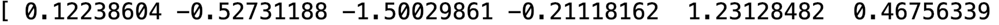

通常这个向量的维度在几百到上千之间，相比one hot几千几万的维度就低了很多。词与词之间可以通过相似度或者距离来表示关系，相关的词向量相似度比较高，或者距离比较近，不相关的词向量相似度低，或者距离比较远，这样词向量本身就有了含义。文本的表示问题就得到解决。

词向量可以通过一些无监督的方法学习得到，比如Word2Vec中的CBOW或者Skip-Gram，可以预先在语料库上训练出词向量，以供后续的使用。

### 1.2 解决具体任务

NLP中有各种各样的任务，比如分类（Classification），问答（QA），实体命名识别（NER）等。

对于这些不同的任务，最早的做法是根据每类任务定制不同的模型，输入预训练好的embedding，然后利用特定任务的数据集对模型进行训练，如下：

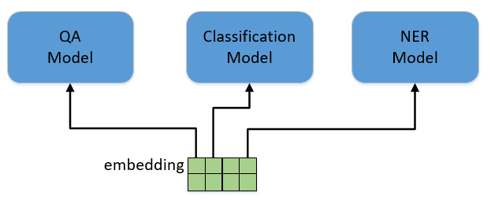

这里存在的问题就是，不是每个特定任务都有大量的标签数据可供训练，对于那些数据集非常小的任务，恐怕就难以得到一个理想的模型。

为了解决这个问题，NLP领域借鉴了CV领域的解决方案。首先用一个通用的网络模型，比如Vgg，ResNet或者GoogleNet，在ImageNet上做预训练（pre-training）。ImageNet有1400万张有标注的图片，包含1000个类别，这样的数据规模足以训练出一个规模庞大的模型。在训练过程中，模型会不断的学习如何提取特征，底层的CNN网络结构会提取边缘，角，点等通用特征，模型越往上走，提取的特征也越抽象，与特定的任务更加相关。当完成预训练之后，根据我自己的分类任务，调整最上层的网络结构，然后在小数据集里对模型进行训练。

在训练时，可以固定住底层的模型参数只训练顶层的参数，也可以对整个模型进行训练，这个过程叫做微调（fine-tuning），最终得到一个可用的模型。

总结一下，整个过程包括两步，拿一个通用模型在ImageNet上做预训练（pre-training），然后针对特定任务进行微调（fine-tuning），完美解决了特定任务数据不足的问题。

还有一个好处是，对于各种各样的任务都不再需要从头开始训练网络，可以直接拿预训练好的结果进行微调，既减少了训练计算量的负担，也减少了人工标注数据的负担。

NLP领域引入了这种做法，用一个通用模型，在非常大的语料库上进行预训练，然后在特定任务上进行微调，BERT就是这套方案的集大成者。BERT不是第一个，但目前为止，是效果最好的方案。BERT用了一个已有的模型结构，提出了一整套的预训练方法和微调方法。

## 2、Attention机制

Attention（注意力）机制的核心逻辑是「**从关注全部到关注重点**」，将有限的注意力集中在重点信息上，从而节省资源，快速获得最有效的信息。

之所以要引入 Attention 机制，主要是Attention 有几个优点：

- **参数少**

模型复杂度跟 [CNN](https://link.zhihu.com/?target=https%3A//easyai.tech/ai-definition/cnn/)、[RNN](https://link.zhihu.com/?target=https%3A//easyai.tech/ai-definition/rnn/) 相比，复杂度更小，参数也更少，所以对算力的要求也就更小。

- **速度快**

Attention 解决了 RNN 不能并行计算的问题。Attention机制每一步计算不依赖于上一步的计算结果，因此可以和CNN一样并行处理。

- **效果好**

在 Attention 机制引入之前，有一个问题大家一直很苦恼：长距离的信息会被弱化，就好像记忆能力弱的人，记不住过去的事情是一样的。

Attention 是挑重点，就算文本比较长，也能从中间抓住重点，不丢失重要的信息，从而达到“天涯若比邻”的效果。

**Attention 原理可以分解为三步：**

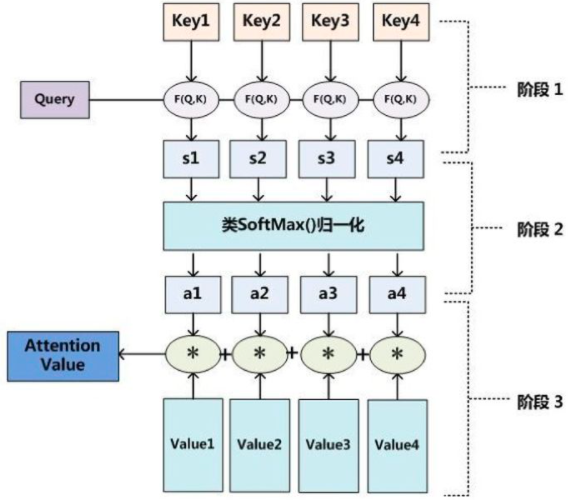

第一步： query 和 key 进行相似度计算，得到权值；

第二步：将权值进行归一化，得到直接可用的权重；

第三步：将权重和 value 进行加权求和；

> 从上面的建模，我们可以大致感受到 Attention 的思路简单，**四个字“带权求和”就可以高度概括**，大道至简。做个不太恰当的类比，人类学习一门新语言基本经历四个阶段：死记硬背（通过阅读背诵学习语法练习语感）->提纲挈领（简单对话靠听懂句子中的关键词汇准确理解核心意思）->融会贯通（复杂对话懂得上下文指代、语言背后的联系，具备了举一反三的学习能力）->登峰造极（沉浸地大量练习）。
> 这也如同attention的发展脉络，RNN 时代是死记硬背的时期，attention 的模型学会了提纲挈领，进化到 [transformer](https://link.zhihu.com/?target=https%3A//easyai.tech/ai-definition/transformer/)，融汇贯通，具备优秀的表达学习能力，再到 GPT、BERT，通过多任务大规模学习积累实战经验，战斗力爆棚。
> 要回答为什么 attention 这么优秀？是因为它让模型开窍了，懂得了提纲挈领，学会了融会贯通。
> ——阿里技术

## 3、Transformer的原理

Bert中的核心结构是Transformer，Transformer包括两个部分encoder和decoder，首先看一下encoder部分的处理：

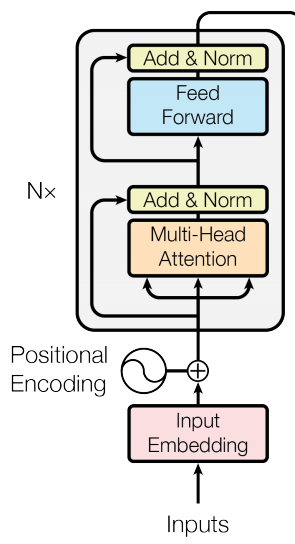

首先是输入word embedding，这里是直接输入一整句话的所有embedding。如下图所示，假设我们的输入是Thinking Machines，每个词对应一个embedding，就有2个embedding。输入embedding需要加上位置编码（Positional Encoding），为什么要加位置编码，后文会做详细介绍。然后经过一个Multi-Head Attention结构，这个结构是算法单元中最重要的部分，我们会在后边详细介绍。之后是做了一个shortcut的处理，就是把输入和输出按照对应位置加起来，如果了解残差网络（ResNet）的同学，会对这个结构比较熟悉，这个操作有利于加速训练。然后经过一个归一化normalization的操作。接着经过一个两层的全连接网络，最后同样是shortcut和normalization的操作。可以看到，除了Multi-Head Attention，都是常规操作，没有什么难理解的。这里需要注意的是，每个小模块的输入和输出向量，维度都是相等的，比如，Multi-Head Attention的输入和输出向量维度是相等的，否则无法进行shortcut的操作；Feed Forward的输入和输出向量维度也是相等的；最终的输出和输入向量维度也是相等的。但是Multi-Head Attention和Feed Forward内部，向量维度会发生变化。

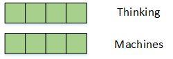

我们来详细看一下Multi-Head Attention的结构。这个Multi-Head表示多头的意思，先从最简单的看起，看看单头Attention是如何操作的。从下图的橙色方块可以看到，embedding在进入到Attention之前，有3个分叉，那表示说从1个向量，变成了3个向量。具体是怎么算的呢？我们看图中，定义了一个$W^Q$矩阵（这个矩阵随机初始化，通过训练得到），将embedding和$W^Q$矩阵做乘法，得到查询向量q，假设输入embedding是512维，在图中我们用4个小方格表示，输出的查询向量是64维，图中用3个小方格以示不同。然后类似地，定义$W^K$和$W^V$矩阵，将embedding和$W^K$做矩阵乘法，得到键向量k；将embeding和$W^V$做矩阵乘法，得到值向量v。对每一个embedding做同样的操作，那么每个输入就得到了3个向量：查询向量，键向量和值向量。需要注意的是，查询向量和键向量要有相同的维度，值向量的维度可以相同，也可以不同，但一般也是相同的。

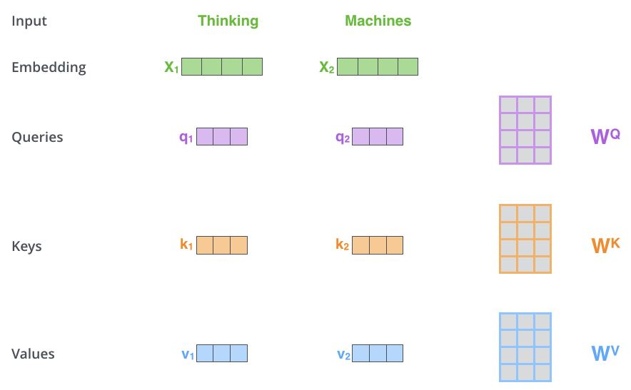

接下来我们计算每一个embedding的输出，以第一个词Thinking为例，参看下图。用查询向量q1跟键向量k1和k2分别做点积，得到112和96两个数值。这也是为什么前文提到查询向量和键向量的维度必须要一致，否则无法做点积。然后除以常数8，得到14和12两个数值。这个常数8是键向量的维度的开方，键向量和查询向量的维度都是64，开方后是8。做这个尺度上的调整目的是为了易于训练。然后把14和12丢到softmax函数中，得到一组加和为1的系数权重，算出来是大约是0.88和0.12。将0.88和0.12对两个值向量v1和v2做加权求和，就得到了Thinking的输出向量z1。类似的，可以算出Machines的输出z2。如果一句话中包含更多的词，也是相同的计算方法。

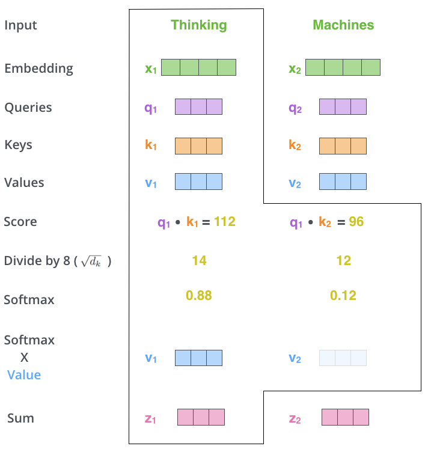

通过这样一系列的计算，可以看到，现在每个词的输出向量z都包含了其他词的信息，每个词都不再是孤立的了。而且每个位置中，词与词的相关程度，可以通过softmax输出的权重进行分析。如下图所示，这是某一次计算的权重，其中线条颜色的深浅反映了权重的大小，可以看到it中权重最大的两个词是The和animal，表示it跟这两个词关联最大。这就是attention的含义，输出跟哪个词关联比较强，就放比较多的注意力在上面。

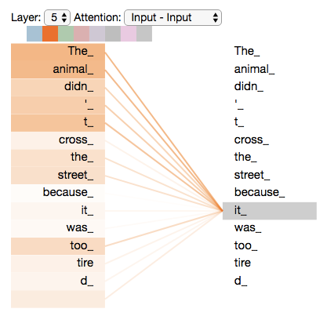

上面我们把每一步计算都拆开了看，实际计算的时候，可以通过矩阵来计算，如图所示。

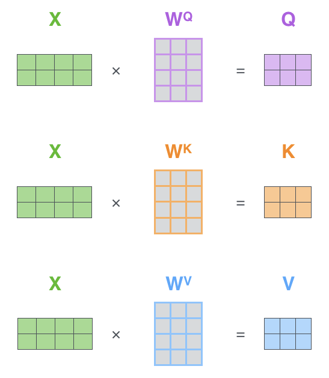

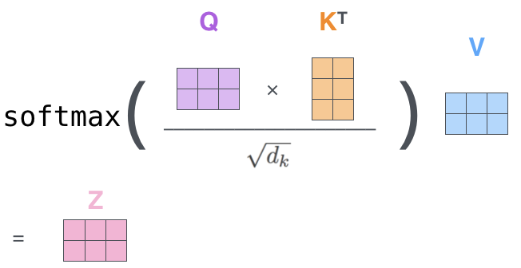

讲完了attention，再来讲Multi-Head。对于同一组输入embedding，我们可以并行做若干组上面的操作，例如，我们可以进行8组这样的运算，每一组都有$W^Q, W^K, W^V$矩阵，并且不同组的矩阵也不相同。这样最终会计算出8组输出，我们把8组的输出连接起来，并且乘以矩阵$W^O$做一次线性变换得到输出，$W^O$也是随机初始化，通过训练得到，计算过程如下图所示。这样的好处，一是多个组可以并行计算，二是不同的组可以捕获不同的子空间的信息。

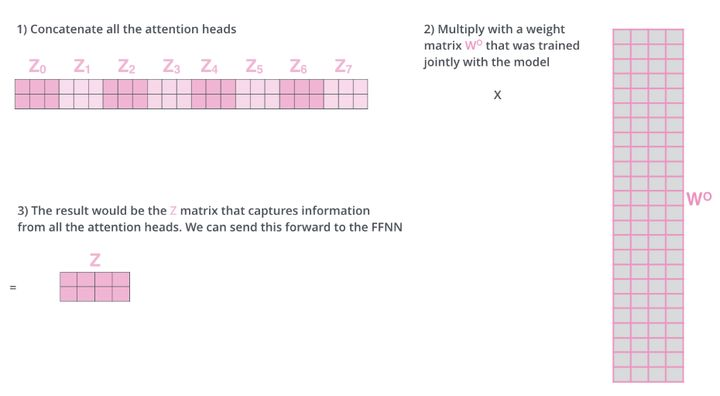

到这里就把Transformer的结构讲完了，同样都是做NLP任务，我们来和RNN做个对比。下图是个最基本的RNN结构，还有计算公式。当计算隐向量h4时，用到了输入x4，和上一步算出来的隐向量h3，h3包含了前面所有节点的信息。h4中包含最多的信息是当前的输入x4，越往前的输入，随着距离的增加，信息衰减得越多。对于每一个输出隐向量h都是如此，包含信息最多得是当前的输入，随着距离拉远，包含前面输入的信息越来越少。但是Transformer这个结构就不存在这个问题，不管当前词和其他词的空间距离有多远，包含其他词的信息不取决于距离，而是取决于两者的相关性，这是Transformer的第一个优势。第二个优势在于，对于Transformer来说，在对当前词进行计算的时候，不仅可以用到前面的词，也可以用到后面的词。而RNN只能用到前面的词，这并不是个严重的问题，因为这可以通过双向RNN来解决。第三点，RNN是一个顺序的结构，必须要一步一步地计算，只有计算出h1，才能计算h2，再计算h3，隐向量无法同时并行计算，导致RNN的计算效率不高，这是RNN的固有结构所造成的，之前有一些工作就是在研究如何对RNN的计算并行化。通过前文的介绍，可以看到Transformer不存在这个问题。通过这里的比较，可以看到Transformer相对于RNN有巨大的优势，因此我看到有人说RNN以后会被取代。

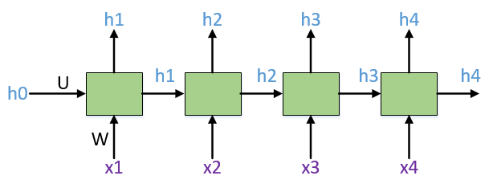

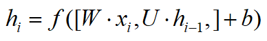

关于上面的第三点优势，可能有人会不认可，RNN的结构包含了序列的时序信息，而Transformer却完全把时序信息给丢掉了。为了解决时序的问题，Transformer的作者用了一个绝妙的办法，这就是我在前文提到的位置编码（Positional Encoding）。位置编码是和word embedding同样维度的向量，将位置embedding和词embedding加在一起，作为输入embedding，如下图所示。位置编码可以通过学习得到，也可以通过设置一个跟位置或者时序相关的函数得到，比如设置一个正弦或者余弦函数，这里不再多说。

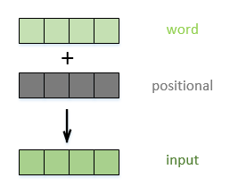

我们把Transformer的结构作为一个基本单元，把N个这样的基本单元顺序连起来，就是BERT的算法模型，如下图所示：

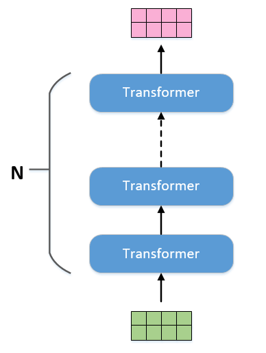

从前面的描述中可以看到，当输入有多少个embedding，那么输出也就有相同数量的embedding，可以采用和RNN相同的叫法，把输出叫做隐向量。在做具体NLP任务的时候，只需要从中取对应的隐向量作为输出即可。

## 4、BERT原理

实际BERT并不是第一个提出预训练加微调的方案，此前还有一套方案叫GPT。GPT的模型结构和BERT是相同的，都是上图的结构，只是BERT的模型规模更加庞大。

GPT是这么预训练的，在一个8亿单词的语料库上做训练，给出前文，不断地预测下一个单词。比如这句话，Winter is coming，当给出第一个词Winter之后，预测下一个词is，之后再预测下一个词coming。不需要标注数据，通过这种无监督训练的方式，得到一个预训练模型。

我们再来看看BERT有什么不同。BERT来自于Bidirectional Encoder Representations from Transformers首字母缩写，这里提到了一个双向（Bidirectional）的概念。BERT在一个33亿单词的语料库上做预训练，语料库就要比GPT大了几倍。预训练包括了两个任务：

- **Masking Input：**第一个任务是随机地扣掉15%的单词，用一个掩码MASK代替，让模型去猜测这个单词；
- **Next Sentence Prediction：**第二个任务是，每个训练样本是一个上下句，有50%的样本，下句和上句是真实的，另外50%的样本，下句和上句是无关的，模型需要判断两句的关系。

这两个任务各有一个loss，将这两个loss加起来作为总的loss进行优化。

对于loss1，其计算过程如下：

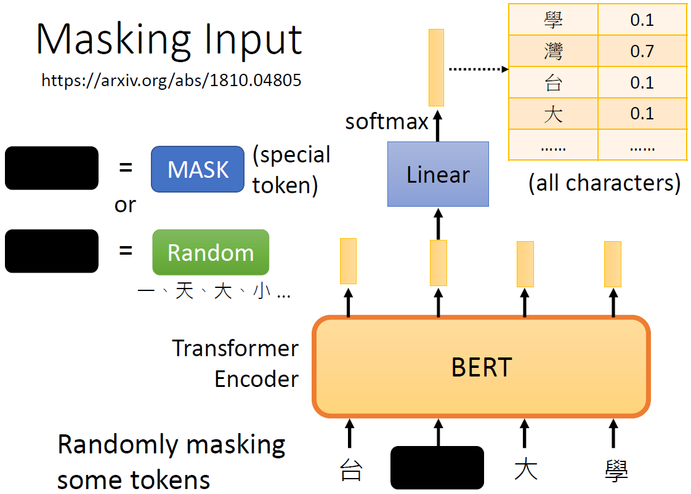

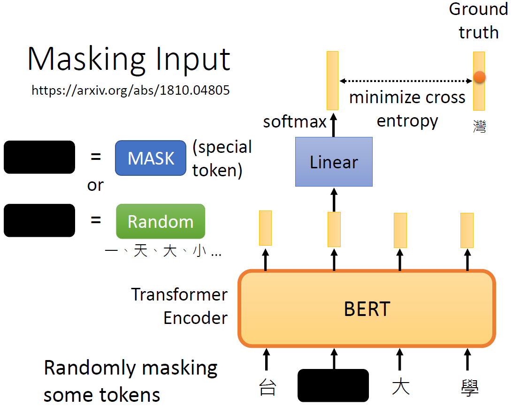

对于loss2，其计算过程如下：

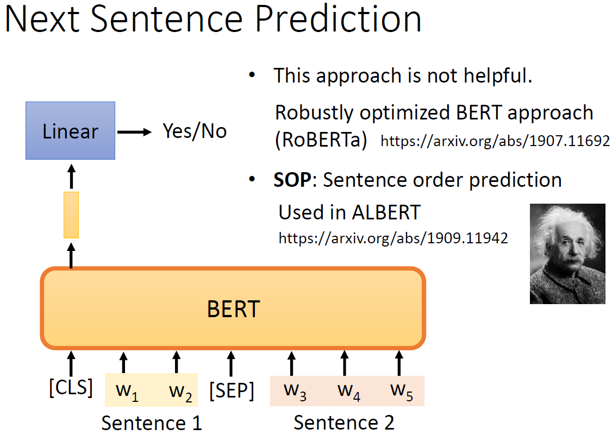

> 当然现在也有一些文献说Next Sentence Prediction没有用。

下面两行是一个小栗子，用括号标注的是扣掉的词，用[MASK]来代替。

**正样本：我[MASK]（是）个算法工程师，我服务于WiFi万能钥匙这家[MASK]（公司）。**

**负样本：我[MASK]（是）个算法工程师，今天[MASK]（股票）又跌了。**

我们来对比下GPT和BERT两种预训练方式的优劣。GPT在预测词的时候，只预测下一个词，因此只能用到上文的信息，无法利用到下文的信息。而BERT是预测文中扣掉的词，可以充分利用到上下文的信息，这使得模型有更强的表达能力，这也是BERT中Bidirectional的含义。在一些NLP任务中需要判断句子关系，比如判断两句话是否有相同的含义。BERT有了第二个任务，就能够很好的捕捉句子之间的关系。

讲完了这两个任务，我们再来看看，如何表达这么复杂的一个训练样本，让计算机能够明白。下图表示“my dog is cute, he likes playing.”的输入形式。每个符号的输入由3部分构成：

- 第一个是词本身的embedding；
- 第二个是表示上下句的embedding，如果是上句，就用A embedding，如果是下句，就用B embedding；
- 最后，根据Transformer模型的特点，还要加上位置embedding，这里的位置embedding是通过学习的方式得到的，BERT设计一个样本最多支持512个位置；

将3个embedding相加，作为输入。需要注意的是，在每个句子的开头，需要加一个Classification（CLS）符号，后文中会进行介绍，其他的一些小细节就不说了。

图3.2

完成预训练之后，就要针对特定任务就行微调了，这里只说下分类任务，分类任务包括对单句子的分类任务，比如判断电影评论是喜欢还是讨厌；多句子分类，比如判断两句话是否表示相同的含义。

下图（a）（b）是对这类任务的一个示例，左边表示两个句子的分类，右边是单句子分类：

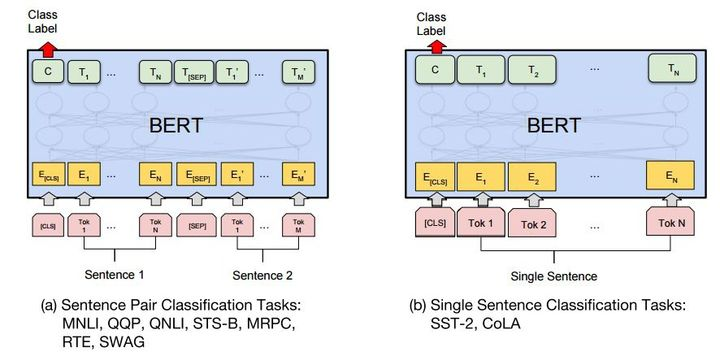

在输出的隐向量中，取出CLS对应的向量C，加一层网络W，并丢给softmax进行分类，得到预测结果P，计算过程如下：
$$
P=softmax(C·W^T)
$$
在特定任务数据集中对Transformer模型的所有参数和网络W共同训练，直到收敛。新增加的网络W是H*K维，H表示隐向量的维度，K表示分类数量，W的参数数量相比预训练模型的参数少得可怜。我们只需要新增少量的参数，然后在特定数据集上进行训练即可。从实验结果来看，即便是很小的数据集，也能取得不错的效果。

## 5、BERT的应用

### 5.1 simpletransformers

Simple Transformers是专为需要简单快速完成某项文本工作而设计。它是AI创业公司Hugging Face在Transformers库的基础上构建的。基于该工具，我们不必拘泥于源代码，也不用费时费力地去弄清楚各种设置，把文本分类问题变得简单易操作。

首先，我们需要安装simpletransformers：

```shell
pip install simpletransformers
```

对于不同的任务，模型的训练流程遵循相同的模式，总共四步：

1. Initialize a task-specific model
2. Train the model with `train_model()`
3. Evaluate the model with `eval_model()`
4. Make predictions on (unlabelled) data with `predict()`

下面以分类模型为例：

#### 5.1.1 准备数据

Simple Transformers要求数据必须包含在至少两列的DataFrames中。我们只需为列的文本和标签命名，SimpleTransformers就会处理数据。或者我们也可以遵循以下约定：

- 第一列包含文本，类型为str。

- 第二列包含标签，类型为int。

对于多类分类，标签应该是从0开始的整数。如果数据具有其他标签，则可以使用dict保留从原始标签到整数标签的映射。

```python
# 读取训练集和验证集数据
train_df = train.iloc[trn_idx][['content', 'label']]
valid_df = train.iloc[val_idx][['content', 'label']]
# 为文本和标签命名（如果不命名，默认将第一列作为text，第二列作为labels）
train_df.columns = ['text', 'labels']
valid_df.columns = ['text', 'labels']
```

#### 5.1.2 模型

导入针对特定任务的模型：

```python
from simpletransformers.classification import ClassificationModel
```

由于Transformers是预训练模型，所以我们可以先load一下预训练好的模型：

- load标准预训练模型：

```python
model = ClassificationModel(
    "roberta", "roberta-base"
)
```

> 标准预训练模型可参见：[**Pretrained models**](https://huggingface.co/transformers/pretrained_models.html)

- load社区预训练模型

```python
model = ClassificationModel(
    "bert", "KB/bert-base-swedish-cased"
)
```

> 社区预训练模型可参见：[**Hugging Face**](https://huggingface.co/)

- load本地预训练模型

```python
model = ClassificationModel(
    "bert", "outputs/best_model"
)
```

> outputs/best_model为本地保存模型的路径。

此外，load模型的时候，可以修改模型的配置选项，使得我们可以很容易的定制模型。配置选项分为两种类型：所有任务通用的选项、针对特定任务的选项。配置方式如下：

```python
model_args = ClassificationArgs()
model_args.num_train_epochs = 5
model_args.learning_rate = 1e-4

model = ClassficationModel("bert", 
                           "bert-base-cased", 
                           use_cuda=True,     # 是否使用CUDA
                           args=model_args)   # 模型配置
```

> 通用配置说明参见：[Configuring a Simple Transformers Model](https://simpletransformers.ai/docs/usage/)

#### 5.1.3 训练

```python
# Train the model
model.train_model(train_df)
```

这就是训练模型的全部操作，我们还可以通过将包含相关属性的字典传递给train_model方法来更改超参数。需要注意的是，即使完成训练，这些修改也将保留。

train_model方法将在第n个step（其中n为self.args ['save_steps']）创建模型的检查点（保存）。训练完成后，最终模型将保存到self.args ['output_dir']。

#### 5.1.4 评估

```python
result, model_outputs, wrong_predictions = model.eval_model(eval_df)
```

要评估模型，只需调用eval_model。此方法具有三个返回值：

• `result`：dict形式的评估结果。默认情况下，仅对多类分类计算马修斯相关系数（MCC）。

• `model_outputs`：评估数据集中每个项目的模型输出list。用softmax函数来计算预测值，输出每个类别的概率而不是单个预测。

• `wrong_predictions`：每个错误预测的InputFeature列表。可以从InputFeature.text_a属性获取文本。（可以在存储库 [ThilinaRajapakse/simpletransformers](https://link.zhihu.com/?target=https%3A//github.com/ThilinaRajapakse/simpletransformers) 的utils.py文件中找到InputFeature类）

我们还可以在评估中使用其他指标，只需将指标函数作为关键字参数传递给eval_model方法。指标功能应包含两个参数，第一个是真实标签，第二个是预测，这遵循sklearn的标准。

对于任何需要附加参数的度量标准函数（在sklearn中为f1_score），你可以在添加了附加参数的情况下将其包装在自己的函数中，然后将函数传递给eval_model。

```python
from sklearn.metrics import f1_score, accuracy_score

def f1_multiclass(labels, preds):
      return f1_score(labels, preds, average='micro')

result, model_outputs, wrong_predictions = model.eval_model(eval_df, f1=f1_multiclass, acc=accuracy_score)
```

作为参考，我使用这些超参数获得的结果如下：

```python
{'mcc': 0.937104098029913, 'f1': 0.9527631578947369, 'acc': 0.9527631578947369}
```

#### 5.1.5 预测

在实际应用中，我们常常不知道什么是真正的标签。要对任意样本执行预测，可以使用predict方法。此方法与eval_model方法非常相似，不同之处在于，该方法采用简单的文本列表并返回预测列表和模型输出列表。

```python
predictions, raw_outputs = model.predict(['Some arbitary sentence'])
```

> 参考文档：[Documentation](https://simpletransformers.ai/docs/usage/)

### 5.2 构建中文文本分类任务

#### 5.2.1 企业隐患排查文本训练和预测

**（1）读取数据**

```python
import warnings
warnings.simplefilter('ignore')

import gc
import torch
import numpy as np
import pandas as pd
from sklearn.metrics import f1_score
from sklearn.model_selection import StratifiedKFold

from simpletransformers.classification import ClassificationModel, ClassificationArgs

# 读取数据
train = pd.read_csv('./drive/MyDrive/data/train.csv')
test = pd.read_csv('./drive/MyDrive/data/test.csv')
train['content'].fillna('', inplace=True)
test['content'].fillna('', inplace=True)

cuda_available = torch.cuda.is_available()
```

**（2）single sentence classification**

单句子的文本分类任务

```python
oof = []
prediction = test[['id']]
prediction['bert_pred'] = 0

kfold = StratifiedKFold(n_splits=5, shuffle=True, random_state=2021)
for fold_id, (trn_idx, val_idx) in enumerate(kfold.split(train, train['label'])):
    train_df = train.iloc[trn_idx][['content', 'label']]
    valid_df = train.iloc[val_idx][['content', 'label']]
    train_df.columns = ['text', 'labels']
    valid_df.columns = ['text', 'labels']

    def get_model_args(dir):
      model_args = ClassificationArgs()
      model_args.max_seq_length = 128    # 截取文本长度为128
      model_args.train_batch_size = 16   
      model_args.num_train_epochs = 2    # 跑2epoch
      model_args.sliding_window=True     # 使用滑动窗口
      model_args.evaluate_during_training = True    # 训练过程中做评估
      model_args.evaluate_during_training_verbose = True
      model_args.fp16 = False    
      model_args.no_save = True     # 不保存模型
      model_args.save_steps = -1    # 不根据step保存检查点
      model_args.overwrite_output_dir = True    # 覆盖输出路径
      model_args.output_dir = dir    # 模型输出路径，默认为/outputs
      return model_args
    
    model_args = get_model_args('./drive/MyDrive/models/bert_fold_' + str(fold_id))
    model = ClassificationModel('bert',
                   'hfl/chinese-roberta-wwm-ext',    # 中文文本train的社区预训练模型
                   use_cuda=cuda_available,
                   args=model_args)
    model.train_model(train_df, eval_df=valid_df)
    _, vaild_outputs, _ = model.eval_model(valid_df)
    
    df_oof = train.iloc[val_idx][['id', 'label']].copy()
    # df_oof['bert_pred'] = vaild_outputs[:,1]
    df_oof['bert_pred'] = [np.mean(output, axis=0)[1] for output in vaild_outputs]
    oof.append(df_oof)
    
    _, test_outputs = model.predict([text for text in test['content']])
    # prediction['bert_pred'] += test_outputs[:, 1] / kfold.n_splits
    prediction['bert_pred'] += np.array([np.mean(output, axis=0)[1] for output in test_outputs]) / kfold.n_splits
    
    del model, train_df, valid_df, vaild_outputs, test_outputs
    gc.collect()
```

**（3）sentence pair classification**

多句子的文本分类任务

```python
oof = []
prediction = test[['id']]
prediction['bert_pred'] = 0

kfold = StratifiedKFold(n_splits=5, shuffle=True, random_state=2021)
for fold_id, (trn_idx, val_idx) in enumerate(kfold.split(train, train['label'])):
    train_df = train.iloc[trn_idx][['level_4', 'content', 'label']]
    valid_df = train.iloc[val_idx][['level_4', 'content', 'label']]
    train_df.columns = ['text_a', 'text_b', 'labels']
    valid_df.columns = ['text_a', 'text_b', 'labels']
    
    def get_model_args(dir):
      model_args = ClassificationArgs()
      model_args.max_seq_length = 256
      model_args.train_batch_size = 16
      model_args.num_train_epochs = 3
      model_args.fp16 = False
      model_args.no_save = True
      model_args.overwrite_output_dir = True
      model_args.output_dir = dir
      return model_args

    model_args = get_model_args('./drive/MyDrive/models/bert_pair_fold_' + str(fold_id))   
    model = ClassificationModel('bert',
                  'hfl/chinese-roberta-wwm-ext',
                  num_labels=2,
                  use_cuda=True,
                  cuda_device=0,
                  args=model_args)
    model.train_model(train_df, eval_df=valid_df)

    _, vaild_outputs, _ = model.eval_model(valid_df)
    
    df_oof = train.iloc[val_idx][['id', 'label']].copy()
    df_oof['bert_pred'] = vaild_outputs[:,1]
    oof.append(df_oof)
    _, test_outputs = model.predict([list(text) for text in test[['level_4', 'content']].values])
    prediction['bert_pred'] += test_outputs[:, 1] / kfold.n_splits
    
    del model, train_df, valid_df, vaild_outputs, test_outputs
    gc.collect()
```

使用五折交叉验证，减小模型过拟合的风险。

#### 5.2.2 选择合适的切分点

```python
i_bst = 0
bst = 0
df_oof = pd.concat(oof)
for i in np.arange(df_oof.bert_pred.min(), df_oof.bert_pred.max(), 0.1):
    df_oof['pred_label'] = df_oof['bert_pred'].apply(lambda x: 1 if x >= i else 0)
    score = f1_score(df_oof['label'], df_oof['pred_label'])
    # print(i, 'f1_score:', score)
    if score> bst:
        i_bst = i
        bst = score
print(i_bst, 'f1_score:', bst)
# 0.9234375
```

对于预测结果，在训练集上选择一个最优切分点，使得训练集上的f1分数最高，然后使用这个切分点在测试集上划分正负样本。

#### 5.2.3 预测结果

```python
prediction['label'] = prediction['bert_pred'].apply(lambda x: 1 if x >= i_bst else 0)
prediction['label'].value_counts()
df_oof[['id', 'bert_pred']].to_csv('./drive/MyDrive/output/roberta_pred_oof2.csv', index=False)
prediction[['id', 'bert_pred']].to_csv('./drive/MyDrive/output/roberta_pred_test2.csv', index=False)
```

bert的预测结果有两种使用方式：

- 在训练集上选择合适的切分点，使用切分点直接在测试集上划分正负样本；

- 将模型的预测结果作为子模型分，同其他统计类特征一起进入LGB模型，输出预测概率；

## 6、sbert双塔模型

### 6.1 双塔SBERT模型

**塔式结构**在深度学习模型中是比较常见的，比较著名的是微软的[DSSM](https://link.zhihu.com/?target=https%3A//posenhuang.github.io/papers/cikm2013_DSSM_fullversion.pdf)（Deep Structured Semantic Models ）基于深度网络的语义模型，其结构如下：

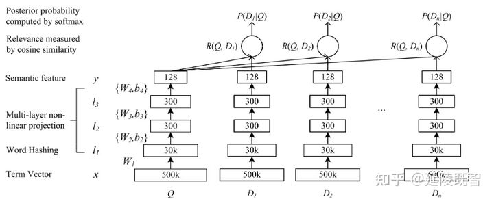

DSSM模型通过一层一层堆叠的网络提取隐含语义，通过semantic特征向量（128维）的两两余弦计算，得到各文本之间的相似度R(q, d)，最后优化相似度与样本的距离。其中128维的**semantic feature**，即为通过该模型学习到的对应文本的**隐含语义**。

而SBert与dssm思想上比较类似，都是通过独立的子模块进行高维信息抽取，通过各文本特征向量的余弦距离，来表征文本语义相似度。sbert结构图如下：


**semantic feature（上图的U、V）**在实际生产上非常有意义，它能够预先通过sbert计算得到。然后，通过向量搜索引擎处理这些向量，检索到最相似语义的文本。这种方式能非常快速实现海量相似文本的查询、排序，而无需再进行高延迟的模型预测。类似的，推荐系统也是预先学习到用户、商品的表征向量，从而进行召回、排序、推荐等任务。

### 6.2 sentence-transformer

sentence-transformer框架提供了一种简便的方法来计算句子和段落的向量表示（也称为句子嵌入）。这些模型基于诸如BERT / RoBERTa / XLM-RoBERTa等模型，并且经过专门调整以优化向量表示，以使具有相似含义的句子在向量空间中接近。

首先，安装sentence-transformers包：

```shell
pip install -U sentence-transformers
```

比如我们的训练数据集如下，任务为：对于给定句子可以查询最相似的文本。

> [('为什么我无法看到额度', '为什么开通了却没有额度', 0),
> ('为啥换不了', '为两次还都提示失败呢', 0),
> ('借了钱，但还没有通过，可以取消吗？', '可否取消', 1),
> ('为什么我申请额度输入密码就一直是那个页面', '为什么要输入支付密码来验证', 0),
> ('今天借 明天还款可以？', '今天借明天还要手续费吗', 0),
> ('你好！今下午咱没有扣我款？', '你好 今天怎么没有扣款呢', 1),

我们可以使用如下代码对预训练模型进行微调：

```python
# 先安装sentence_transformers
from sentence_transformers import SentenceTransformer

# Define the model. Either from scratch of by loading a pre-trained model
model = SentenceTransformer('distiluse-base-multilingual-cased')
# distiluse-base-multilingual-cased 蒸馏得到的，官方预训练好的模型

# 加载数据集
def load_data(filename):
    D = []
    with open(filename, encoding='utf-8') as f:
        for l in f:
            try:
                text1, text2, label = l.strip().split(',')
                D.append((text1, text2, int(label)))
            except ValueError:
                _
    return D

train_data = load_data('text_matching/input/train.csv')
valid_data = load_data('text_matching/input/dev.csv')
test_data  = load_data('text_matching/input/test.csv')

from sentence_transformers import SentenceTransformer, SentencesDataset 
from sentence_transformers import InputExample, evaluation, losses
from torch.utils.data import DataLoader

# Define your train examples.
train_datas = []
for i in train_data:
    train_datas.append(InputExample(texts=[i[0], i[1]], label=float(i[2])))

# Define your evaluation examples
sentences1,sentences2,scores = [],[],[]
for i in valid_data:
    sentences1.append(i[0])
    sentences2.append(i[1])
    scores.append(float(i[2]))

evaluator = evaluation.EmbeddingSimilarityEvaluator(sentences1, sentences2, scores)


# Define your train dataset, the dataloader and the train loss
train_dataset = SentencesDataset(train_datas, model)
train_dataloader = DataLoader(train_dataset, shuffle=True, batch_size=16)
train_loss = losses.CosineSimilarityLoss(model)

# Tune the model
model.fit(train_objectives=[(train_dataloader, train_loss)], epochs=3, warmup_steps=100, 
          evaluator=evaluator, evaluation_steps=200, output_path='./two_albert_similarity_model')
```

向量相似度的测评：

```python
# Define your evaluation examples
sentences1,sentences2,scores = [],[],[]
for i in test_data:
    sentences1.append(i[0])
    sentences2.append(i[1])
    scores.append(float(i[2]))

evaluator = evaluation.EmbeddingSimilarityEvaluator(sentences1, sentences2, scores)
model.evaluate(evaluator)
'''
0.68723840499831
'''
```

模型准确度的测评：

```python
'''
Evaluate a model based on the similarity of the embeddings by calculating the accuracy of 
identifying similar and dissimilar sentences. The metrics are the cosine similarity as well 
as euclidean and Manhattan distance The returned score is the accuracy with a specified metric.
'''
evaluator = evaluation.BinaryClassificationEvaluator(sentences1, sentences2, scores)
model.evaluate(evaluator)
'''
0.8906211331111515
'''
```

模型获取向量：

```python
from sentence_transformers import SentenceTransformer, util

model = SentenceTransformer('./two_albert_similarity_model')

# Sentences are encoded by calling model.encode()
emb1 = model.encode('什么情况导致评估不过')
emb2 = model.encode("个人信用怎么评估出来的")
print(emb1)
print(emb2)

cos_sim = util.pytorch_cos_sim(emb1, emb2)
print("Cosine-Similarity:", cos_sim)
'''
emb1:[ 2.98918579e-02 -1.61327735e-01 -2.11362451e-01 -8.07176754e-02 8.48087892e-02 -1.54550061e-01 -1.11961491e-01 -7.36757461e-03 。。。 -1.64973773e-02 -6.62902296e-02 7.76088312e-02 -5.86621352e-02]
emb2:[-0.00474379 0.01176221 -0.12961781 0.03897651 -0.08082788 0.02274037 -0.01527447 -0.03132218 0.04967966 -0.11125126 0.03260884 -0.08910057。。。 0.04023521 0.07583613 -0.01950659 -0.04246246 0.03055439 0.0451214] Cosine-Similarity: tensor([[-0.0515]])
'''
```

模型向量召回：

```python
from tqdm import tqdm
import numpy as np
import faiss                   # make faiss available

ALL = []
for i in tqdm(test_data):
    ALL.append(i[0])
    ALL.append(i[1])
ALL = list(set(ALL))

DT = model.encode(ALL)
DT = np.array(DT, dtype=np.float32)

# https://waltyou.github.io/Faiss-Introduce/
index = faiss.IndexFlatL2(DT[0].shape[0])   # build the index
print(index.is_trained)
index.add(DT)                  # add vectors to the index
print(index.ntotal)
```

查询最相似的文本：

```python
k = 10                          # we want to see 10 nearest neighbors
aim = 220
D, I = index.search(DT[aim:aim+1], k) # sanity check
print(I)
print(D)
print([ALL[i]for i in I[0]])
'''
[[ 220 4284 3830 2112 1748 639 5625 6062 1515 1396]]
[[0. 0.04789903 0.04982989 0.07678283 0.08252098 0.08306326
0.08532818 0.11053496 0.11116458 0.11140325]]
['4500元一天要多少息', '借一万一天利息多少钱', '万元日利息多少', '代五万元，一天的息是多少', '一万元的日息是多少？', '一万元每天多少钱利息', '1千元日息是多少', '一天利息好多钱', '10000块日利息是多少', '借1万一天多少钱利息啊']
'''
```

先获取特征再查询最相似的文本：

```python
query = [model.encode('1万元的每天利息是多少')]
query = np.array(query, dtype=np.float32)
D, I = index.search(query, 10) # sanity check
print(I)
print(D)
print([ALL[i]for i in I[0]])
'''
[[3170 1476 639 2112 1826 3193 1396 4332 5360 1748]]
[[0.03987426 0.05244656 0.05858241 0.05872107 0.07376505 0.08907703
0.0905426 0.09842405 0.10062639 0.10626719]]
['20000每天利息多少', '1万元日利息多少', '一万元每天多少钱利息', '代五万元，一天的息是多少', '1万元日息是多少啊！', '100000元一天的利息是5000吗', '借1万一天多少钱利息啊', '借一万八，那一天是多少利息', '28000的日息是多少', '一万元的日息是多少？']
'''
```

### 6.3 文本相似度提取

前面介绍了sentence-transformers的使用方法，对于该比赛的数据，刚开始考虑的一个想法是将level_4和content作为双塔的输入，label作为标签，在预训练模型上进行微调。后来觉得场景有些不适用，因为sbert更适合表征文本语义相似度的任务，而比赛中的数据，标签为1表示的是针对level_4的标准，content填报不合规，采用这样的数据进行微调显然有些不合理。

后来干脆就不作微调了，直接将level和content文本送入预训练模型，获取文本的sentence embedding，然后计算(level_1, content)，(level_2, content)，(level_3, content)和(level_4, content)之间的cos similar，将sentence embedding降维后同cos similar一起作为最终LGB模型的输入，结果发现cos similar还是有些用的，但是embedding不是太好用，最终模型只使用了level和content的similar特征。

计算sentence embedding和similar的代码如下：

```python
def get_embedding(data):
    """获取文本的sentence embedding和cos similar"""
    sentences1, sentences2 = [], []
    for i in data:
        sentences1.append(i[0])
        sentences2.append(i[1])

        # Sentences are encoded by calling model.encode()
        emb1 = model.encode(sentences1, convert_to_tensor=True)
        emb2 = model.encode(sentences2, convert_to_tensor=True)
        cos_sim = torch.cosine_similarity(emb1, emb2, dim=1)

        return emb1, emb2, cos_sim

tr_emb1, tr_emb2, tr_cos_sim = get_embedding(train_all_data)
ts_emb1, ts_emb2, ts_cos_sim = get_embedding(test_data)

emb1_cat = np.concatenate((tr_emb1, ts_emb1), axis=0)
emb2_cat = np.concatenate((tr_emb2, ts_emb2), axis=0)

# 保存embedding和cosine-similarity
from sklearn.decomposition import TruncatedSVD

df_tr = tr_data[['id']].copy()
df_ts = ts_data[['id']].copy()
n_components = 16
svd = TruncatedSVD(n_components=n_components)

svd.fit(emb1_cat)
emb1_cat_svd = svd.transform(emb1_cat)
emb1_tr_svd = emb1_cat_svd[:tr_data.shape[0], :]
emb1_ts_svd = emb1_cat_svd[tr_data.shape[0]:, :]

for i in range(n_components):
    df_tr[f'l4_emb_{i}'] = emb1_tr_svd[:, i]
    df_ts[f'l4_emb_{i}'] = emb1_ts_svd[:, i]

svd.fit(emb2_cat)
emb2_cat_svd = svd.transform(emb2_cat)
emb2_tr_svd = emb2_cat_svd[:tr_data.shape[0], :]
emb2_ts_svd = emb2_cat_svd[tr_data.shape[0]:, :]

for i in range(n_components):
    df_tr[f'ct_emb_{i}'] = emb2_tr_svd[:, i]
    df_ts[f'ct_emb_{i}'] = emb2_ts_svd[:, i]

df_tr['cos_sim'] = tr_cos_sim
df_ts['cos_sim'] = ts_cos_sim
```

如上介绍了使用bert提取文本特征的方法，最终选择进入LGB模型的特征有：

- single sentence classification的预测结果
- sentence pair classification的预测结果
- sbert提取的level和sentence之间的相似度


## 参考和引用：

[1] [自然语言处理中的Transformer和BERT](https://zhuanlan.zhihu.com/p/53099098)

[2] [基于双塔SBERT模型的智能语义计算实验](https://zhuanlan.zhihu.com/p/351678987)

[3] [一文看懂 Attention](https://zhuanlan.zhihu.com/p/91839581)

[4] [文本预处理：词袋模型（bag of words，BOW）、TF-IDF](https://blog.csdn.net/u012328159/article/details/84719494)

[5] [Simple Transformer：用BERT、RoBERTa、XLNet、XLM进行多类文本分类](https://zhuanlan.zhihu.com/p/89232880)

[6] [simpletransformers Documentation](https://simpletransformers.ai/docs/usage/)


