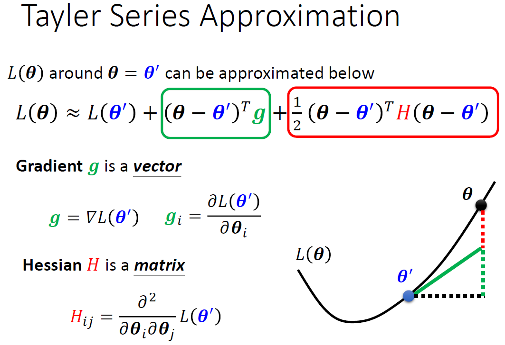

# 深度学习总结

## 1.机器学习框架

### 1.1 Framework of ML

- Step1: function with unknown parameters
- Step2: define loss from training data
- Step3: optimization

### 1.2 General Guide

（1）Model Bias   VS   Optimization Issue

（2）Overfitting

（3）Bias Complexity Trade off

（4）Cross Validation

（5）mismatch

## 2.模型为什么不work？

### 2.1 局部最小值 (local minima) 与鞍点 (saddle point)

数学证明：

通过一个实验可以看出：实际在高维空间，local minima并不常见，更多见到的是saddle point，所以梯度为0的时候，是可以解决梯度下降的问题的。

### 2.2 Batch and Momentum

对抗local minima和saddle point

（1）Batch

（2）为什么要用Batch？  

更快

更好

（3）Momentum

###  2.3 Adaptive Learning Rate

Error surface is rugged ...

### 2.4 損失函數 (Loss) 

### 2.5  批次标准化 (Batch Normalization) 

