# 分群建模&评分卡和xgb分数校准

## 1、分群

风控模型上可以对客户分群，在群上定制建模，提高模型预测精度。

### 1.1 K-Means

**1.1.1 算法思想**

该算法利用数据点之间的欧式距离大小，将数据划分到不同的类别，欧式距离较短的点处于同一类。算法结果直接返回的是数据点所属的类别。

K-Means的具体聚类过程参见聚类分析方法论。

**1.1.2 缺点**

二维k-means模型的本质是，它以每个簇的中心为圆心，簇中的点到簇中心点的欧氏距离最大值为半径画一个圆。这个圆硬性的将训练集进行截断。而且，k-means要求这些簇的形状必须是圆形的。因此，k-means模型拟合出来的簇（圆形）与实际数据分布（可能是椭圆）差别很大，经常出现多个圆形的簇混在一起，相互重叠。总的来说，k-means存在两个缺点，使得它对许多数据集（特别是低维数据集）的拟合效果不尽如人意：

- 类的形状不够灵活，拟合结果与实际相差较大，精度有限。
- 样本属于每一个簇的概率是定性的，只有是与否，不能输出概率值。应用中缺少鲁棒性。

> 聚类算法使用前需要先对数据做预处理，包括缺失值填充、极值和异常值处理等。

### 1.2 GMM

**1.2.1 GMM算法原理**


**1.2.2 GMM简单应用**

高斯混合模型（GMM）可以看做是k-means模型的一个优化。它既是一种工业界常用的技术手段，也是一种生成式模型。高斯混合模型试图找到多维高斯模型概率分布的混合表示，从而拟合出任意形状的数据分布。在最简单的场景中，GMM可以用与k-means相同的方式进行聚类。

```python3
import matplotlib.pyplot as plt
import seaborn as sns; sns.set()
import numpy as np

#产生实验数据
from sklearn.datasets.samples_generator import make_blobs
X, y_true = make_blobs(n_samples=700, centers=4,
                       cluster_std=0.5, random_state=2019)
X = X[:, ::-1] #方便画图

from sklearn.mixture import GaussianMixture as GMM
gmm = GMM(n_components=4).fit(X) #指定聚类中心个数为4
labels = gmm.predict(X)
plt.scatter(X[:, 0], X[:, 1], c=labels, s=50, cmap='viridis')
```

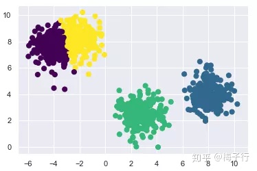

它使用EM算法进行迭代：

1.选择位置和初始形状；

2.循环直至收敛：

- E步骤：对于每个点，为每个点分别计算由该混合模型内的每个分量生成的概率。

- M步骤：调整模型参数以最大化模型生成这些参数的可能性。

该算法保证该过程内的参数总会收敛到一个局部最优解。

**1.2.3 GMM中的概率模型**

事实上在GMM算法中，有一个隐含的概率模型。可以通过其得到簇分配结果的概率。打印前十个点分别属于四个类的概率。

```python3
probs = gmm.predict_proba(X)
print(probs[:10].round(2))
```

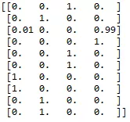

因为GMM模型并不是通过硬截断进行分割类别，而是通过高斯平滑模型进行估计的。所以将每个点的概率进行可视化时，散点图并不是严格成椭圆形状的。

```python3
size = probs.max(1)
plt.scatter(X[:, 0], X[:, 1], c=labels, cmap='viridis', s=size)
```

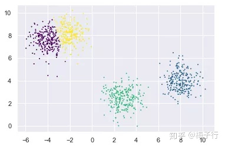

如果允许使用全部的协方差类型，则可以拟合任意形状的分布。为了更好的展示GMM模型的拟合结果，首先需要构造一个画椭圆的函数。在网上找到的代码因为一些API有改动，重新更新了一版。

```python3
from matplotlib.patches import Ellipse

#给定的位置和协方差画一个椭圆
def draw_ellipse(position, covariance, ax=None, **kwargs):
    ax = ax or plt.gca()
    #将协方差转换为主轴
    if covariance.shape == (2, 2):
        U, s, Vt = np.linalg.svd(covariance)
        angle = np.degrees(np.arctan2(U[1, 0], U[0, 0]))
        width, height = 2 * np.sqrt(s)
    else:
        angle = 0
        width, height = 2 * np.sqrt(covariance)

    #画出椭圆
    for nsig in range(1, 4):
        ax.add_patch(Ellipse(position, nsig * width, nsig * height,
                             angle, **kwargs))
#画图
def plot_gmm(gmm, X, label=True, ax=None):
    ax = ax or plt.gca()
    labels = gmm.fit(X).predict(X)
    if label:
        ax.scatter(X[:, 0], X[:, 1], c=labels, s=4, cmap='viridis', zorder=2)
    else:
        ax.scatter(X[:, 0], X[:, 1], s=4, zorder=2)
    ax.axis('equal')
    w_factor = 0.2 / gmm.weights_.max()
    for pos, covar, w in zip(gmm.means_, gmm.covariances_  , gmm.weights_):
        draw_ellipse(pos, covar, alpha=w * w_factor)
```

下面使用椭圆形来拟合数据。

```python3
rng = np.random.RandomState(13)
X_stretched = np.dot(X, rng.randn(2, 2))
gmm = GMM(n_components=4, covariance_type='full', random_state=42)
plot_gmm(gmm, X_stretched)
```

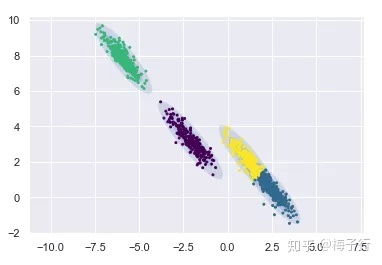

**1.2.4 GMM模型的组件**

下面考虑一个特殊的分布形式。如下图所示

```python3
from sklearn.datasets import make_moonsXmoon, y
moon = make_moons(100, noise=.04, random_state=0)
plt.scatter(Xmoon[:, 0], Xmoon[:, 1]);
```

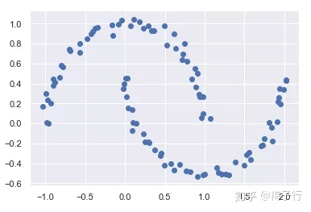

如果使用两个高斯分布进行拟合，则得到的结果如下。

```python3
gmm2 = GMM(n_components=2, covariance_type='full', random_state=0)
plot_gmm(gmm2, Xmoon)
```

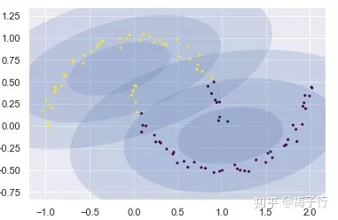

即使是椭圆形状，仍有一部分点被错误的归类为另一个分布。这时，如果使用更多的高斯分布进行归纳，则可以得到更好的效果。

```python3
gmm10 = GMM(n_components=10, covariance_type='full', random_state=0)
plot_gmm(gmm10, Xmoon, label=False)
```

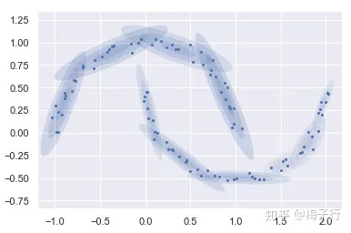

这里使用了10个高斯分布。但是并不是为了得到10个聚类结果。而是通过10个分布进行集成得到最终的归纳结果。也就是说，GMM模型的本质并不是聚类，而是得到一个，能够生成当前样本形式的分布。

因此可以使用前面10个高斯分布集成的生成模型，来生成服从当前分布形式的200个新的样本。

```python3
Xnew = gmm10.sample(200)[0]
plt.scatter(Xnew[:, 0], Xnew[:, 1])
```

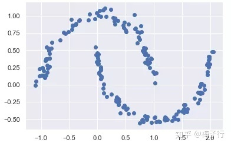

**1.2.5 最优组件个数的确定**

在实际使用过程中，需要选择每次建模使用多少个高斯分布进行聚类才能有最好的聚类效果。这里介绍两种确定最优组件个数的方法——赤池信息准则（kaike information criterion ，AIC)）和贝叶斯信息准则（ Bayesian information criterion ，BIC）。

很多参数估计问题均采用似然函数作为目标函数，当训练数据足够多时，可以不断提高模型精度，但这是以提高模型复杂度为代价的，同时带来一个机器学习中非常普遍的问题——过拟合。因此需要一种方法在模型复杂度与模型对数据集描述能力之间寻求最佳平衡。

为此提出一种概念叫做信息准则，通过加入模型复杂度的惩罚项来避免过拟合问题，这里介绍两种常用的模型选择方法：

（1）AIC

AIC是衡量统计模型拟合优良性的一种准则，它是建立熵的概念上，提供了权衡估计模型复杂度和拟合数据优良性的标准。

通常情况下，AIC定义为：


$$
AIC=2k-2lnL
$$


其中，k是模型参数个数，L是似然函数。从一组可供选择的模型中选择最佳模型时，通常选择AIC最小的模型。

当两个模型之间存在较大差异时，差异主要体现在似然函数项，当似然函数差异不显著时，式中第一项，即模型复杂度会起作用，从而表明参数个数少的模型是较好的选择。

一般而言，当模型复杂度提高（k增大）时，似然函数L也会增大，从而使AIC变小，但是k过大时，似然函数增速减缓，导致AIC增大。模型过于复杂容易造成过拟合现象。

所以目标就是选取AIC最小的模型，AIC不仅要提高模型拟合度（极大似然），而且要引入惩罚项，使模型参数尽可能少，从而降低过拟合的可能性。

（2）BIC

BIC与AIC相似，更多地用于模型选择。训练模型时，增加参数数量，也就是增加模型复杂度，会增大似然函数，但是也会导致过拟合现象，针对该问题，AIC和BIC均引入了与模型参数个数相关的惩罚项，BIC的惩罚项比AIC的大。同时要考虑样本数量，样本数量过多时，可有效防止模型精度过高造成的模型复杂度过高。
$$
BIC=klnn-2lnL
$$
其中，k为模型参数个数，n为样本数量，L为似然函数。  惩罚项在维度过大且训练样本数量相对较少的情况下，可以有效避免出现维度灾难现象。

（3）AIC和BIC的比较

```python3
n_components = np.arange(1, 21)
models = [GMM(n, covariance_type='full', random_state=0).fit(Xmoon)
          for n in n_components]

plt.plot(n_components, [m.bic(Xmoon) for m in models], label='BIC')
plt.plot(n_components, [m.aic(Xmoon) for m in models], label='AIC')
plt.legend(loc='best')
plt.xlabel('n_components')
```

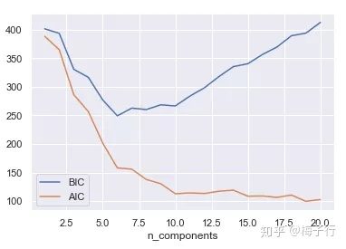

最佳的聚类数目是使得AIC或BIC最小化的值，具体取决于我们希望使用的近似值。上图可以看出，AIC显示，选择10个高斯分布差不多就是最优解了。而BIC则倾向于使用更简单的模型，在6个高斯分布时即达到最优解。

除此之外，KMeans和GMM聚类均可采用手肘法和轮廓系数来评价聚类效果，其中手肘法取曲线的转折位置，轮廓系数取最大值。

> 手肘法和轮廓系数参见聚类分析方法论。

**1.2.6 总结**

GMM模型因其优秀的聚类表现，以及可以生产样本的强大功能，在风控领域的应用非常广泛。如对反欺诈中的欺诈样本抓取与生成、模型迭代中的幸存者偏差等问题都有一定的作用。

比如说在反欺诈检测模型中，可以先通过GMM模型对欺诈样本进行聚类，后将聚类后得到的簇作为同一类欺诈手段，后续只针对不同的簇进行建模，在实践中对欺诈客户的召回有很好的效果。

## 2 评分卡模型分数校准

分群后模型的概率值不具备可比性，需进行分数校准。

### 2.1 风控业务背景

在评分卡建模中，我们通常会把LR输出的概率分（probability）转换为整数分(score)，称之为评分卡分数校准(calibration)。事实上，这个阶段称为尺度变换（scaling）或许更为合适。只是有些书中并不严格区分校准和尺度变换，统称为风险校准。

大家耳熟能详的一些信用评分就是最终以这种形式呈现，例如：

> 1. 芝麻分的分值范围为350～950，分值越高代表信用越好，相应违约率相对较低，较高的芝麻分可以帮助用户获得更高效、更优质的服务。
> 2. FICO分的分值范围为300～850，分数越高, 说明客户的信用风险越小。

但我们可能并不清楚这些问题：分数校准的概念是什么？为什么要做分数校准？分数校准的原理是什么？如何做分数校准？在哪些场景里需要做分数校准？

### 2.2 分数校准的概念

在机器学习模型实践应用中，大多数情况下，我们主要关注分类模型的**排序性（ranking）**，而很少关心输出概率的具体数值。也就是——**关注相对值，忽略绝对值**。

一方面，有的分类器（例如SVM）只能直接打上类别标签没法给出置信度。另一方面，在某些场景中，我们希望得到真实的概率。例如，在信贷风控中，将预测的客户违约概率(Probability of Default ，PD）与真实违约概率对标，即**模型风险概率能够代表真实的风险等级。**这样我们就可以进行更准确的风险定价。

这就引出了校准(calibration)的概念，我们将其理解为：

> 预测分布和真实分布（观测）在统计上的一致性。

对于完美校准的（2分类）分类器，如果分类器预测某个样本属于正类的概率是0.8，那么就应当说明有80%的把握（置信度，confidence level）认为该样本属于正类，或者100个概率为0.8的样本里面有80个确实属于正类。

由于我们无法获知真实的条件概率，通常用观测样本的标签来统计代替，并用**可靠性曲线图**（Reliability Curve Diagrams）来直观展示当前模型的输出结果与真实结果有多大偏差。如图1所示，如果数据点几乎都落在对角线上，那么说明模型被校准得很好；反之，如果和对角线的偏离程度越明显，则校准越差。

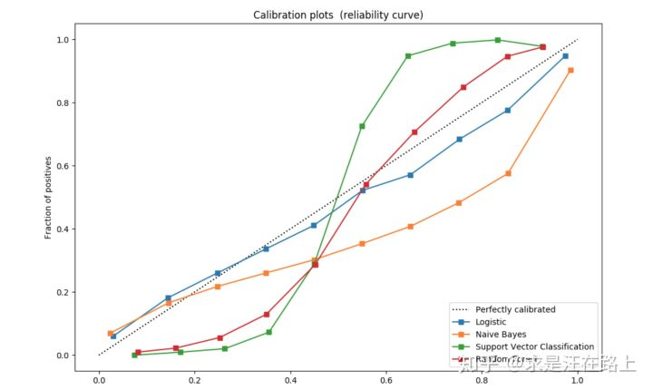

<center>图 1 - 校准曲线（横坐标 = 预测概率，纵坐标 = 实际频率）</center>

因此，其横坐标为事件发生预测概率，纵坐标为事件发生实际频率，能展示**“某个事件预测概率 VS 实际发生的频率”之间的关系**。对于一个理想的预测系统，两者是完全一致的，也就是对角线。

那么可靠性曲线图是如何绘制的？步骤如下：

- **step 1.** 横坐标：将预测概率升序排列，选定一个阈值，此时[0，阈值]作为一个箱子。
- **step 2**. 纵坐标：计算这个箱子内的命中率（hit rate），也就是正样本率。
- **step 3**. 选定多个阈值，重复计算得到多个点，连接成线。

$$
hit\_rate={{position}\over{position+negative}}
$$

我们以扔硬币来评估正面朝上的概率这个场景进行说明。经过投掷记录，我们得到1W（或者更多）个有真实0（反面朝上）和1（正面朝上）标签的样本。进而，我们根据硬币的各类特征和正反面标签，训练得到一个二分类模型，给这批样本打上分，升序排列。然后，取一个分数作为阈值（如0.5），统计分数取值为0～0.5的这批样本中1的实际占比，当作“真实”概率。最后，比较“真实”概率与预测概率来检测一致性。

在实践中，我们已经普遍认识到一个现象：

> LR的输出概率可以认为是真实概率，而其他分类器的输出概率并不反映真实概率。

那么这背后的数学原理是什么？

### 2.3 分数校准的业务应用场景

分数校准主要目的在于：

1. 确保不同评分卡给出的分数具有相同的含义；
2. 保证预测概率与真实概率之间的一致性（拟合度）；
3. 修正实际概率和开发样本中期望概率之间的偏差。

接下来，我们将结合实际业务场景展开介绍。注意，因为我们是用评分卡(LR)建立的模型，因此分数校准实际只做了尺度变换这一步。

**场景1: 分群评分卡**

有时候我们会发现单一评分卡在**全量人群**上表现并不是特别好。此时会采用先分群（segmentation），再针对各人群建立多个子评分卡模型。

基于以下几个原因，我们需要把分数校准到同一尺度。

1. 针对多个分支模型需要制订多套风控策略，将会大大增加策略同学的工作量，且不利于策略维护调整。
2. 不同评分卡输出的分数并不具有可比性，它们的分布存在差异。为了融合后统一输出一个最终分数。
3. 各分群评分卡相当于一个分段函数，分数之间存在跃变。校准可以保证各分数具有连续性。

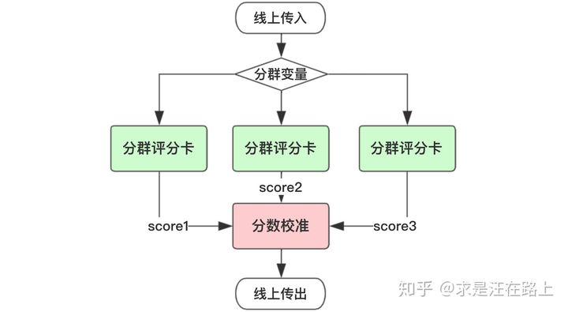

<center>图 2 - 分群评分卡场景

**场景2: 降级备用策略**

在用到外部数据建模时，考虑到外部数据采集上存在潜在的不稳定性，我们通常会采取降级策略。也就是说，去掉外部数据后再建立一个模型，作为主用（active）模型的一个备用（standby）模型。如果外部数据有一天停止提供服务，就可以切换到备用模型上。

同时，为了使下游业务调用无感知，我们会将主用备用模型的分数校准至一个尺度。这样就能保证风控策略同学只需要制订一套cutoff方案，且不用调整，只需做必要的**策略切换日志**和**前后波动监控**即可。

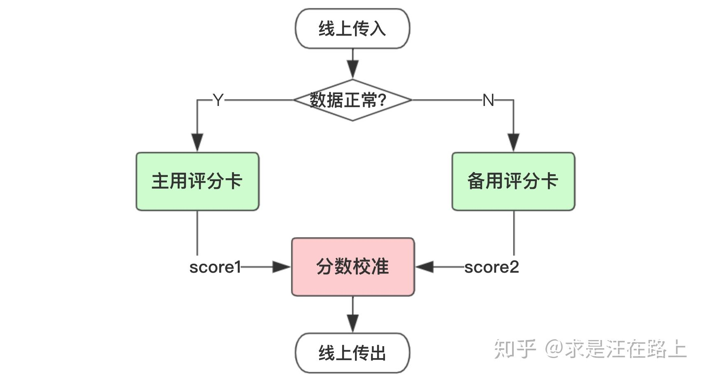

<center>图 3 - 降级备用策略</center>

**场景3: 客群变化修正**

当面向客群发生变化时，开发样本与最近样本之间存在偏差（bias）。如果开发样本的Odds大于实际的Odds，那么计算每个分数段的坏样本率，得出来的结果将会大于真实情况。

然而考虑到建模成本，我们有时并不想refit模型，此时就可以利用最近样本对评分卡进行校准，修正偏差。

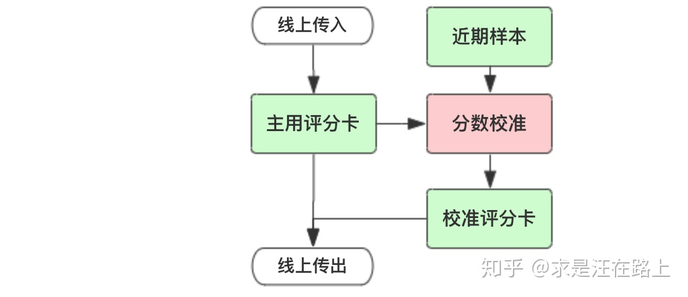

<center>图 4 - 基于近期样本校准

> 除此之外，场景三也适用于如下情况：
>
> 1. 产品本身坏样本较少，为了提高评分模型的敏感程度，会对坏样本进行过抽样或者好样本进行欠抽样；
>
> 2. 如果是乙方公司，好坏样本的来源可能不同，或者甲方爸爸并没有全量反馈样本表现，那么自然样本中的好坏比无法反映真实的情况。

### 2.4 如何进行概率分数校准？

针对上述实际业务场景，我们该如何去做概率分数校准呢？ 以下是两种最为常见的概率校准方法：

1. Platt scaling使用LR模型对模型输出的值做拟合（并不是对reliability diagram中的数据做拟合），适用于样本量少的情形，如**信贷风控场景**中。
2. Isotonic regression则是对reliability diagram中的数据做拟合，适用于样本量多的情形。例如**搜索推荐场景**。样本量少时，使用isotonic regression容易过拟合。

现以数值案例展示前文中的三个场景。

**方案1：针对场景1和2的Platt校准**

假设目前有一个LR模型分数score1，并令score2 = 0.75*score1，以此来模拟场景1和2。此时score1和score2的排序性完全一致，只是绝对值不同，对应不同的风险等级，如图5所示。我们需要将score1和score2校准到同一尺度。

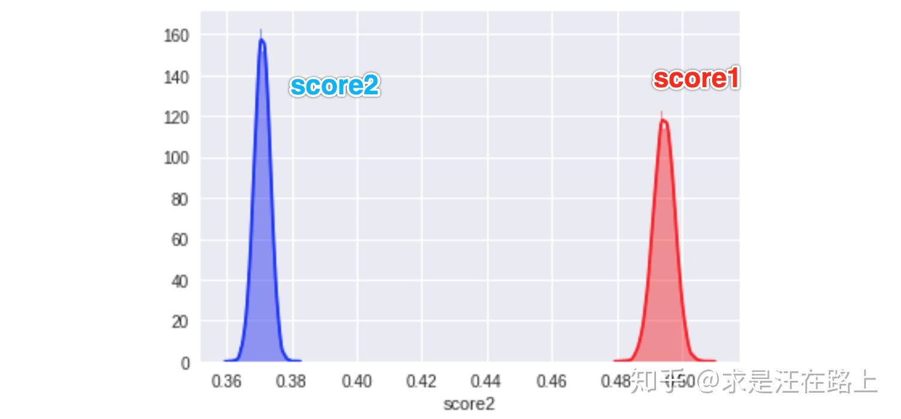

<center>图 5 - 两个分支模型的概率分布

普拉托（Platt）最早提出可以通过**sigmoid函数**将SVM的预测结果转化为一个后验概率值，其实施流程为：

- **step 1**. 利用样本特征X和目标变量y训练一个分类器model1。（不限定分类器类型）
- **step 2**. 利用model1对样本预测，得到预测结果out。
- **step 3**. 将预测结果out作为新的特征X'，再利用样本的标签y，训练一个LR。
- **step 4**. LR最后输出的概率值就是platt's scaling后的预测概率。

我们把score1和score2分别执行step 3，得到校准后的分数score1_cal和score2_cal，如图6所示。通过分布可知，两个分数的**差异几乎为0**，故而具有相同的风险等级。同时，由于校准函数是单调的，那么校准前后将不会影响排序性和区分度。

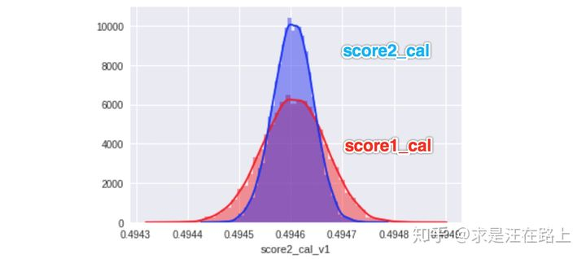

<center>图 6 - 校准后的两个分支模型的概率分布

**方案2：针对场景3的Odds校准**

场景3一般称为评分卡分数的错误分配（Misassignment），如图7所示。

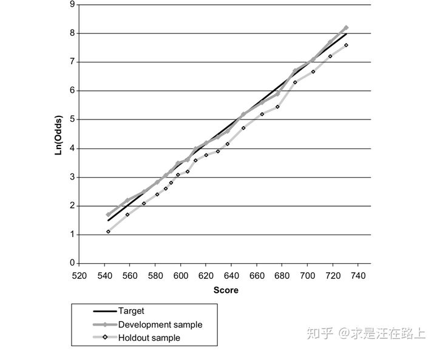

<center>图 7 - 截距错配(Intercept Misalignment)

我们知道，LR中的截距近似于开发样本的ln(Odds)，那么就可以采取以下方式进行校准。

![[公式]](https://www.zhihu.com/equation?tex=%5Cleft%5C%7B+%5Cbegin%7Baligned%7D+ln%28%5Cfrac%7Bp%7D%7B1-p%7D%29+%3D+w+%2A+x+%2B+ln%28%7BOdds_%7Bexpect%7D%7D%29+%5C%5C+ln%28%7BOdds_%7Bcalibrate%7D%7D%29+%3D+ln%28%5Cfrac%7BOdds_%7Bactual%7D%7D%7BOdds_%7Bexpect%7D%7D%29+%3D+ln%28Odds_%7Bactual%7D%29+-+ln%28%7BOdds_%7Bexpect%7D%7D%29%5C%5C+%5Cend%7Baligned%7D+%5Cright.+%5C%5C++%5CRightarrow+ln%28%5Cfrac%7Bp%7D%7B1-p%7D%29+%3D+w_1+%2A+x_1+%2B+ln%28%7BOdds_%7Bexpect%7D%7D%29+%2B+ln%28%7BOdds_%7Bcalibrate%7D%7D%29+%5C%5C++%5CRightarrow+ln%28%5Cfrac%7Bp%7D%7B1-p%7D%29+%3D+w_1+%2A+x_1+%2B+ln%28%7BOdds_%7Bactual%7D%7D%29+%5Ctag%7B1%7D)

> 理解可参考：https://zhuanlan.zhihu.com/p/90895509

在评分卡尺度变换后，我们可以得到ln(Odds)和Score之间的线性关系（后文会介绍），也就是：

![[公式]](https://www.zhihu.com/equation?tex=Score+%3D+A+-+B+%2A+Ln%28Odds%29+%5Ctag%7B2%7D)

那么，利用近期样本和开发样本就可以分别绘制出这样一条直线。如果这两条直线是平行关系，此时我们认为：在同一个分数段上，开发样本相对于近期样本把Odds预估得过大或过小。因此， 可通过$Ln(Odds_{actual}-Ln(Odds_{expect}))$来进行校正。

在图8中，实际上该产品的整体违约率只有**2%**左右，而评分卡开发样本的违约率为**10%**。因此可以通过这种方式对每个分数区间的Odds予以校准。

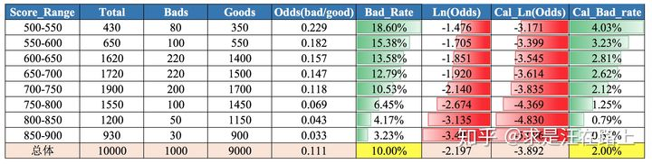

<center>图 8 - 基于Odds的评分卡校准

### 2.5 如何定量评估校准的好坏？

我们通常用对数损失函数(Logarithmic Loss，LL)和Brier分数（Brier score，BS）来衡量校准质量，分别定义如下：

![[公式]](https://www.zhihu.com/equation?tex=%5Cleft%5C%7B+%5Cbegin%7Baligned%7D+Log%5C_Loss+%3D+-%5Csum_%7Bi%3D1%7D%5E%7BN%7D%28y_i+%2A+log%28p_i%29+%2B+%281-y_i%29%2Alog%281-p_i%29%29++%5C%5C+Brier%5C_Score+%3D+%5Cfrac%7B1%7D%7BN%7D%5Csum_%7Bi%3D1%7D%5E%7BN%7D%28y_i+-+p_i%29%5E2+%5C%5C+y_i+%5Cin+%5C%7B0%2C1%5C%7D+%3A+actual+%5Cspace%5Cspace+class+%5Cspace%5Cspace+label%5C%5C+p_i+%5Cin+%5B0%2C1%5D+%3A+%5Cspace%5Cspace+estimated+%5Cspace%5Cspace+default+%5Cspace%5Cspace+probability+%5C%5C+%5Cend%7Baligned%7D+%5Cright.+%5Ctag%7B3%7D)

1. 观察LL可知，当真实label=0，预测概率为1时，损失函数将达到+∞。LL惩罚明显错误的分类。当**预测概率越接近于真实标签，LL越小，模型的校准效果就越好**。
2. 观察BS可知，当BS指标越小，代表模型预测结果越接近于真实标签。

因此，这两个指标都反映样本集上**真实标签与预测概率之间的差异性**（也就是一致性）。

这里，我们就有了答案 ：LR在参数估计时所用到的损失函数正是对数损失函数，故而才具有良好的校准度。

> LogisticRegression returns well calibrated predictions as it directly optimizes **log-loss**.

### 2.6 概率分数尺度变换成整数分数

至此**，**我们已经掌握了如何对模型输出概率进行校准，但还不是文章开头所见的整数分。现在，介绍**将概率分数尺度变换（scaling）成整数分数**。在很多信用评分书籍中，有时也会并不加以区分地称为风险校准，但并不恰当。

这是非常有用的，因为从业务上很难理解一个概率分代表的含义，但人们对于整数分更容易接受。比如，温度计上的刻度 ️。单调性保证了映射过程不会改变分数的排序性。

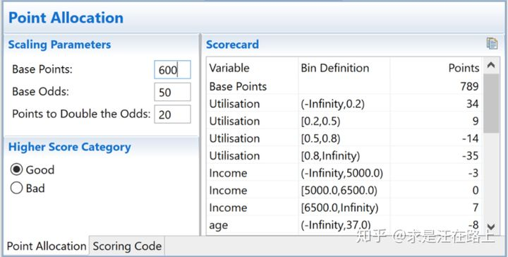

<center>图 9 - 评分卡赋分

为简化处理，我们只考虑一个自变量X，那么逻辑回归定义如下：

![[公式]](https://www.zhihu.com/equation?tex=ln%28Odds%29+%3D+ln%28%5Cfrac%7Bp%28Y%3DBad%7CX%29%7D%7Bp%28Y%3DGood%7CX%29%7D%29+%3D++ln%28%5Cfrac%7Bp%7D%7B1-p%7D%29+%3D+w+%2A+WOE%28x%29+%2B+b+%5Ctag%7B4%7D)

在《[WOE与IV指标的深入理解应用](https://zhuanlan.zhihu.com/p/80134853)》一文中，我们认识到WOE变换是一个**分段函数，**其把**自变量x与y之间的非线性关系转换为线性关系**。若把WOE定义如下，那么含义为：**自变量x在经过WOE变换后，取值越大，预测为bad的概率越高。**

![[公式]](https://www.zhihu.com/equation?tex=WOE%28x%29+%3D+%5Cleft%5C%7B+%5Cbegin%7Baligned%7D+woe_1+%3D+ln%28%5Cfrac%7BBad_1%7D%7BGood_1%7D%29++-+ln%28%5Cfrac%7BBad_T%7D%7BGood_T%7D%29+%2C+x+%5Cin+bin_1%5C%5C+woe_2+%3D+ln%28%5Cfrac%7BBad_2%7D%7BGood_2%7D%29++-+ln%28%5Cfrac%7BBad_T%7D%7BGood_T%7D%29+%2C+x+%5Cin+bin_2%5C%5C+...+%5C%5C+woe_m+%3D+ln%28%5Cfrac%7BBad_m%7D%7BGood_m%7D%29++-+ln%28%5Cfrac%7BBad_T%7D%7BGood_T%7D%29+%2C+x+%5Cin+bin_m+%5C%5C+%5Cend%7Baligned%7D+%5Cright.+%5Ctag%7B5%7D)

我们会发现在2个地方出现了Odds的身影——**LR的左边和WOE变换**。

此时，由于两者的Odds（几率）的定义是**坏好比**，也就是**“坏人概率 / 好人概率”**。因此，在参数估计时，自变量前的**权重系数w的符号是正的**。实践中发现不少人搞不清楚为什么有时候是正号，有时候是负号。问题主要在于**WOE和LR中Odds定义是否一致**。

1. 当WOE中定义Odds是**好坏比**时，w系数为**负**；
2. 当WOE中定义Odds是**坏好比**时，w系数为**正**；

将LR输出线性映射为信用分的公式如下，通常将**常数A称为补偿**，**常数B称为刻度。**

![[公式]](https://www.zhihu.com/equation?tex=define+%5Cleft%5C%7B+%5Cbegin%7Baligned%7D+A+%3E+0%2C+B+%3E+0+%5C%5C+Odds+%3D+%5Cfrac%7Bp%28Y%3DBad%7CX%29%7D%7Bp%28Y%3DGood%7CX%29%7D++%3D+%5Cfrac%7Bp%7D%7B1+-+p%7D+%5C%5C+%5Cend%7Baligned%7D+%5Cright.+%5C%5C++%5CRightarrow+credit%5C_score+%3D+A+-+B+%2A+ln%28Odds%29+%5C%5C++%5CRightarrow+credit%5C_score+%3D+A+-+B+%2A+%5B%5Cbeta_0+%2B+%5Cbeta_1+%2A+WOE%28x%29%5D+%5Ctag%7B6%7D)

在上式中，由于Odds是坏好比，Odds越大，代表bad的概率越高；而信用分越高，代表bad的概率越低。**两者业务含义上相反，因此是减号**。

我们需要定义三个必要的参数：

- **1. 基准Odds**：与真实违约概率一一对应，可换算得到违约概率。
- **2. 基准分数**：在基准Odds时对应的信用分数。
- **3. PDO**:**（P**oints to **D**ouble the **O**dds）：Odds（坏好比）变成2倍时，所**减少**的信用分。

接下来，我们就可以求解出A和B，过程如下：

![[公式]](https://www.zhihu.com/equation?tex=define+%5Cleft%5C%7B+%5Cbegin%7Baligned%7D+PDO+%3E+0+%5C%5C+A+%3E+0%2C+B+%3E+0+%5C%5C+Odds+%3D+%5Cfrac%7Bp%28Y%3DBad%7CX%29%7D%7Bp%28Y%3DGood%7CX%29%7D+%3D+%5Cfrac%7Bp%7D%7B1+-+p%7D+%5C%5C+%5Cend%7Baligned%7D+%5Cright.+%5C%5C++%5CRightarrow+%5Cleft%5C%7B+%5Cbegin%7Baligned%7D+base%5C_score+%3D+A+-+B+%2A+ln%28Odds_0%29+%5C%5C+base%5C_score+-+PDO+%3D+A+-+B+%2A+ln%282+%2A+Odds_0%29+%5C%5C+%5Cend%7Baligned%7D+%5Cright.+%5C%5C++%5CRightarrow+%5Cleft%5C%7B+%5Cbegin%7Baligned%7D+B+%3D+%5Cfrac%7BPDO%7D%7Bln%282%29%7D+%5C%5C+A+%3D++base%5C_score+%2B+%5Cfrac%7BPDO%7D%7Bln%282%29%7D+%2A+ln%28Odds_0%29+%5C%5C++%5Cend%7Baligned%7D+%5Cright.+%5C%5C++%5Ctag%7B7%7D)

现以具体数字来说明。假设我们希望信用分base_score为600时，对应的Odds（坏好比）为**1:50**。而当Odds扩大2倍至**2:50**时，信用分**降低20分**至580分**（PDO=20）**。那么：

![[公式]](https://www.zhihu.com/equation?tex=+%5Cleft%5C%7B+%5Cbegin%7Baligned%7D+B+%3D+%5Cfrac%7BPDO%7D%7Bln%282%29%7D+%3D+%5Cfrac%7B20%7D%7Bln%282%29%7D+%3D+28.8539++%5C%5C+A+%3D++base%5C_score+%2B+%5Cfrac%7BPDO%7D%7Bln%282%29%7D+%2A+ln%28Odds_0%29+%3D+600+%2B+28.8539+%2A+ln%281%2F50%29+%3D+487.122%5C%5C+%5Cend%7Baligned%7D+%5Cright.+%5C%5C++%5CRightarrow++%5CRightarrow+credit%5C_score+%3D+487.122+-+28.8539+%2A+ln%28Odds%29++%5C%5C++%5CRightarrow+credit%5C_score+%3D+487.122+-+28.8539+%2A+%28w+%2A+WOE%28x%29+%2B+b%29+%5Ctag%7B8%7D+)

### 2.7 总结

我们从新的角度再次认识到了为什么评分卡最终选择了逻辑回归。其中一个原因是，**逻辑回归本身具有良好的校准度，其输出概率与真实概率之间存在良好的一致性。**因此，我们也就可以直接把概率分数线形映射为整数分数。

## 3 xgb分数校准

如果我们用机器学习模型（如XGBoost、随机森林等）来进行风控建模，又希望把概率对标到真实概率，那么我们就可以考虑**Platt Scaling**。

即将分群的模型分别计算总样本上的概率，然后将几个概率重新做模型（LR），得到可比的总体分数。


参考资料：

[1] [最佳聚类实践：高斯混合模型（GMM）]( https://zhuanlan.zhihu.com/p/81255623 )

[2] [信用评分卡模型分数校准](https://zhuanlan.zhihu.com/p/82670834)

[3] [原来评分卡模型的概率是这么校准的！](https://zhuanlan.zhihu.com/p/90895509)

[4] [风控模型中的概率分数校准](https://zhuanlan.zhihu.com/p/92958088)


