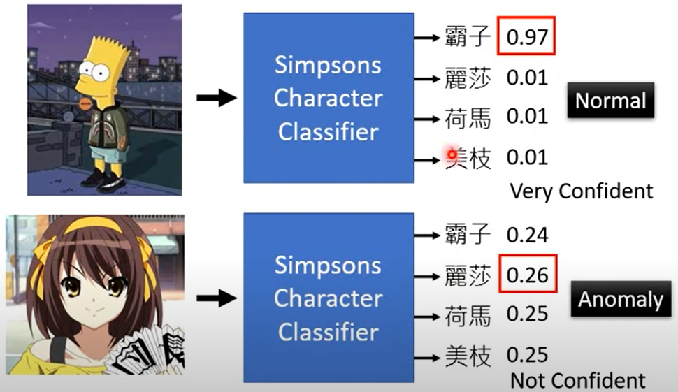
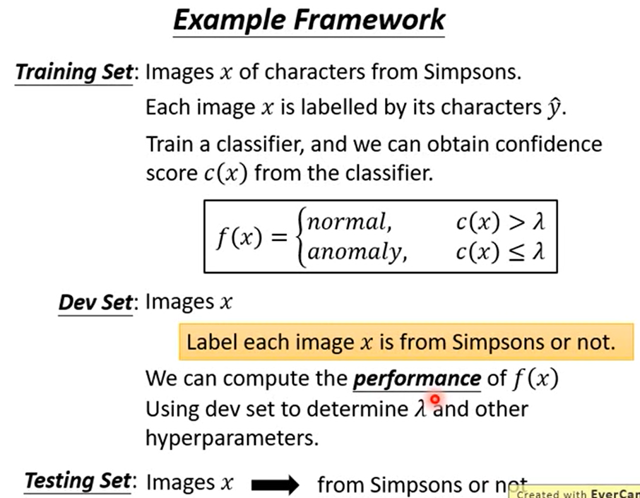

# 异常检测

## Applications

- Fraud Detection
  - Traning data: 正常刷卡行为，x: 盗刷？
  - Ref: https://www.kaggle.com/ntnu-testimon/paysim1/home
  - Ref: https://www.kaggle.com/mlg-ulb/creditcardfraud/home

- Network Intrusion Detection
  - Training data: 正常连接，x: 攻击行为？
  - Ref: http://kdd.ics.uci.edu/databases/kddcup99/kddcup99.html
- Cancer Detection
  - Training data: 正常细胞，x: 癌细胞
  - Ref: https://www.kaggle.com/uciml/breast-cancer-wisconsin-data/home

## with labels

1. 如何使用分类器？

2. 如何估计confidence

- the maximum scores
- negative entropy

注：分类的时候，不仅输出分类概率值，同时输出confidence.

3. example Framework

4. Evaluation

- 异常检测中样本通常是不均衡的，所以准确率不是一个好的度量方法；

- 考虑两类错误

5. Possible Issues

有标签训练出来的分类器可能存在如上的误分类，因此，可以考虑提供一些异常样本，使得模型不只是学做分类，而是看到正常的样本，confidence就高，看到异常的样本，confidence就低。

## without labels

0

